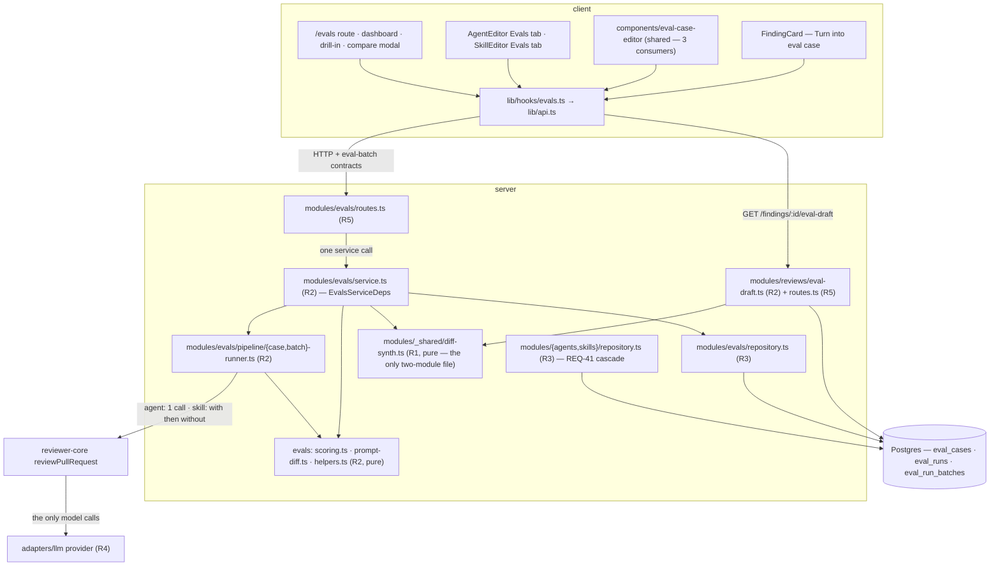

# Plan 09 — Eval Pipeline

**Modules:** server · client   **Created:** 2026-08-28   **Status:** executed 2026-08-28 · **partly superseded 2026-08-29** — read the banner below before acting on anything here
**Spec:** SPEC-03 — [`server/specs/SPEC-03-eval-pipeline.md`](../../server/specs/SPEC-03-eval-pipeline.md) — **amended 2026-08-29; this plan predates that amendment**

---

## READ FIRST — three things in this plan are no longer true

**Revision 4 — 2026-08-29 — record-only.** Plan 09 executed to completion on 2026-08-28: all 22
tasks returned `DONE` and the architecture review loop closed. `server/specs/SPEC-03-eval-pipeline.md`
was then **amended on 2026-08-29**, when the owner closed OQ-7 and removed the runner agent from
skill eval batches. **No task below has been rewritten and nothing has been renumbered** — every
`REQ`, `T`-number and matrix cell still means what it meant when the work was dispatched. This
revision only marks what the amendment overturned, so that a future reader is not misled by a plan
that reads as binding and is not.

**1. REQ-68 is SUPERSEDED, and T17 shipped the superseded behaviour.** The amended **AC-68** removes
the runner agent entirely: a skill batch consults no agent, no `agent_skills` link and no `agents`
row, persists `null` in `runner_agent_id`/`runner_agent_version`, and never answers `400` for a skill
with no linked enabled agent. REQ-68 as stated in §2 is the *old* rule, verbatim. Its
replacement is **AC-72** (a fixed neutral baseline reviewer prompt, one constant in
`modules/evals/constants.ts`) and **AC-73** (provider/model via `resolveFeatureModel` for the new
feature id `eval_baseline`). AC-13's skill-side precondition was deleted and AC-69 was narrowed to
historical rows.

**2. `REQ-72` and `REQ-73` are plan-local ids that COLLIDE with the spec's new `AC-72` and `AC-73`,
and they mean entirely different things.** §2's foundational claim — *"REQ-n restates AC-n
one-for-one, same number, so the chain is arithmetic"* — is **false for 72 and 73 and for no other
number**. Plan `REQ-72` is the additive migration; plan `REQ-73` is the new contract file. Both were
drawn from spec *prose* because AC-72 and AC-73 **did not exist** when this plan was written. They do
now, and they are the baseline prompt and the model resolver. **A reader comparing plan REQ-72
against spec AC-72 is comparing two unrelated things.** They are deliberately **not** renumbered:
T1's and T2's acceptance boxes and the §6 matrix cite them by number, and renumbering a completed
plan is churn with a real chance of introducing a wrong reference.

**3. AC-72 and AC-73 have no REQ, no task and no coverage-matrix cell here — deliberately.** They
postdate this plan and were implemented outside it. See §2.1 for what they require, where the work
landed, and why fabricating coverage would have been the worse answer.

### Warning to `plan-verifier` — REQ-68 is a false positive waiting to happen

> **Do not grade REQ-68 as shipped.** T17's code, its `.it` suite and its acceptance boxes all exist
> and are green, so REQ-68 inspects as `VERIFIED` — **while the amended AC-68 requires the opposite
> behaviour.** This is the reverse of §1.1's and OI-2's warnings, which guard against a *met*
> requirement grading unmet; this one guards against an *unmet* requirement grading met, and a green
> row is the one nobody re-reads. The correct verdict for REQ-68 is **superseded — not applicable**,
> and the behaviour that replaces it is graded against AC-68/AC-72/AC-73 in the spec, not here.

### Where the replacement work lives — and why there is no plan file for it

The owner ruled that the amendment is implemented **without a plan**: two inline task blocks plus one
`[parent session]` Tier A step. Landed: the Tier A step (`eval_baseline` added to `FeatureModelId`
and `FEATURE_MODELS` in `contracts/platform.ts`, `sync-vendor.sh` run and clean, the
`client/src/lib/feature-models.ts` mirror updated) and the client block (the `Run all evals` runner
gate removed from the skill `Evals` tab, its `usedBy` prop dropped, the orphaned
`evalsTab.noLinkedAgentReason` key pruned). In flight: the server block — the AC-72 constant, AC-73's
model resolution, deletion of `resolveSkillRunner` / `listAgentSkillLinks` / `SkillRunnerLink` and the
R5 closure feeding them, plus the inverted `.it` assertions. **Nothing in that work is planned here
and none of it should be re-decomposed from this file.**

Also closed since this plan ran, and unrelated to the amendment: the round-2 `CRITICAL` (an
`adapters/**` import from R5 in `modules/evals/routes.ts`) — `parseUnifiedDiff` now reaches the route
via `platform/container.ts`, and the static import-boundary test was widened from `pipeline/**` to
all of `modules/evals/**`.

---

**Revision 3 — 2026-08-28.** A second review against the code found eight more, all fixed here.
(a) `vendor/ui/charts/LineChart.tsx` types a series as `number[]` and coerces a gap to `0`
(`s.data[i] ?? 0`), with no per-series dash — so T16 could not have met REQ-37 or REQ-25 through it.
T3 now widens it, exactly as it widens `Modal` and for the same reason (§6 checks, T3, T16).
(b) `parseUnifiedDiff` honours `+++ ` **inside** a hunk, so an authored line `++ x` emits as `+++ x`
and silently retargets the synthesized file; T5's REQ-58 box tested inputs that cannot trip it. T5
now owns the parser fix and tests the real bypass (§4.3, T5). (c) T2 left `eval_runs.batch_id`'s
`onDelete` unspecified, which REQ-41 would have hit as an FK violation in wave 3 — after the
migration was already generated (T2). (d) REQ-17's, REQ-11's and REQ-12's **server** halves had no
acceptance box (T13). (e) The coverage matrix under-listed seven rows against the tasks' own
`Implements` and boxes (§6). (f) T13 owned 10 files across three modules; REQ-41's cascade is split
out as **T22** in wave 2 (§5, §6, T13, T22). (g) T1's red flag forbade the intra-`vendor/shared`
imports the R0 matrix row allows, which would have forced a duplicate `EvalOwnerKind` (T1).
(h) Wave 4's two tasks are two halves of one feature; §6 said nothing about it (§6).

**Revision 2 — 2026-08-28.** Plan review against the code found five defects, all fixed here and
listed so a reader of revision 1 knows what moved. (a) `diff-synth.ts` moved from
`modules/evals/` to `modules/_shared/`: T11 would otherwise have made the repo's first cross-module
import, which `onion-architecture` rule 2 forbids **in both directions** (§4.3, §5, T5, T11, T17).
(b) REQ-41's cascade cannot live in `agents`/`skills` **services** — R2 may import neither
`db/schema*` nor another module's repository — so `modules/{agents,skills}/repository.ts` joined
T13's owned paths and the unreachable copy left T7 (§5, T7, T13). (c) T14 moved to wave 2 and T12 to
wave 3: three tasks render `EvalCaseEditor`, and in revision 1 T15 depended on a same-wave task while
T12 had no dependency on it at all (§6, T12, T14). (d) T20 now owns the `owner_kind` branch in
`EvalCaseEditor.tsx`; previously no task could wire `CodeInput`/`ActualOutput` in (T14, T20).
(e) The dashboard, history, drill-in and compare routes had zero acceptance boxes and REQ-37's
server half had no owning task — both closed in T7, T10 and T13.

## 1. Goal

Wire the dormant `eval_cases` / `eval_runs` tables into a working eval harness: turn an accepted or
dismissed finding into a reusable eval case, run an agent over its whole case set as one batch
against frozen diffs, score every batch **entirely in code** (recall, precision, citation accuracy),
and show the history, the deltas and a side-by-side comparison with the system-prompt diff that
separates two batches. Then give a **skill** the same treatment — cases authored as before/after
source, run twice per case (with and without the skill in the prompt) so the skill's contribution is
one measured number.

**Not in scope, from the spec's own non-goals:** LLM-as-judge anywhere in scoring, running an agent
against a historic version, `Promote v7`, `Run all agents`, the `Stats`/`CI` tabs, `PR meta` case
inputs, skill batches on the Eval Dashboard, spend caps, and batch cancellation. The root `evals/`
package (`@devdigest/evals`) is **untouched** — it grades this repo's own skills through the Agent
SDK and shares no code, table or concept with this feature.

### Three owner decisions this plan is built on

Recorded here because each one changes what a task ships, and a later reader will otherwise read the
spec and the code as disagreeing.

1. **`400` vs `422` (REQ-10).** The repo's law wins (`server/AGENTS.md`: schema-first validation via
   `fastify-type-provider-zod`, invalid input → `422` before the handler, never a hand-rolled
   `.parse()`). So: **`422`** from the route schema for shape failures, **`400`** from the service
   for the semantic limits (REQ-15 zero cases, ~~REQ-68 no runner~~ **[SUPERSEDED 2026-08-29 — no
   skill set-run is refused for want of a runner; see Revision 4]**, >50 expectations, >200 cases), and
   **`413`** for size. AC-10's "400" is implemented as *"rejected with a field-level message before
   anything is persisted"*. **`plan-verifier`: REQ-10 is met by a 422 carrying a field-level
   message — do not read the literal `400` as unmet.** The spec is not edited.
2. **The skill `Evals` tab renders the case list and nothing else.** No batch history, no metric
   cards, no deltas, no alert banner, no trend chart on the skill side. Skill cases still run, are
   still scored two-armed, and are still persisted — only the rendering is cut. Consequences carried
   deliberately: **REQ-31**'s "every batch history list" is scoped to agent drill-ins, and **REQ-35**
   ships as server capability with no skill-side entry point (see §9, OI-1).
3. **AC-42 is proved by a hermetic test plus a written procedure**, not by an automated end-to-end
   experiment — it needs a human to author two case kinds, edit a prompt between two batches and
   spend four real model calls. **REQ-42 is expected to grade `PARTIAL` on inspection; that is the
   designed outcome, not a gap** (see T21 and §9, OI-2).

## 2. Requirements

`REQ-n` restates `AC-n` one-for-one, same number, so the criterion → requirement → task → acceptance
chain is arithmetic — **with exactly two exceptions, and they are the dangerous kind.** All 71 of
REQ-1..REQ-71 are `supplied` from SPEC-03 and do restate the `AC` of the same number.

> **[COLLISION — 2026-08-29] `REQ-72` and `REQ-73` are plan-local ids and do NOT correspond to the
> spec's `AC-72` and `AC-73`.** They were drawn from the spec's `## Inputs and provenance` prose
> because **AC-72 and AC-73 did not exist when this plan was written**. They were added on
> 2026-08-29 and mean something entirely different — the baseline reviewer prompt and the
> `eval_baseline` model resolver (§2.1). For these two numbers only, the arithmetic above is broken:
> plan REQ-72 ≠ spec AC-72, plan REQ-73 ≠ spec AC-73. They are **not renumbered** — T1's and T2's
> acceptance boxes and §6's matrix cite them by number, and renumbering a completed plan risks a
> wrong reference for no gain. Read their `Source` cells before comparing either one to an `AC`.

| ID | Requirement (one testable sentence) | Source |
|---|---|---|
| REQ-1 | An expanded finding with `accepted_at` or `dismissed_at` non-null and a stored patch renders a `Turn into eval case` action in the action row beside `Accept` and `Dismiss`. | AC-1 |
| REQ-2 | A finding with neither timestamp renders that action disabled, with an accessible name stating it must be accepted or dismissed first, and does not open the editor. | AC-2 |
| REQ-3 | A finding whose `pr_files.patch` is null or empty renders the action disabled with an accessible name stating no stored diff is available, and the draft endpoint answers `409` naming the same reason. | AC-3 |
| REQ-4 | Activating the action on an **accepted** finding opens the editor pre-filled with `owner_kind="agent"`, `owner_id` = the producing agent, `input_diff` = that file's stored patch, `name` = `From finding: <title>` truncated to the cap, `expected_output` = one skeleton carrying `severity`/`category`/`title`/`file`/`start_line`/`end_line`, and empty `forbidden_regions`. | AC-4 |
| REQ-5 | On a **dismissed** finding the pre-fill is identical except `expected_output` is `[]` and `forbidden_regions` is one entry carrying `file`/`start_line`/`end_line`. | AC-5 |
| REQ-6 | Opening the editor persists nothing: a case-list request immediately after returns the same count as immediately before. | AC-6 |
| REQ-7 | The agent `Evals` tab lists every `eval_cases` row with `owner_kind='agent'`, that `owner_id` and the caller's workspace, ordered `name` asc with `id` asc as tie-break. | AC-7 |
| REQ-8 | A case with at least one `eval_runs` row renders its most recent run as a pass/fail marker plus `expected <n> finding(s), got <m>`, counting the findings array for an agent case and the **with** arm's findings for a skill case. | AC-8 |
| REQ-9 | A case with no `eval_runs` row renders a neutral marker and the text `never run`, and no pass/fail marker. | AC-9 |
| REQ-10 | Saving a case whose `expected_output` is not an array — possibly empty — of skeletons carrying `severity`/`category`/`title`/`start_line`/`end_line` (plus `file` for an agent case) is rejected with a field-level message and persists nothing; `[]` is always valid. | AC-10 |
| REQ-11 | With `Run on save` on, a successful save runs that single case immediately and renders pass state, duration and cost without a second user action. | AC-11 |
| REQ-12 | Deleting a case requires a confirmation step and deletes that case's `eval_runs` rows with it. | AC-12 |
| REQ-13 | `Run all evals` for an agent or a skill that has at least one case and no batch in a non-terminal state answers within 500 ms with `202` and a batch id, having persisted an `eval_run_batches` row with `status='running'`, that `owner_kind`/`owner_id`, and `owner_version` equal to the owner's `version` at that moment. **[AMENDED 2026-08-29 — the skill-side precondition "has a runner resolvable under AC-68" was deleted from AC-13; this row previously read "for an eligible owner", which carried it.]** | AC-13 |
| REQ-14 | A set-run for an owner with a **live** running batch — under 60 minutes since the later of `started_at` and the newest `eval_runs.ran_at` for that batch — answers `409` with the in-flight batch id and creates no second row; past that threshold the batch is stale, is served as `failed`, and does not block. | AC-14 |
| REQ-15 | A set-run for an owner with zero eval cases answers `400` and creates no batch row. | AC-15 |
| REQ-16 | A batch's cases run through a bounded pool of at most `EVAL_BATCH_CONCURRENCY` concurrent `reviewPullRequest` calls (never an unbounded fan-out), and a skill case's two arms run one after the other. *Amended 2026-08-29 (owner decision) from "one at a time … at most one call in flight"; see AC-16's own amendment note. The bound is the requirement — its value changed, its existence did not.* | AC-16 |
| REQ-17 | While `status` is `running` the batch endpoint returns the cases completed so far, progress is announced through an `aria-live="polite"` region, and the client re-requests every 2 seconds until terminal. | AC-17 |
| REQ-18 | When every case has been attempted the batch's `status` becomes `succeeded` (every case produced a result), `partial` (at least one errored and at least one produced) or `failed` (none produced), and `finished_at` is set. | AC-18 |
| REQ-19 | A case that errors is recorded as errored with its reason, the batch continues, and it counts in `cases_total` and never in `cases_passed`. | AC-19 |
| REQ-20 | Each case's stored `input_diff` is fed to the engine through `parseUnifiedDiff`, with no git clone, no GitHub call and no read of the originating pull request. | AC-20 |
| REQ-21 | `recall` is `TP / (TP + FN)` counting only expectations of `must_find` cases, so a `must_not_flag` case contributes nothing. | AC-21 |
| REQ-22 | `precision` is `TP / (TP + FP)`. | AC-22 |
| REQ-23 | `citation_accuracy` is `kept / (kept + dropped)` read from the `ReviewOutcome` of the single call, with no second `groundFindings`. | AC-23 |
| REQ-24 | An expectation on a finding whose `kind` is `secret_leak`, `lethal_trifecta`, `phantom` or `hook` matches on `file` equality alone, with no line-range intersection required. | AC-24 |
| REQ-25 | A metric whose denominator is zero is persisted and served as `null` and rendered as `—`; `0` is never persisted, served or rendered for an unmeasured metric. | AC-25 |
| REQ-26 | A case is `pass = true` if and only if every expectation matched **and** zero false positives were attributed to it. | AC-26 |
| REQ-27 | A batch's `cost_usd` is the sum of the non-null per-case values in ascending `case_id` order — a skill case's per-case value being the sum of its two arms' non-null `costUsd` — and `null` when every per-case value is null. | AC-27 |
| REQ-28 | One `eval_runs` row is persisted per case per batch, carrying that case's `pass`, `recall`, `precision`, `citation_accuracy`, `duration_ms`, `cost_usd`, `actual_output` and the batch's `batch_id`. | AC-28 |
| REQ-29 | The Eval Dashboard renders one row per **enabled** agent in the workspace, showing its model, its latest batch, and that batch's three metrics. | AC-29 |
| REQ-30 | An agent's *latest batch* is the single terminal `eval_run_batches` row with the greatest `finished_at`, greatest `id` breaking a tie; no dashboard figure is derived by summing or averaging across batches. | AC-30 |
| REQ-31 | Every batch history list is ordered `started_at` desc with `id` desc as tie-break. | AC-31 |
| REQ-32 | An agent's drill-in renders each metric's delta against that agent's immediately preceding terminal batch, and `—` rather than a signed zero when none exists. | AC-32 |
| REQ-33 | The drill-in's alert banner is generated by a pure function with no model call, emitted if and only if `recall`, `precision` or `citation_accuracy` fell by ≥ 0.02 between the latest two batches, and names the metric, the size of the fall and the agent version. | AC-33 |
| REQ-34 | Selecting exactly two distinct batches and activating `Compare` opens a modal showing the older value, the newer value and the signed difference for `recall`, `precision`, `citation_accuracy` and `cost_usd`. | AC-34 |
| REQ-35 | A comparison of two batches with differing `owner_version` renders a server-computed line-by-line diff of the two versions' authoring text — `system_prompt` from `agent_versions.config_json` for agents, `body` from `skill_versions` for skills — served as an ordered array of `{op: "same"\|"add"\|"del", text}`. | AC-35 |
| REQ-36 | A comparison of two batches with the same `owner_version` renders a statement that both runs used the same version, never an empty diff pane. | AC-36 |
| REQ-37 | The trend chart renders Recall, Precision and Citation as three named series over the trailing 30 days, distinguishable without colour, with an explicit empty state when the window holds no terminal batch. | AC-37 |
| REQ-38 | Exactly one item, `Eval Dashboard`, is added to the `SKILLS LAB` group of `NAV` after `Conventions`, and no other group or item. | AC-38 |
| REQ-39 | Exactly one tab, `Evals`, is added to `AgentEditor`'s `TABS` after `Context`, and neither `Stats` nor `CI`. | AC-39 |
| REQ-40 | Every eval endpoint scopes to the caller's workspace through `getContext` and answers `404` — never `403` — for a case, batch or run belonging to another workspace. | AC-40 |
| REQ-41 | Deleting an agent or a skill deletes every `eval_cases` **and** every `eval_run_batches` row naming it, in the same operation, and reports the deleted case count in a new **optional** response field that leaves the existing `{ ok: true }` body valid without it. | AC-41 |
| REQ-42 | A system prompt edited to report a class the set's `must_not_flag` cases forbid produces a strictly lower `precision` on the later of two batches, rendered as a negative signed delta beside the prompt diff carrying the added instruction. | AC-42 |
| REQ-43 | `expectation_kind` is derived from `expected_output` emptiness alone (empty → `must_not_flag`, non-empty → `must_find`), rendered as a read-only badge, with no control anywhere in UI or API to set it independently. | AC-43 |
| REQ-44 | A case created from `+ New eval case` opens with `expected_output` `[]`, empty `forbidden_regions` and a `must_not_flag` badge, and the badge flips to `must_find` on the first keystroke making the array non-empty and back when it is emptied. | AC-44 |
| REQ-45 | A `must_not_flag` case with non-empty `forbidden_regions` counts as a false positive only a returned finding matching one of those regions, and not one located elsewhere in the same diff. | AC-45 |
| REQ-46 | A `must_not_flag` case with empty or null `forbidden_regions` counts **every** returned finding as a false positive. | AC-46 |
| REQ-47 | Matching is greedy and one-to-one: expectations are walked in `expected_output` order, findings in engine order, and the first unconsumed match is consumed and cannot satisfy a later expectation. | AC-47 |
| REQ-48 | The editor renders a full-width banner above `Name` reading `POSITIVE CASE` / `MUST find "<title>" at <file>:<start_line>` when `expected_output` is non-empty and `NEGATIVE CASE` / `MUST NOT flag` when it is empty, containing no control. | AC-48 |
| REQ-49 | The editor's `Actual output` region shows the most recent run's `actual_output` as formatted JSON — the findings array for an agent case, the two-arm object for a skill case — or the exact string `Never run yet`. | AC-49 |
| REQ-50 | A single-case run (`Run on save`, the row `Run`, the editor `Run case`) runs the **with** arm only, persists one `eval_runs` row with `batch_id` null that is eligible as the most recent run, neither refuses under REQ-14 nor creates its in-flight condition, and never reaches the dashboard. | AC-50 |
| REQ-51 | The skill `Evals` tab lists that skill's cases ordered `name` asc with `id` asc, with `Run all evals` and `+ New eval case` in the header and `Run`, `Edit` and delete on every row. | AC-51 |
| REQ-52 | Exactly one tab, `Evals`, is added to `SkillEditor`'s `TABS` after `Versions`, and not `Stats`. | AC-52 |
| REQ-53 | The editor's `Input` tab set is driven by `owner_kind`: `Diff` enabled with `Files` and `PR meta` disabled for `'agent'`; `Code` enabled with sub-tabs `New file` and `Modified file`, and `PR meta` disabled, for `'skill'`. | AC-53 |
| REQ-54 | `eval_cases.input_meta` stays null for every case of both owner kinds, and every disabled `PR meta` tab carries an accessible name stating that PR metadata is not fed to the reviewer. | AC-54 |
| REQ-55 | A skill-owned `expected_output` entry may omit `file` and is persisted with `file` set to that case's synthesized filename, so every stored expectation carries a `file` and one matching rule serves both owner kinds. | AC-55 |
| REQ-56 | Every skill-owned case stores a synthesized filename, defaulting to `snippet.ts` when the field is absent, empty or whitespace-only, used as the synthesized diff's single file path and as every expectation's `file`, overwriting any client-supplied `file`. | AC-56 |
| REQ-57 | On save, a skill case's unified diff is built on the server as one file and one hunk — every `before` line prefixed `-`, then every `after` line prefixed `+` — so an `after` of `m` lines numbers `1..m` on the new side and an expectation over `[1, m]` intersects the hunk; on `New file` the hunk header declares a zero-length old side. | AC-57 |
| REQ-58 | Every authored source line is emitted into the synthesized diff prefixed with `-`, `+` or a single space, and no authored line is emitted at column 0. | AC-58 |
| REQ-59 | A saved skill case persists the authored before/after source in `eval_cases.input_files` **and** the synthesized diff in `eval_cases.input_diff`. | AC-59 |
| REQ-60 | `Preview generated diff` renders that case's stored `input_diff` verbatim and synthesizes no diff in the client. | AC-60 |
| REQ-61 | A skill case executes as two `reviewPullRequest` calls over an otherwise identical `ReviewInput` — a **with** arm passing `skills` as the one-element array of that skill's current `body`, a **without** arm omitting the `skills` key entirely — varying no other field. | AC-61 |
| REQ-62 | A skill case is scored from its **with** arm alone; that arm's findings alone determine `pass`, `recall`, `precision` and `citation_accuracy`, and no batch aggregate reads the without arm. | AC-62 |
| REQ-63 | The without arm's `recall` is computed by REQ-21's rule, and neither `precision` nor `citation_accuracy` is computed for that arm. | AC-63 |
| REQ-64 | Both arms persist into the single `eval_runs.actual_output` column as `{"with": {recall, precision, citation_accuracy, findings}, "without": {recall, findings}}`, with no column added to `eval_runs`. | AC-64 |
| REQ-65 | A without arm that was never run persists `{"unavailable": "not_run"}`; one that errored while the with arm succeeded persists `{"unavailable": "errored", "reason": …}`, keeps the with arm's `pass` and metrics, and is not counted as errored under REQ-19. | AC-65 |
| REQ-66 | A batch issues exactly one `reviewPullRequest` call per agent-owned case and exactly two per skill-owned case, so its model-call count equals `agent_cases + (2 × skill_cases)`. | AC-66 |
| REQ-67 | A case row whose two arms both completed renders a signed skill-lift figure equal to `recall(with) − recall(without)`, and `—` if either recall is null or the without arm is unavailable. | AC-67 |
| REQ-68 | **[SUPERSEDED 2026-08-29 — DO NOT IMPLEMENT, DO NOT GRADE AS SHIPPED]** ~~A skill batch executes under the first agent linked to that skill whose own `agents.enabled` is true, taken by `agent_skills.order` ascending, records that agent's id and `version` as `runner_agent_id`/`runner_agent_version`, and answers `400` with no batch row when the skill has no such agent.~~ The amended **AC-68** requires the opposite: both arms run under the fixed neutral baseline prompt of **AC-72** with the provider/model of **AC-73**, no agent, `agent_skills` link or `agents` row is consulted, both runner columns persist `null`, and no `400` is raised for a skill lacking a linked enabled agent. **T17 shipped the struck-through rule** — see the Revision 4 banner and §9, OI-4. | AC-68 **(as amended 2026-08-29 — this row states the pre-amendment text)** |
| REQ-69 | Deleting an agent named by a skill batch's `runner_agent_id` retains that batch row, sets `runner_agent_id` to null and leaves `runner_agent_version` unchanged. **[NARROWED 2026-08-29 — AC-69 now governs *historical* rows only. Under the amended AC-68 every new batch writes `null` to both columns, so this can no longer fire on new data. T7's assertion remains correct and remains required; it now tests a legacy shape rather than a live one.]** | AC-69 |
| REQ-70 | Deleting a case referenced by an `eval_run_batches` row in a non-terminal status answers `409` carrying that batch's id and deletes nothing. | AC-70 |
| REQ-71 | A metric that is `null` on either of two compared batches renders `—` for its delta under REQ-32 and its signed difference under REQ-34, and emits no alert under REQ-33. | AC-71 |
| REQ-72 | The additive migration creates `eval_run_batches`, adds the nullable `eval_runs.batch_id`, and adds `expectation_kind`, the nullable jsonb `forbidden_regions` and the nullable text synthesized filename to `eval_cases`, dropping and renaming nothing. | **plan-local id — NOT spec `AC-72`.** Spec body, `## Inputs and provenance`; cites no AC. Spec `AC-72` was added 2026-08-29 and is the baseline reviewer prompt — an unrelated requirement. See §2.1. |
| REQ-73 | `server/src/vendor/shared/contracts/eval-batch.ts` is added carrying every new wire shape with `z.number().nullable()` metrics, `eval-ci.ts` and `knowledge.ts` are left unedited, and the client mirror is byte-identical. | **plan-local id — NOT spec `AC-73`.** Spec body, `## Inputs and provenance`; cites no AC. Spec `AC-73` was added 2026-08-29 and is the `eval_baseline` model resolver — an unrelated requirement. See §2.1. |

### 2.1 Criteria added after this plan — spec AC-72 and AC-73

Added to SPEC-03 on **2026-08-29**, after this plan had executed. **Neither has a `REQ`, a task or a
coverage-matrix cell here, and that is the correct record, not a gap.**

| Spec criterion | What it requires | Where it was implemented |
|---|---|---|
| **AC-72** | A skill-owned case's `ReviewInput.systemPrompt` is set, identically on both arms, to one byte-fixed neutral baseline reviewer prompt held as a module constant in `server/src/modules/evals/constants.ts`; no other system-prompt text is passed on either arm. | The amendment's server task block — **not** this plan. |
| **AC-73** | Provider and model for both arms resolve through `resolveFeatureModel` (`modules/_shared/feature-models.ts`) for the feature id `eval_baseline` — the workspace override where set, else the `FEATURE_MODELS` default `openrouter` / `deepseek/deepseek-v4-flash` — the same resolved pair on both arms. | The amendment's `[parent session]` Tier A step (the enum + registry widening in `contracts/platform.ts`, `sync-vendor.sh`, the `client/src/lib/feature-models.ts` mirror) plus the server task block — **not** this plan. |

**Why a pointer and not two fabricated `REQ` rows.** §6's own Checks warn that the coverage
matrix is what `plan-verifier` walks and must be reconciled against the tasks rather than written
from memory. A `REQ` row with no task produces a matrix cell with no owner, which reads as an
unshipped requirement — false, since both criteria are being implemented, just not by this plan. The
alternative, pointing a new `REQ` at an invented task, would be a straightforward false claim of
coverage. Beyond that: `plan-verifier` walks the cited spec's full `AC` list as well as the plan's
`REQ` list, so AC-72 and AC-73 surface on their own regardless. This section's job is to make that
surfacing land as *"deliberately outside this plan, implemented here"* rather than as an unexplained
unmapped criterion.

**One trap this section exists to close.** AC-72's constant lives in
`server/src/modules/evals/constants.ts` — a file **T4 created and owns**. The file is this plan's;
the constant in it is not. Do not read T4's `Owned paths` as evidence that this plan shipped the
baseline prompt.

## 3. Insights consulted

Read in full before decomposing: `server/INSIGHTS.md` (205 lines), `client/INSIGHTS.md` (221),
`reviewer-core/INSIGHTS.md` (15). The entries that bind this change, pushed down into the tasks named
in the last column:

| Module | Date | Entry | Binds |
|---|---|---|---|
| server | 2026-08-22 | A Zod contract edit that passes **both** typechecks can still break every fixture — `server/test/**` is outside `tsconfig`'s `include` and `.parse()` takes `unknown`. A contract edit's done condition must run `pnpm exec vitest run --exclude '**/*.it.test.ts'`, never just `pnpm typecheck`. | T1 |
| server | 2026-08-17 | Only a diff containing an add **and** a drop triggers `drizzle-kit generate`'s un-answerable "created or renamed?" prompt on Windows; a purely additive migration generates in one shot. | T2, parent step B |
| server | 2026-08-16 | Widening a contract enum is 3 edits and 0 migrations — the Zod enum, the Drizzle `text(col, { enum: [...] })`, and `./scripts/sync-vendor.sh`. `0000_init.sql` declares these as plain `text` with zero `CHECK`s. | T1, T2 |
| server | 2026-08-15 | `Container` structurally satisfies a per-service `Deps` interface — `new XService(app.container)` compiles unchanged. | T13 |
| server | 2026-08-21 | Secrets have two sources (`~/.devdigest/secrets.json` **and** `process.env` via `dotenv/config`), so only `overrides.secrets` closes both channels. Any `.it` test reaching `container.llm(...)` makes real billed calls without `hermeticOverrides()`. | T7, T13, T18 |
| server | 2026-08-23 | A red `.it` lane is usually Testcontainers contention, not a regression — re-run one suite alone before debugging, and never run two `.it` invocations concurrently. | T7, T13 |
| server | 2026-08-17 | `freshRepo()` per test does **not** isolate a `.it` test — `LocalNoAuthProvider` resolves the same default workspace for every request, so a skill/agent one test writes is visible to the rest of the file. Workspace-scoped state must be deleted before the test closes, not merely scoped to its own repo. | T7, T13, T17 |
| server | 2026-08-17 | `created_at` cannot break a sort tie between rows written by one transaction; any user-visible list needs a unique immutable last key (`asc(id)`). | T7, T10 |
| server | 2026-08-25 | A runtime guarantee parked in an optional helper silently never runs — put validate-before-persist at the **write chokepoint**, never in a builder a caller may skip. `tsc` checks the literal; opaque jsonb only fails on read. | T7, T18 |
| server | 2026-08-09 | `completeAgentRun` has a third, hidden param-type copy — the `reviews/repository.ts` class wrapper re-declares the inline object type instead of deriving it, so a miss surfaces as `TS2353` at the call site, not at the repo. | T11 |
| server | 2026-08-10 | `reviews.run_id` is a `uuid` — string ids fail with `invalid input syntax for type uuid` in `.it` seeds. | T7 |
| client | 2026-08-27 | An aggregate that folds floats is order-dependent; a helper claiming order-independence must impose its own order before folding. Summing the same three costs in two orders gave `0.0266` and `0.026600000000000002`. | T4 |
| client | 2026-08-26 | `tsc` and vitest map `./x.js` → `x.ts`; Next's webpack does not without `experimental.extensionAlias`, so a broken vendored import passes `pnpm typecheck` **and** `pnpm test` and only fails in the dev server. `import type` is erased by SWC — the first runtime **value** import of the barrel is what trips it. | T8 |
| client | 2026-08-25 | A hook's `isError` branch does not cover a malformed payload — `api.get<T>()` is a cast with no runtime parse, so a drifted response throws in render and blanks the route segment. Wrap such cards in `components/error-boundary` with `resetKeys`. | T16 |
| client | 2026-08-16 | `vendor/ui` interactive primitives have **no accessible name by default** — `Toggle`/`Checkbox` render a `<button role=…>` that a wrapping `<label>` does not name; pass `ariaLabel`. `FormField` only labels its control when given `htmlFor` + a matching `id`. | T3, T12, T14, T16, T19 |
| client | 2026-08-17 | `FormField required` folds the `*` into the label's accessible name, so `getByLabelText("Name")` throws — match a prefix (`/^Name/`). | T14 |
| client | 2026-08-18 | Never run `pnpm build` in `client/` while `pnpm dev` is running — the build overwrites `.next/` and every route 500s until the dev server is restarted. | parent session |
| client | 2026-08-09 (seed) | All server data flows through `lib/hooks/*` → `lib/api.ts`; a `fetch` inside a component is the wrong shape. Tests mock the hook boundary, never global `fetch`. | T8, T12, T14, T15, T16, T19, T20 |
| reviewer-core | 2026-08-09 (seed) | The build **is** the typecheck — the package never emits JS. Grounding is the safety net; never relax `groundFindings` to trust a location. | T4, T9 |

## 4. Contract changes

**The wire shape changes.** Wave 0 adds exactly one new file and edits none.

### 4.1 New contract file — `server/src/vendor/shared/contracts/eval-batch.ts`

Carries `EvalExpectationKind`, `EvalExpectedFinding`, `EvalForbiddenRegion`, `EvalCaseSource`,
`EvalCaseRecord`, `EvalCaseDraft`, `EvalCaseRunResult`, `EvalAblationOutput`, `EvalBatchRecord`,
`EvalBatchDetail`, `EvalBatchComparison`, `EvalPromptDiffLine`, `EvalOwnerDashboard`,
`EvalTrendSeriesPoint`. Every metric field is `z.number().nullable()`.

**Why a new file rather than an edit.** `EvalDashboard.current`/`.delta`
(`contracts/eval-ci.ts:68-89`), `EvalRun` (`contracts/knowledge.ts:58-68`) and the `EvalRunResult`
that wraps it declare `recall`, `precision` and `citation_accuracy` as non-nullable `z.number()`.
REQ-25 requires an unmeasured metric to be **served** as `null`, which fails at the response schema
at runtime with both typechecks green — the exact trap `server/INSIGHTS.md` 2026-08-22 records.
**No endpoint this feature adds returns `EvalDashboard`, `EvalRun` or `EvalRunResult`**; those three
stay in place, unedited and unread. `EvalCaseInput` (`eval-ci.ts:20-30`) is likewise not edited — the
narrowed write payload is a new `EvalCaseWrite` in `eval-batch.ts`. Existing files under
`vendor/shared/contracts/**` are **Tier A**.

### 4.2 The HTTP surface

No `AC` names a route, so the table below is this plan's design decision. Both sides code against it,
which is what lets the client tasks run in parallel with the server tasks that serve them.

| Verb + path | Purpose | REQs |
|---|---|---|
| `GET /evals/cases?owner_kind&owner_id` | list an owner's cases + each one's latest run | 7, 8, 9, 40, 51 |
| `POST /evals/cases` | create; derives `expectation_kind`, synthesizes a skill diff | 10, 43, 55, 56, 57, 59 |
| `PUT /evals/cases/:id` | update, same derivations | 10, 43, 55, 56, 57, 59 |
| `DELETE /evals/cases/:id` | delete case + its runs | 12, 70 |
| `POST /evals/cases/:id/run` | single-case run, with arm only | 11, 50 |
| `POST /evals/batches` | start a set-run; returns `202 { batch_id }` | 13, 14, 15, 68 |
| `GET /evals/batches/:id` | batch detail, partial while running | 17, 18, 19 |
| `GET /evals/batches?owner_kind&owner_id` | batch history | 31 |
| `GET /evals/batches/compare?a&b` | two-batch comparison + version diff | 34, 35, 36, 71 |
| `GET /evals/dashboard` | one row per enabled agent | 29, 30 |
| `GET /evals/dashboard/:agentId` | drill-in: metrics, deltas, alert, trend, runs | 32, 33, 37, 71 |
| `GET /findings/:id/eval-draft` | **reviews module** — the pre-filled draft, `409` on no patch | 3, 4, 5 |

Every route declares `schema.response` from `eval-batch.ts`, following `modules/skills/routes.ts`.

### 4.3 The one thing the spec's AC-4 does not say, and the owner decided

`pr_files.patch` is a **bare `@@` fragment** — GitHub's `files[].patch`, stored raw
(`adapters/github/*.ts:127`; the fixture at `adapters/mocks.ts:184` is
`'@@ -10,3 +10,4 @@\n   port: 3000,\n+  stripeKey: …'`). `parseUnifiedDiff` only assigns a file path
from a `diff --git` or `+++` line and then drops path-less files
(`adapters/git/diff-parser.ts:33-43,78`), so a bare patch parses to `files: []` — which REQ-19 would
turn into *every agent-owned case errors, always*.

**Decision:** `input_diff` stores the three synthetic header lines plus the patch — byte-for-byte the
shape `diffFromPrFiles` already builds (`modules/reviews/diff-loader.ts:38-41`). AC-4's *"and nothing
else"* excludes **other files**, not the headers. `buildAgentCaseDiff` in
`modules/_shared/diff-synth.ts` (T5) is the single implementation, used by the draft endpoint (T11),
so both owner kinds reach `parseUnifiedDiff` through one code path and there is no second header
synthesizer.

**The parser's half of the same decision.** `diff-parser.ts:38,44` honours `+++ ` and `--- ` inside a
hunk as well as outside it, so the `+`-prefix that REQ-58 relies on does **not** neutralize an
authored line `++ x` — it produces `+++ x`, a header the parser believes. T5 therefore also owns a
one-guard fix to `adapters/git/diff-parser.ts`: a file-header line counts only before the first `@@`
of a file. That is the correct reading of a unified diff, so no existing caller changes behaviour,
and it is the only place the defect can be fixed — the synthesizer has no escape available to it.

**Why `_shared/` and not `modules/evals/`.** The draft endpoint lives in the **reviews** module
(§5), and `onion-architecture` rule 2 is symmetric: *"No module imports another module"*, with R2's
forbidden column naming **another module's anything**. `modules/reviews/eval-draft.ts` importing
`modules/evals/diff-synth.ts` breaches that rule in the reviews→evals direction just as surely as
the reverse would, and the repo has **zero** cross-module imports today. `_shared/` is the sanctioned
shared point and *"may hold only R0/R1-grade code"* — `diff-synth.ts` is pure string work with no
I/O, no `Db`, no container, which is exactly R1-grade. Both `modules/evals/**` and
`modules/reviews/**` may import `modules/_shared/**` under the R2 row of the matrix.

### 4.4 Serialized parent-session steps

Neither is an implementer task; both touch Tier A paths.

- **`[parent session]` A — after T1, before wave 1.** `./scripts/sync-vendor.sh && ./scripts/sync-vendor.sh --check && cd server && pnpm typecheck && cd ../client && pnpm typecheck`
  `client/src/vendor/shared/**` is a byte-identical mirror and is never hand-edited; `client.yml`
  runs `sync-vendor.sh --check` as its first blocking step. This command **is** the contract lane's
  final proof from `docs/plans/README.md`; T1 therefore carries the backend-hermetic command instead,
  which is also what `server/INSIGHTS.md` 2026-08-22 requires of a contract edit.
- **`[parent session]` B — after T2, before wave 1.** `cd server && pnpm db:generate && pnpm db:migrate`
  `server/src/db/migrations/**` is generated output and Tier A. The diff is purely additive, so
  `drizzle-kit generate` runs non-interactively on Windows in one shot.

## 5. Architecture



**Placement.** A new `modules/evals/` vertical slice: `routes.ts` (R5) → `service.ts` (R2) →
`repository.ts` (R3), the service taking an explicit `EvalsServiceDeps`, never the `Container`
(`modules/skills/service.ts` is the in-repo precedent). Scoring, version diffing and DTO/alert
helpers are **pure R2 modules with no I/O**, and diff synthesis is a pure R1 module in `_shared/`
(§4.3), which is what puts REQ-21..27, REQ-33, REQ-35, REQ-45..47 and REQ-56..58 in the hermetic
lane rather than the `.it` lane. The batch loop lives under `modules/evals/pipeline/**`, which the
R2 row of the import matrix admits by name.

**The no-cross-module rule, and how it is satisfied — in both directions.** `onion-architecture`
rule 2 is not directional: R2's forbidden column is *another module's anything*, so
`evals → reviews` and `reviews → evals` are equally out. This plan adds **no** cross-module import
in either direction, and the three places that would have needed one are resolved as follows.

1. **evals reading agent/skill tables.** The five reads —
   `agents.system_prompt`/`model`/`version`/`enabled`, `agent_versions.config_json`, `skills.body`,
   `skill_versions.body` and ~~`agent_skills.order`~~ **[REMOVED 2026-08-29 — the amended AC-68 reads
   no `agent_skills` link and no `agents` row on the skill eval path; the `agent_skills.order` read
   and the `agents.enabled` read that fed runner selection are gone, and the amendment adds one read
   in their place: the `eval_baseline` model choice via `_shared/feature-models.ts` (AC-73), which
   also crosses no module boundary]** — are taken by **`modules/evals/repository.ts`
   reading `db/schema` directly**, which R3 already permits, rather than by adding ports to
   `platform/container.ts`.
2. **reviews needing the diff header synthesizer.** `buildAgentCaseDiff` lives in
   `modules/_shared/diff-synth.ts`, the sanctioned shared point, not in `modules/evals/**` (§4.3).
   The draft endpoint of REQ-3..5 stays in the **reviews** module, which already owns
   `POST /findings/:id/accept|dismiss` and `repo.findingContext(findingId)`.
3. **agents/skills deleting eval rows (REQ-41).** `AgentsService.delete` and `SkillsService.delete`
   are R2 and may import neither `db/schema*` nor `modules/evals/repository.ts`. The cascade
   therefore lands as a new method on **`modules/agents/repository.ts`** and
   **`modules/skills/repository.ts`** — R3, which may import all of `db/**`, the eval tables
   included — called by each module's own service exactly as `deleteById` already is. All six files
   are owned by **T22**, which needs only T2's schema and therefore runs in wave 2, a wave before the
   evals service it has no dependency on.

**Client placement.** The dashboard is a new top-level route `client/src/app/evals/` with components
colocated under `_components/`. The case editor has two consumers from the start (the agent tab and,
in wave 5, the skill tab) so it is promoted to `client/src/components/eval-case-editor/` rather than
copied. All data access goes `lib/hooks/evals.ts` → `lib/api.ts`; no `fetch` in a component.

## 6. Task graph

**Execution mode:** multi-agent

### Waves

| Wave | Tasks | Lane(s) | Parallel? |
|---|---|---|---|
| 0 | T1, T2, T3 | contract, backend, frontend | yes — T3 is the only client task in the wave |
| — | `[parent session]` A: `sync-vendor.sh` · B: `db:generate && db:migrate` | — | serialized, between waves 0 and 1 |
| 1 | T4, T5, T6, T7, T8 | backend ×4, frontend | yes |
| 2 | T9, T10, T11, T22, T14 | backend ×4, frontend | yes |
| 3 | T12, T13, T15, T16 | backend, frontend ×3 | yes |
| 4 | T17, T18 | backend ×2 | yes |
| 5 | T19, T20, T21 | frontend ×2, backend | yes |

**Why the editor runs in wave 2 and the three surfaces that open it in wave 3.** `EvalCaseEditor`
(T14) is the one client component with three consumers — the agent `Evals` tab (T12), the finding
card (T15) and the skill `Evals` tab (T19) — and all three *render* it rather than merely coexisting
with it. Its own dependencies (T3's `Modal`, T8's hooks) both land by wave 1, so it moves to wave 2
and every consumer gets a real component to import. The alternative — the editor beside its
consumers in one wave — leaves T12 and T15 importing a module that does not exist yet, and that is
lost work rather than a merge conflict.

**Staging.** Waves 0-3 deliver the **agent-owned** pipeline end to end and are independently
shippable: a finding becomes a case, a set runs, it scores, the dashboard and compare modal render.
Until wave 4, `POST /evals/batches` and case writes with `owner_kind='skill'` answer `400` with a
stated reason (T13) — an honest, tested intermediate state, not a silent gap. Waves 4-5 add the
skill-owned half by editing the same server files in a later wave, which the ownership invariant
permits because disjointness is checked *within* a wave.

**Wave 4 is the one wave whose two tasks are two halves of one feature, and that is deliberate.**
T17 (accept skill cases, ~~resolve the runner agent~~ **[SUPERSEDED 2026-08-29 — runner resolution
was removed from AC-68 entirely; see Revision 4]**) and T18 (the with/without ablation) are
file-disjoint and can be written concurrently, but **neither is shippable alone**: until T18 lands,
a skill batch started by T17 runs through T9's single-arm runner and stores no `without` arm, and
T18's ablation has nothing to run against until T17 accepts a skill case. So
wave 4 is a unit — do not ship after T17 and call the skill half delivered, and do not read T18's
`Depends on: T9, T13` as licence to run it before T17 exists. The pairing cannot be dissolved by
moving T18 to wave 5: T20 depends on it and is already there.

### Coverage matrix — Requirement → Task

| REQ | Task(s) | REQ | Task(s) | REQ | Task(s) |
|---|---|---|---|---|---|
| REQ-1 | T15 | REQ-26 | T4 | REQ-51 | T17, T19 |
| REQ-2 | T15 | REQ-27 | T4 | REQ-52 | T19 |
| REQ-3 | T11, T15 | REQ-28 | T7, T9 | REQ-53 | T14, T20 |
| REQ-4 | T11, T15 | REQ-29 | T10, T13, T16 | REQ-54 | T14, T17, T20 |
| REQ-5 | T11, T15 | REQ-30 | T7, T10, T13 | REQ-55 | T17, T20 |
| REQ-6 | T15 | REQ-31 | T7, T13, T16 | REQ-56 | T5, T17 |
| REQ-7 | T7, T12 | REQ-32 | T10, T13, T16 | REQ-57 | T5 |
| REQ-8 | T12 | REQ-33 | T10, T13, T16 | REQ-58 | T5 |
| REQ-9 | T12 | REQ-34 | T13, T16 | REQ-59 | T17 |
| REQ-10 | T13, T14 | REQ-35 | T6, T13, T16 | REQ-60 | T20 |
| REQ-11 | T13, T14 | REQ-36 | T6, T13, T16 | REQ-61 | T18 |
| REQ-12 | T7, T13, T14 | REQ-37 | T3, T7, T10, T13, T16 | REQ-62 | T4, T18 |
| REQ-13 | T9, T12, T13 | REQ-38 | T8 | REQ-63 | T4, T18 |
| REQ-14 | T13 | REQ-39 | T12 | REQ-64 | T18, T20 |
| REQ-15 | T13, T17 | REQ-40 | T7, T11, T13 | REQ-65 | T18 |
| REQ-16 | T9, T18 | REQ-41 | T22 | REQ-66 | T9, T18 |
| REQ-17 | T12, T13 | REQ-42 | T21 | REQ-67 | T18, T20 |
| REQ-18 | T9 | REQ-43 | T4, T13, T14 | REQ-68 | T17 — **SUPERSEDED, do not grade as shipped** |
| REQ-19 | T9 | REQ-44 | T14 | REQ-69 | T7 |
| REQ-20 | T9 | REQ-45 | T4 | REQ-70 | T7, T13, T17 |
| REQ-21 | T4 | REQ-46 | T4 | REQ-71 | T10, T16 |
| REQ-22 | T4 | REQ-47 | T4 | REQ-72 *(plan-local — **not** AC-72)* | T2 |
| REQ-23 | T4 | REQ-48 | T8, T14 | REQ-73 *(plan-local — **not** AC-73)* | T1 |
| REQ-24 | T4 | REQ-49 | T8, T14 | | |
| REQ-25 | T3, T4, T12, T13, T16 | REQ-50 | T13, T14 | | |

### Checks

- **[2026-08-29] One matrix cell is dead and two ids are false friends.** `REQ-68 | T17` records
  work that shipped and that the amended AC-68 has since overturned — the cell stays so the record
  of what was dispatched survives, and carries **SUPERSEDED** so nobody grades it. `REQ-72` and
  `REQ-73` are plan-local ids that collide with the spec's later AC-72 and AC-73 (§2, §2.1); the
  cells carry that marker because the matrix is the surface a mechanical reader trusts most. Coverage
  is otherwise unchanged: this revision added no task and removed none.
- **Coverage:** all 73 requirements appear in at least one task's `Acceptance`. Verified against the
  matrix above; no empty row. Where a requirement has both a server and a client half — REQ-11,
  REQ-12, REQ-17, REQ-29, REQ-31..37 — **each half carries its own acceptance box**, so a server
  route is never graded through a client task's mocked-hook test. REQ-17 is the case that makes the
  rule worth stating: its client half (poll at 2 s, `aria-live`) is T12's and its server half
  (answer a `running` batch with the cases completed so far) is T13's, and a plan carrying only the
  first would look complete.
- **The matrix is reconciled against the tasks, not written from memory.** Every `Task(s)` cell was
  checked against that task's own `Implements` line *and* against the presence of an acceptance box
  naming the REQ. This matters because `plan-verifier` walks the matrix: a task that ships a half
  the matrix does not name reads as a gap. Two kinds of cell are deliberately **not** listed, because
  the task owns the mechanism rather than the requirement: a parenthetical supply (T5's
  `buildAgentCaseDiff` for REQ-4/REQ-20, T3 hosting REQ-34/REQ-48/REQ-49 inside `Modal`), and a
  `(shape only)` box (T1 proving REQ-25 and REQ-65 **parse**, which is not the same as proving the
  service serves `null`). Everything else that carries a real box is in the matrix — checked in both
  directions, so no cell names a task without a box and no boxed half is missing from a cell.
- **Disjointness:** verified per wave. The union of `Owned paths` within each of waves 0-5 has no
  repeated path. The three files every surface wants — `client/messages/en/eval.json`,
  `client/src/lib/hooks/index.ts` and `client/src/lib/types.ts` — are owned by **T8 alone**, which
  seeds every key and export in wave 1. `modules/evals/service.ts` and `routes.ts` are owned by T13
  in wave 3 and by T17 in wave 4; `pipeline/{case,batch}-runner.ts` by T9 in wave 2 and T18 in
  wave 4; `components/eval-case-editor/EvalCaseEditor.tsx` by T14 in wave 2 and T20 in wave 5 —
  every one a different wave, so no concurrent write. In wave 2, T22 is the only task touching
  `modules/{agents,skills}/**` and T11 the only one touching `modules/reviews/**`.
- **Ordering:** n/a — waved. Every `Depends on:` names a task in a strictly earlier wave; re-checked
  after T14 moved to wave 2 and T12 to wave 3, which is what makes that true of T12, T15 and T19.
- **Lane skill stacks are deliberately trimmed, not forgotten.** `docs/plans/README.md` lists
  `fastify-best-practices` in the backend stack; T2, T4, T5, T6, T9, T10 and T21 omit it because
  none of them touches a route, a schema or the request lifecycle — they are `db/**` and pure R1/R2
  modules. T3 omits `next-best-practices` for the same reason: it edits one `vendor/ui` primitive
  and no App Router surface. Every task that *does* serve HTTP (T11, T13, T17) carries the full
  backend stack, and every App Router task (T8, T12, T15, T16, T19, T20) carries the full frontend
  stack. An implementer that judges an omitted skill relevant should load it — the README's lane row
  outranks this plan in that direction.
- **Exclusivity:** no task owns a Tier B path (`.claude/agents/README.md`,
  `.claude/skills/README.md`). T3 owns two shared `client/src/vendor/ui/**` primitives — `kit/Modal`
  and `charts/LineChart` — neither a protected path but both consumed by existing screens; per the
  owner's instruction it is the only **client** task in its wave and is marked `**Parallel:** yes`
  only because its two wave-0 siblings are a contract task and a server schema task. Both primitives
  sit in T3 for one reason: a later task cannot add what a `vendor/ui` component does not expose, and
  the alternative is a fork under `app/evals/**`. `vendor/ui` is **not** touched by
  `sync-vendor.sh`, which mirrors `vendor/shared` only — so hand-editing it here is correct and is
  not the Tier A hazard §4.4 A guards.
- **One R4 edit, deliberately scoped.** T5 owns a one-guard fix to `adapters/git/diff-parser.ts`
  (§4.3): file-header lines are honoured only outside a hunk. It is the only adapter edit in the
  plan, it is on the path every product review already parses through, and its acceptance box
  requires the existing suites to stay green.
- **Tier A work:** two `[parent session]` steps — §4.4 A (`sync-vendor.sh`, for
  `client/src/vendor/shared/**`) and §4.4 B (`db:generate && db:migrate`, for
  `server/src/db/migrations/**`). No implementer path list names either tree, and no implementer
  runs either command.

## 7. Tasks

### T1 — Add the `eval-batch` contract file
**Wave:** 0 · **Parallel:** yes · **Lane:** contract · **Ring:** R0 · **Depends on:** —
**Implements:** REQ-73

**Owned paths (exclusive — no other task may name these):**
- `server/src/vendor/shared/contracts/eval-batch.ts` (new)
- `server/src/vendor/shared/index.ts` (edit — one `export *` line)
- `server/test/eval-contracts.test.ts` (new)

**May read:** `server/src/vendor/shared/contracts/{eval-ci,knowledge,findings}.ts`,
`server/src/db/schema/eval.ts`, SPEC-03 §"Inputs and provenance"

**Skills (mandatory):** `zod`, `onion-architecture` (R0 rule only)

**Binding insights:**
- `2026-08-22` — a Zod contract edit that passes both typechecks can still break every fixture;
  `server/test/**` is outside `tsconfig`'s `include` and `.parse()` takes `unknown`. The done
  condition must run vitest, not only `pnpm typecheck`.
- `2026-08-16` — a new enum value is 3 edits: the Zod enum, the Drizzle `text(col, { enum: [...] })`
  (T2's half) and `sync-vendor.sh` (parent step A). The DDL needs no `CHECK`.

**Do:** Add the single new contract file listed in §4.1 with every shape named there. Every metric
field is `z.number().nullable()` — that nullability is the entire reason this file exists rather than
an edit to `eval-ci.ts`. Model `EvalAblationOutput`'s `without` arm as a **discriminated union** of
the metrics object and `{unavailable: 'not_run' | 'errored', reason?}` so REQ-65's two absences are
distinguishable at the type level, not by convention. Add one `export *` line to the barrel. The test
asserts the shapes parse a representative fixture and that a `null` metric survives.

**Acceptance:**
- [ ] REQ-73 — `eval-batch.ts` exists, imports nothing from outside `vendor/shared/**` (`zod` plus
      sibling contract files, as `eval-ci.ts` already does), reuses `EvalOwnerKind` from
      `./knowledge.js` rather than re-declaring it, and is re-exported from `vendor/shared/index.ts`
      with the `.js` suffix the barrel uses
- [ ] REQ-73 — `contracts/eval-ci.ts` and `contracts/knowledge.ts` show **zero** diff
- [ ] REQ-25 (shape only) — every metric field parses `null` without error, proven by an assertion
- [ ] REQ-65 (shape only) — `{"unavailable":"not_run"}` and `{"unavailable":"errored","reason":"x"}`
      both parse, and a metrics object parses, through one discriminated union

**Red flags (stop if you are about to do any of these):**
- [ ] editing any existing file under `vendor/shared/contracts/**` — Tier A, and the whole point of
      this task is that it adds a file
- [ ] importing anything from **outside `vendor/shared/**`** into `eval-batch.ts` — the R0 row reads
      "`zod`, itself", and *itself* is the contract tree: `eval-ci.ts:2-3` already imports
      `./findings.js` and `./knowledge.js`. Reuse `EvalOwnerKind` from `./knowledge.js` and the
      finding shapes from `./findings.js`; **re-declaring `EvalOwnerKind` locally is the defect this
      flag exists to stop** — a second enum drifts from the Drizzle `text(col, { enum })` T2 writes,
      which is exactly what `server/INSIGHTS.md` 2026-08-16 counts as edit two of three
- [ ] putting a Drizzle row type or a `Date` into a contract shape
- [ ] declaring a metric as `z.number()` — REQ-25 needs `null` on the wire
- [ ] running `./scripts/sync-vendor.sh` or touching `client/src/vendor/shared/**` — parent step A

**Inner loop:** `cd server && pnpm exec vitest run test/eval-contracts.test.ts --reporter=dot --silent`

**Done condition:** `cd server && pnpm typecheck && pnpm exec vitest run --exclude '**/*.it.test.ts'`

---

### T2 — Additive eval schema: the batch table and three case columns
**Wave:** 0 · **Parallel:** yes · **Lane:** backend · **Ring:** R4 · **Depends on:** —
**Implements:** REQ-72

**Owned paths (exclusive):**
- `server/src/db/schema/eval.ts` (edit)
- `server/src/db/schema.ts` (edit — barrel + the `schema` object)
- `server/src/db/rows.ts` (edit — add `EvalCaseRow`, `EvalRunRow`, `EvalBatchRow`)

**May read:** `server/src/db/schema/{agents,skills,core}.ts`, SPEC-03 §"Inputs and provenance"

**Skills (mandatory):** `drizzle-orm-patterns`, `postgresql-table-design`, `onion-architecture`,
`typescript-expert`

**Binding insights:**
- `2026-08-17` — only a diff containing an add **and** a drop triggers `drizzle-kit generate`'s
  un-answerable "created or renamed?" prompt on Windows. Keep this change purely additive.
- `2026-08-16` — the Drizzle `text(col, { enum: [...] })` is the second of the enum's three edits;
  `0000_init.sql` uses plain `text` with zero `CHECK`s, so the DDL needs none.

**Do:** Add `evalRunBatches` with `id, workspace_id, owner_kind, owner_id, owner_version,
runner_agent_id, runner_agent_version, started_at, finished_at, status, recall, precision,
citation_accuracy, cases_passed, cases_total, cost_usd`. `workspace_id` is a cascading FK;
`owner_id` carries **no** FK, mirroring `eval_cases.owner_id` in addressing two tables from one
column; `runner_agent_id` is a **nullable** FK to `agents` declared `onDelete: 'set null'`, which is
what makes REQ-69 hold. Add a nullable `batch_id` FK to `eval_runs` declared
**`onDelete: 'set null'`** — REQ-41 deletes an owner's `eval_run_batches` rows, and the `eval_runs`
rows pointing at them are not necessarily gone first, so the default `NO ACTION` turns that cascade
into an FK violation. Fixing it in wave 3, where T22 discovers it, means a **second** migration that
alters a constraint — no longer purely additive, which is the `drizzle-kit`-on-Windows hazard the
binding insight above is about. Also add `expectation_kind`,
`forbidden_regions` (nullable jsonb) and `input_filename` (nullable text) to `eval_cases`. Index the
FKs the reads actually filter on — Postgres does not index them for you.

**Acceptance:**
- [ ] REQ-72 — `eval_run_batches` is declared with every column above, `runner_agent_id` nullable
      and `onDelete: 'set null'`, `owner_id` with no FK
- [ ] REQ-72 — `eval_runs.batch_id` is nullable (REQ-50 stores a run with no batch) **and declares
      `onDelete: 'set null'`**, so deleting a batch row never raises an FK violation from `eval_runs`
- [ ] REQ-72 — `eval_cases` gains `expectation_kind` as `text(col, { enum: ['must_find','must_not_flag'] })`, `forbidden_regions` jsonb, `input_filename` text
- [ ] REQ-72 — `git diff` on `db/schema/**` shows **no** dropped and no renamed column
- [ ] REQ-72 — the new table is exported from the `db/schema.ts` barrel **and** listed in its
      `schema` object, and `EvalCaseRow`/`EvalRunRow`/`EvalBatchRow` are exported from `db/rows.ts`

**Red flags:**
- [ ] dropping or renaming a column in the same change — hangs `drizzle-kit generate` on Windows
- [ ] running `pnpm db:generate` or `pnpm db:migrate`, or writing under `db/migrations/**` — Tier A,
      parent step B
- [ ] adding a column to `eval_runs` for the ablation — REQ-64 stores both arms in `actual_output`
- [ ] adding an FK on `eval_run_batches.owner_id` — one column addresses two tables
- [ ] leaving `eval_runs.batch_id` on the default `NO ACTION` — REQ-41 deletes batch rows, and the
      repair is a second, non-additive migration
- [ ] `input_files` DDL — it already exists as an unwritten jsonb

**Inner loop:** none — this task owns no test file; run the done condition directly

**Done condition:** `cd server && pnpm typecheck && pnpm exec vitest run --exclude '**/*.it.test.ts'`

---

### T3 — Make the two shared primitives this feature inherits fit for it
**Wave:** 0 · **Parallel:** yes · **Lane:** frontend · **Depends on:** —
**Implements:** REQ-25 and REQ-37 (the chart's half only — the null-safety and the
colour-independence T16 cannot add from outside the primitive); otherwise n/a —
SPEC-03 §"Non-functional requirements" accessibility, and REQ-34, REQ-48 and REQ-49 all render
inside `Modal`

**Owned paths (exclusive):**
- `client/src/vendor/ui/kit/Modal.tsx` (edit)
- `client/src/vendor/ui/kit/Modal.test.tsx` (new — the first test under `src/vendor/**`)
- `client/src/vendor/ui/charts/LineChart.tsx` (edit)
- `client/src/vendor/ui/charts/LineChart.test.tsx` (new)

**May read:** `client/src/vendor/ui/kit/{index.ts,Drawer.tsx}`,
`client/src/vendor/ui/charts/{index.ts,Sparkline.tsx}`,
`client/src/test/showcase/Showcase.tsx` (the **only** `LineChart` call site),
`client/src/app/skills/[id]/_components/SkillEditor/_components/VersionsTab/VersionsTab.tsx`
(an existing `Modal` consumer), `client/vitest.config.ts`

**Skills (mandatory):** `frontend-ui-architecture`, `react-best-practices`, `react-testing-library`,
`typescript-expert`

**Binding insights:**
- `2026-08-16` — `vendor/ui` interactive primitives have no accessible name by default; a wrapping
  `<label>` does not name a `<button role=…>`. Anything you add here needs its own `aria-label`.

**Do — two primitives, one rationale.** This is the only client task in its wave precisely because
every later surface in this plan inherits from these two, and neither can be fixed from the outside.

1. **`Modal`.** Today it renders `role="dialog" aria-modal="true"` and nothing else — no Escape
   handler, no focus trap, no focus restore, no scroll containment, and **no accessible name** even
   though it already takes a `title`. Add all five (name the dialog by wiring `aria-labelledby` to
   the rendered `title`, falling back to nothing rather than to an empty id), plus
   `overscroll-behavior: contain` on the scrolling body.
2. **`LineChart`.** REQ-37 wants three series distinguishable **without colour** and REQ-25 forbids
   an unmeasured metric ever rendering as `0`. The primitive as it stands defeats both:
   `ChartSeries.data` is typed `number[]`, the row builder does `row[s.name] = s.data[i] ?? 0` so a
   gap becomes a **plotted zero**, and `<Line>` is given `stroke`/`strokeWidth` but no
   `strokeDasharray`. Widen `data` to `(number | null)[]`, pass the null through to Recharts as a
   gap instead of coercing it (`connectNulls={false}`), and add an optional per-series `dash`.
   `isAnimationActive={false}` is already set — leave it.

Every existing consumer must keep compiling with no call-site change, so new behaviour is default-on
and any opt-out is an optional prop. `LineChart` has exactly one call site today
(`client/src/test/showcase/Showcase.tsx`), and widening `number[]` to `(number | null)[]` is
covariant for it, so no showcase edit should be needed; if one is, the widening is wrong.

**Acceptance:**
- [ ] Pressing `Escape` invokes `onClose`, and does not when `onClose` is absent
- [ ] Focus moves into the dialog on open, `Tab`/`Shift+Tab` cycle within it, and focus returns to
      the element that was focused before open when it closes
- [ ] The dialog carries an accessible name taken from `title` when one is given
- [ ] The scrolling body sets `overscroll-behavior: contain`
- [ ] REQ-25 — a series containing `null` renders a **gap**: the null is neither plotted at `0` nor
      silently bridged, proven by an assertion rather than by a screenshot
- [ ] REQ-37 — two series differing only in `dash` render distinguishable stroke patterns, so colour
      is not the only encoding
- [ ] Every existing `Modal` and `LineChart` call site compiles unchanged — no required prop is added
      and `Showcase.tsx` is not edited
- [ ] `cd client && pnpm test` is green, including the pre-existing `SkillEditor` suites

**Red flags:**
- [ ] adding a required prop, or changing the existing prop names — both components have live consumers
- [ ] forking a private copy into the eval feature instead of fixing the shared one — a `TrendChart`
      that reimplements a line chart under `app/evals/**` is this red flag, not a way around it
- [ ] keeping `?? 0` in the row builder, or "fixing" the gap with `connectNulls` — REQ-25 needs the
      absence to be visible, and a bridged line asserts a measurement that was never taken
- [ ] asserting the focus trap with `getComputedStyle` — `client/INSIGHTS.md` 2026-08-27: an *unset*
      style resolves to its CSS default, never `""`; read `el.style` when the point is absence
- [ ] using `fireEvent` — this repo's lane is `userEvent.setup()`

**Inner loop:** `cd client && pnpm exec vitest run src/vendor/ui --reporter=dot --silent`

**Done condition:** `cd client && pnpm typecheck && pnpm test`

---

### T4 — The pure scorer
**Wave:** 1 · **Parallel:** yes · **Lane:** backend · **Ring:** R2 · **Depends on:** T1
**Implements:** REQ-21, REQ-22, REQ-23, REQ-24, REQ-25, REQ-26, REQ-27, REQ-43, REQ-45, REQ-46,
REQ-47, REQ-62, REQ-63

**Owned paths (exclusive):**
- `server/src/modules/evals/scoring.ts` (new)
- `server/src/modules/evals/constants.ts` (new)
- `server/src/modules/evals/types.ts` (new)
- `server/test/evals-scoring.test.ts` (new)

**May read:** `server/src/vendor/shared/contracts/{eval-batch,findings}.ts`,
`reviewer-core/src/grounding.ts`, `reviewer-core/src/review/run.ts`, SPEC-03 §"Scoring"

**Skills (mandatory):** `onion-architecture`, `zod`, `typescript-expert`

**Binding insights:**
- `client 2026-08-27` — an aggregate that folds floats is order-dependent; a helper claiming
  order-independence must impose its own order before folding. REQ-27's "ascending `case_id` order"
  exists for exactly this reason, and a test must pin it.
- `reviewer-core 2026-08-09` — grounding is the safety net; the full-file `kind` branch REQ-24
  mirrors is `groundFindings`' own, not a new rule.

**Do:** One pure module, no I/O, no container, no `Db`. Implement the match predicate (same `file`
**and** intersecting `[start_line, end_line]`, with REQ-24's four kinds matching on `file` alone),
greedy one-to-one consumption in array order, the TP/FN/FP tally including REQ-45's per-region and
REQ-46's blanket arms, the three metrics with `null` on a zero denominator, per-case `pass`, and the
batch cost fold. `constants.ts` holds the limits and the full-file kind set; `types.ts` holds the
module-local shapes. The intersection test must walk the **diff/finding** side, never
`[start_line..end_line]` — a saved case claiming `end_line: 1_000_000` would otherwise hang the event
loop on every future batch, and REQ-45 multiplies that by the region count.

**Acceptance:**
- [ ] REQ-21/REQ-22/REQ-23 — the three metrics compute per the stated formulas, `citation_accuracy`
      from what the `ReviewOutcome` already carries and with no second `groundFindings` call.
      **There is no `kept` field:** `run.ts:216` sets `review.findings = ground.kept`, so `kept` is
      `outcome.review.findings.length` and `dropped` is `outcome.dropped.length`. The
      human-readable `outcome.grounding` string (`"3/4 passed"`) is for logs — never parse it
- [ ] REQ-24 — a `secret_leak` expectation matches on `file` equality with a non-intersecting range
- [ ] REQ-25 — each of the three returns `null`, never `0`, on a zero denominator
- [ ] REQ-26 — a `must_find` case returning the right finding plus two unrelated ones fails, TP=1, FP=2
- [ ] REQ-27 — folding the same per-case costs in two different input orders yields the identical
      float, and all-null yields `null`
- [ ] REQ-43 — `expectation_kind` is derived from `expected_output` emptiness by a function here and
      is never read from an input
- [ ] REQ-45 — a forbidden-region case where the agent flags elsewhere in the same diff **passes**,
      with the finding neither TP nor FP
- [ ] REQ-46 — a region-less `must_not_flag` case counts every returned finding as FP
- [ ] REQ-47 — two overlapping expectations and one returned finding give `recall = 0.5`, not `1.0`
- [ ] REQ-62/REQ-63 — the scorer exposes a with-arm entry point returning all three metrics and a
      without-arm entry point returning `recall` only

**Red flags:**
- [ ] importing `drizzle-orm`, `db/schema*`, `fastify` or `platform/container` — this is R2 and pure
- [ ] any model call, or reading `severity`/`category`/`title` in the match test — REQ-47 keys on
      `file` and the range only
- [ ] iterating `[start_line..end_line]` — walk the finding/diff side, as `rangeIntersects` does
- [ ] returning `0` for an unmeasured metric
- [ ] letting one finding satisfy two expectations
- [ ] reaching for `outcome.kept` — the field does not exist; see the REQ-23 acceptance box
- [ ] parsing `outcome.grounding` — it is a display string, not a data channel

**Inner loop:** `cd server && pnpm exec vitest run test/evals-scoring.test.ts --reporter=dot --silent`

**Done condition:** `cd server && pnpm typecheck && pnpm exec vitest run --exclude '**/*.it.test.ts'`

---

### T5 — The pure diff synthesizer, for both owner kinds
**Wave:** 1 · **Parallel:** yes · **Lane:** backend · **Ring:** R1 (`_shared/`) + R4 (the parser fix)
· **Depends on:** T1
**Implements:** REQ-56, REQ-57, REQ-58 (and supplies `buildAgentCaseDiff` for REQ-4/REQ-20)

**Owned paths (exclusive):**
- `server/src/modules/_shared/diff-synth.ts` (new)
- `server/test/shared-diff-synth.test.ts` (new)
- `server/src/adapters/git/diff-parser.ts` (edit — **the in-hunk header guard only**, see `Do` 3)
- `server/test/diff-parser.test.ts` (new — the parser has no test file of its own today)

**May read:** `server/src/modules/reviews/diff-loader.ts`,
`server/src/modules/_shared/schemas.ts` (the file-shape precedent), `reviewer-core/src/grounding.ts`,
SPEC-03 AC-56 – AC-59

**Skills (mandatory):** `onion-architecture`, `typescript-expert`, `security`

**Binding insights:** none — this module is new, pure, and has no logged history. The constraint that
matters is in §4.3 of this plan, not in a log.

**Why `_shared/` and not `modules/evals/`.** Two modules need this function — `evals` on the write
path and `reviews` on the draft endpoint (T11) — and `onion-architecture` rule 2 forbids either one
importing the other. `_shared/` is the sanctioned shared point and *"may hold only R0/R1-grade
code"*, which this is: two pure functions over strings, no `Db`, no container, no I/O. Placing it
under `modules/evals/` would force T11 into a cross-module import and make the plan's own §5
invariant false. Read §4.3 before writing a line.

**Do:** Two exported pure functions, no dependency added — `createTwoFilesPatch`/`structuredPatch`
appear nowhere in this repo and no `package.json` declares `diff`, so this is first-party string
work. (1) `buildAgentCaseDiff(file, patch)` prepends the three header lines
(`diff --git a/<f> b/<f>`, `--- a/<f>`, `+++ b/<f>`) to a stored `pr_files.patch` — byte-for-byte the
shape `diffFromPrFiles` builds, and the reason every agent-owned case parses at all (§4.3).
(2) `buildSkillCaseDiff({before, after, filename})` emits one file and one hunk, every `before` line
prefixed `-` then every `after` line prefixed `+`, so an `after` of `m` lines numbers `1..m` on the
new side; on an empty `before` the hunk header declares a zero-length old side. Normalize the
filename here, defaulting to `snippet.ts`. Split input on `/\r?\n/`.

(3) **Prefixing alone does not make a source line safe, and this is why the parser is in scope.**
`diff-parser.ts:38` treats **any** line beginning `+++ ` as a file header and `:44` skips any line
beginning `--- `, both **inside** a hunk as well as outside it. So an authored `after` line
`++ x` emits as `+++ x`, and the parser reads it as a header and sets `current.path = 'x'` — the
synthesized file silently changes path, every expectation then fails to match on `file`, and the case
scores `recall = 0` with **no error raised anywhere**. The `before` twin, `-- x` → `--- x`, is
dropped from the hunk. There is no prefix that escapes this: `+`-prefixing is the whole encoding, so
the fix belongs in the parser. Honour `--- ` and `+++ ` **only while not inside a hunk** — i.e. only
before the first `@@` of a file — which is what a real unified diff means by a file header and what
every existing caller already relies on. Keep the change to that guard; nothing else in the parser
moves.

**Acceptance:**
- [ ] REQ-56 — an absent, empty or whitespace-only filename yields `snippet.ts`, and the value
      becomes the path of the single file in the synthesized diff
- [ ] REQ-57 — for an `after` of `m` lines, `parseUnifiedDiff` on the output yields one file whose
      hunk's `newLineNumbers` is exactly `1..m`, and `New file` (empty `before`) declares a
      zero-length old side
- [ ] REQ-58 — authored source containing `diff --git`, `---`, `+++` and `@@` at column 0 round-trips
      through `parseUnifiedDiff` as **one** file and **one** hunk, forging no header
- [ ] REQ-58 (**the case that actually bypasses it**) — an `after` line `++ evil.ts` and a `before`
      line `-- evil.ts` round-trip with the file's path still the case's synthesized filename, both
      lines still present in the hunk, and no second file produced. Assert on the **path**, not only
      on the file count: before the parser guard this input parses to one file named `evil.ts`, which
      a count-only assertion passes
- [ ] the parser guard is scoped — `--- `/`+++ ` outside a hunk still resolve a file path exactly as
      today, proven over a real multi-file `git diff` fixture, and `pnpm exec vitest run --exclude
      '**/*.it.test.ts'` stays green across the review suites that already parse diffs
- [ ] REQ-4/REQ-20 — `buildAgentCaseDiff` over the bare `'@@ -10,3 +10,4 @@\n…'` fixture shape yields
      a diff `parseUnifiedDiff` resolves to one file with the finding's path — the bare patch alone
      yields `files: []`, and a test asserts both halves
- [ ] both functions are pure: no `import` of `drizzle-orm`, `fastify`, `node:fs` or a container,
      and no import from `modules/<any>/**` — `_shared/` holds R0/R1-grade code only

**Red flags:**
- [ ] adding a diff package — the NFR table says "diff-generation dependencies added: exactly 0"
- [ ] writing a second header synthesizer anywhere else in the plan; this module is the only one
- [ ] placing the file under `modules/evals/` — that breaks T11 (§4.3)
- [ ] importing anything from a named module into `_shared/`, or putting a `Db`/container/route
      concern here — `_shared/` may hold only R0/R1-grade code
- [ ] emitting an authored line at column 0
- [ ] treating the prefix as the whole defence — `++ x` and `-- x` are prefixed *and* still forge a
      header; the acceptance box names them
- [ ] widening the `diff-parser.ts` edit past the in-hunk guard, or "improving" the parser while you
      are in there — every review in the product parses through this function
- [ ] splitting on `'\n'` — `\r` is a JS regex line terminator and CRLF input then breaks silently
      (`server/INSIGHTS.md` 2026-08-17)
- [ ] resolving the filename against a clone directory or any filesystem path

**Inner loop:** `cd server && pnpm exec vitest run test/shared-diff-synth.test.ts test/diff-parser.test.ts --reporter=dot --silent`

**Done condition:** `cd server && pnpm typecheck && pnpm exec vitest run --exclude '**/*.it.test.ts'`

---

### T6 — The pure version-text line differ
**Wave:** 1 · **Parallel:** yes · **Lane:** backend · **Ring:** R2 · **Depends on:** T1
**Implements:** REQ-35 (the computation), REQ-36

**Owned paths (exclusive):**
- `server/src/modules/evals/prompt-diff.ts` (new)
- `server/test/evals-prompt-diff.test.ts` (new)

**May read:** `server/src/vendor/shared/contracts/eval-batch.ts`, SPEC-03 AC-35, AC-36

**Skills (mandatory):** `onion-architecture`, `typescript-expert`

**Binding insights:** none

**Do:** One pure function taking two strings and returning
`{op: 'same' | 'add' | 'del', text}[]` — a first-party LCS line diff, no package. Also export the
same-version verdict REQ-36 renders, so the route never has to decide between "diff" and "identical"
by inspecting an empty array. Bound the input so a pathological pair cannot blow the stack: iterative
DP, not recursion.

**Acceptance:**
- [ ] REQ-35 — two texts differing by one inserted line yield the unchanged lines as `same`, the
      inserted one as `add`, and nothing as `del`, in source order
- [ ] REQ-35 — the return is an ordered array of `{op, text}` matching the contract shape exactly
- [ ] REQ-36 — two identical texts return a distinguishable "same version" verdict rather than an
      array a caller must test for emptiness
- [ ] the module imports nothing but the contract and node builtins

**Red flags:**
- [ ] adding a diff package
- [ ] recursive LCS — a long prompt pair overflows the stack
- [ ] rendering or formatting here; this returns data, the client renders it
- [ ] reading `agent_versions` or `skill_versions` in this module — that is T7's repository

**Inner loop:** `cd server && pnpm exec vitest run test/evals-prompt-diff.test.ts --reporter=dot --silent`

**Done condition:** `cd server && pnpm typecheck && pnpm exec vitest run --exclude '**/*.it.test.ts'`

---

### T7 — The evals repository
**Wave:** 1 · **Parallel:** yes · **Lane:** backend · **Ring:** R3 · **Depends on:** T1, T2
**Implements:** REQ-7, REQ-12, REQ-28, REQ-30, REQ-31, REQ-37 (the 30-day read), REQ-40 (query
scoping), REQ-69, REQ-70 (the reference query)

**Owned paths (exclusive):**
- `server/src/modules/evals/repository.ts` (new)
- `server/test/evals-repository.it.test.ts` (new)

**May read:** `server/src/db/{schema.ts,rows.ts}`, `server/src/db/schema/{eval,agents,skills}.ts`,
`server/src/modules/skills/repository.ts` (shape reference),
`server/test/helpers/{overrides.ts,pg.ts}`

**Skills (mandatory):** `onion-architecture`, `drizzle-orm-patterns`, `postgresql-table-design`,
`zod`, `typescript-expert`

**Binding insights:**
- `2026-08-21` — a `.it` test is not hermetic by default: `LocalSecretsProvider` reads
  `~/.devdigest/secrets.json` **and** falls back to `process.env`. Use `hermeticOverrides()` from
  `server/test/helpers/overrides.ts` or the suite makes real billed calls that `catch` blocks swallow.
- `2026-08-23` — a red `.it` lane is usually Testcontainers contention; re-run one suite alone before
  debugging, and never run two `.it` invocations concurrently.
- `2026-08-17` — `created_at` cannot break a sort tie between rows written by one transaction; a
  user-visible list needs a unique immutable last key (`asc(id)`). This is why REQ-7, REQ-30 and
  REQ-31 all carry an `id` tie-break.
- `2026-08-17` — `freshRepo()` per test does **not** isolate a `.it` test: `LocalNoAuthProvider`
  resolves the same default workspace for every request, so an agent or skill one test writes stays
  visible to the rest of the file. Delete workspace-scoped state before the test closes — this suite
  seeds agents, skills and `agent_skills` links, which is exactly the shape that bit
  `conventions.it.test.ts`.
- `2026-08-10` — `uuid` columns reject string ids; seed real uuids in `.it` fixtures.

**Do:** The only place in `modules/evals/**` where `drizzle-orm` and `db/schema` appear. Case CRUD
scoped by `workspace_id` + `owner_kind` + `owner_id`; latest-run-per-case; batch insert, progress
read and terminal update; batch history; latest-terminal-batch selection; the trailing-30-day trend
read; and the four cross-table reads the evals module needs — `agents` (`system_prompt`, `model`,
`version`, `enabled`), `agent_versions.config_json`, `skills`/`skill_versions.body`, and
`agent_skills.order`. **[AMENDED 2026-08-29 — the amended AC-68 removes the `agent_skills.order`
read and the `agents.enabled` read that fed runner selection; the agent-batch reads of `agents` and
`agent_versions` are unaffected. The shipped method is dead code on the skill path.]** Reading those
tables **here** is what keeps `modules/evals/**` free of any
import from `modules/agents/**` or `modules/skills/**`. Return row types and scalars only.

**REQ-41's owner-cascade is deliberately NOT here.** It is triggered by `DELETE /agents/:id` and
`DELETE /skills/:id`, whose services are R2 and may import neither `db/schema*` nor this file
(another module's anything). A `deleteByOwner` written here would be unreachable from the only
caller that needs it, so the cascade lands on `modules/{agents,skills}/repository.ts` instead — T22,
§5 point 3. Do not add one here "for symmetry".

**Acceptance:**
- [ ] REQ-7 — the case list filters on all three of workspace, owner kind and owner id, and orders
      `name` asc, `id` asc; two cases sharing a name keep a stable order across refetches
- [ ] REQ-12 — deleting a case deletes its `eval_runs` rows
- [ ] REQ-28 — a run row round-trips `pass`, the three metrics, `duration_ms`, `cost_usd`,
      `actual_output` and `batch_id`, with `batch_id` nullable
- [ ] REQ-30 — latest batch is the single terminal row with greatest `finished_at`, `id` breaking
      the tie; a `running` batch is never selected
- [ ] REQ-31 — history orders `started_at` desc, `id` desc
- [ ] REQ-37 — the trend read returns only **terminal** batches whose `finished_at` falls inside the
      trailing 30 days, in ascending `finished_at` order, and an owner whose every batch is older
      returns an empty array rather than the newest row outside the window
- [ ] REQ-40 — every read and write takes `workspaceId` and a row in another workspace is not
      returned, proven by a two-workspace fixture
- [ ] REQ-69 — deleting an agent that is a skill batch's `runner_agent_id` leaves the batch row
      present with `runner_agent_id` null and `runner_agent_version` unchanged **[still required
      2026-08-29 — AC-69 now governs historical rows only, so this asserts a legacy shape; the
      `onDelete: 'set null'` it proves is what keeps a skill's batch history from being deleted by
      another owner]**
- [ ] REQ-70 — a query returns the non-terminal batch referencing a given case, or none
- [ ] the suite deletes the agents, skills and `agent_skills` links it seeded before it closes —
      `freshRepo()` does not isolate workspace-scoped state (`server/INSIGHTS.md` 2026-08-17)

**Red flags:**
- [ ] importing `modules/reviews/**`, `modules/agents/**`, `modules/skills/**`, `adapters/**` or
      `platform/container` — R3 imports R0, R1, `drizzle-orm` and `db/**`, nothing else
- [ ] adding a REQ-41 owner-cascade here — it belongs to `modules/{agents,skills}/repository.ts`
      (T22), and a copy here is unreachable dead code
- [ ] returning a query builder, a `SQL` fragment or the `Db` handle from a method
- [ ] letting a contract type into a repository signature — mapping is `helpers.ts`'s job (T10)
- [ ] naming the test `.test.ts` — a DB-backed test **must** end `.it.test.ts` or it runs in the
      Docker-less lane
- [ ] a `.it` test without `hermeticOverrides()`

**Inner loop:** `cd server && pnpm exec vitest run test/evals-repository.it.test.ts --reporter=dot --silent`

**Done condition:** `cd server && pnpm typecheck && pnpm exec vitest run .it.test`

---

### T8 — Client foundation: copy, hooks, types, nav
**Wave:** 1 · **Parallel:** yes · **Lane:** frontend · **Depends on:** T1, `[parent session]` A
**Implements:** REQ-38

**Owned paths (exclusive):**
- `client/messages/en/eval.json` (edit — seeds **every** string this plan renders)
- `client/src/lib/hooks/evals.ts` (new)
- `client/src/lib/hooks/index.ts` (edit — one `export *` line)
- `client/src/lib/types.ts` (edit — re-export the new contract types)
- `client/src/vendor/ui/nav.ts` (edit)
- `client/src/lib/hooks/evals.test.tsx` (new)

**May read:** `client/src/lib/{api.ts,hooks/core.ts,hooks/skills.ts,hooks/reviews.ts}`,
`client/src/vendor/shared/contracts/eval-batch.ts`, `client/src/i18n/request.ts`, §4.2 of this plan

**Skills (mandatory):** `frontend-ui-architecture`, `next-best-practices`, `react-best-practices`,
`react-testing-library`, `typescript-expert`, `zod`

**Binding insights:**
- `2026-08-26` — `tsc` and vitest map `./x.js` → `x.ts`; Next's webpack does not without
  `experimental.extensionAlias`, so a broken vendored import passes `pnpm typecheck` **and**
  `pnpm test` and only surfaces in the dev server. `import type` is erased by SWC, so the first
  runtime **value** import of the barrel is what trips it.
- `2026-08-09 (seed)` — all server data flows through `lib/hooks/*` → `lib/api.ts`; a `fetch` inside
  a component is the wrong shape. Tests mock the hook boundary, not global `fetch`.
- `2026-08-16` — `vendor/ui` primitives have no accessible name by default.

**Do:** This task exists so that no later client task has to touch a shared file. Seed
`messages/en/eval.json` with every key waves 2-5 render — it already carries ~60 keys and needs the
REQ-48 banner copy (`POSITIVE CASE`, `NEGATIVE CASE`, `MUST find "{title}" at {file}:{line}`,
`MUST NOT flag`), REQ-49's exact `Never run yet`, REQ-8's `expected {n, plural, …}, got {m}`,
REQ-53's `Code`/`New file`/`Modified file`, REQ-54's disabled-tab reason, and the REQ-2/REQ-3
disabled reasons. Write one query/mutation hook per row of §4.2's route table, with query keys
namespaced `["evals", …]`. Re-export the new contract types from `lib/types.ts`. Add exactly one
`NAV` item: `{ key: "evals", label: "Eval Dashboard", icon: "FlaskConical", href: "/evals" }`, last
in `SKILLS LAB`. `icon` is typed `IconName`, so it must be a name `vendor/ui/icons.tsx` actually
exports — `FlaskConical` is there and is unused by the existing nav. Give it **no** `gKey`: `e` is
unclaimed but a shortcut is not in any requirement, and the three existing items' letters are.

**Acceptance:**
- [ ] REQ-38 — `NAV`'s `SKILLS LAB` group gains exactly one item, `Eval Dashboard`, positioned after
      `Conventions`; no other group or item is added, and `git diff` on `nav.ts` shows only that
- [ ] every route in §4.2 has a hook, and each mutation invalidates the query keys its write affects
- [ ] `messages/en/eval.json` carries every string named in `Do`, and the REQ-48/REQ-49 copy is
      byte-exact against the spec
- [ ] the new contract types are re-exported from `lib/types.ts`, and `lib/hooks/index.ts` gains one
      `export *` line
- [ ] no component file is created or edited by this task

**Red flags:**
- [ ] a `fetch` outside `lib/api.ts`
- [ ] re-declaring a contract type locally instead of re-exporting from `@devdigest/shared`
- [ ] hand-rolling a `post` that skips `useMutation` without doing its own
      `setQueryData`/`invalidateQueries` — `client/INSIGHTS.md` 2026-08-27 records exactly that bug,
      hidden for 30 s by `staleTime`
- [ ] adding a second nav item, or a `Stats`/`CI` entry anywhere
- [ ] leaving a message key for a later task to add — every shared file this feature needs is owned
      here, once

**Inner loop:** `cd client && pnpm exec vitest run src/lib/hooks/evals.test.tsx --reporter=dot --silent`

**Done condition:** `cd client && pnpm typecheck && pnpm test`

---

### T9 — The batch execution pipeline (agent-owned)
**Wave:** 2 · **Parallel:** yes · **Lane:** backend · **Ring:** R2 · **Depends on:** T4, T5, T7
**Implements:** REQ-13 (execution half), REQ-16, REQ-18, REQ-19, REQ-20, REQ-28, REQ-66 (agent side)

**Owned paths (exclusive):**
- `server/src/modules/evals/pipeline/case-runner.ts` (new)
- `server/src/modules/evals/pipeline/batch-runner.ts` (new)
- `server/test/evals-batch-runner.test.ts` (new)

**May read:** `server/src/modules/evals/{scoring,constants,types,repository}.ts`,
`server/src/modules/_shared/diff-synth.ts`,
`server/src/adapters/git/diff-parser.ts`, `server/src/adapters/mocks.ts`,
`server/src/modules/reviews/run-executor.ts` (the `ReviewInput` construction, ~line 341-377),
`reviewer-core/src/review/run.ts`

**Skills (mandatory):** `onion-architecture`, `zod`, `typescript-expert`, `security`

**Binding insights:**
- `reviewer-core 2026-08-09` — the engine is consumed as TypeScript source through a tsconfig alias;
  its typecheck is its build. Do not build or import a compiled artefact.
- `2026-08-25` — a runtime guarantee parked in an optional helper silently never runs; put
  validate-before-persist at the write chokepoint. `actual_output` is opaque jsonb that only fails
  on read.

**Do:** Two R2 modules under `pipeline/**`. `case-runner.ts` executes **one** case: parse its stored
`input_diff` through `parseUnifiedDiff`, call `reviewPullRequest` once, time it on the wall clock
(`ReviewOutcome` carries `costUsd` but **no** `durationMs`), score it through T4, and return a result
plus the row values REQ-28 persists. Zero parsed files is an **errored** case with a reason, never an
empty-but-valid diff. `batch-runner.ts` is the detached in-process loop: strictly one case at a time,
one `reviewPullRequest` in flight, a per-case `try/catch` so one failure never stops the batch, then
the terminal status of REQ-18 and the aggregate write. Take the llm **resolver** (`() => Promise<…>`),
never a resolved client — booting with no keys is a product requirement. Skill cases are out of scope
here; leave the two-arm seam for T18 and run the with arm only.

**Acceptance:**
- [ ] REQ-13 (execution half) — the loop exposes a start that **returns before the first case
      completes**, so T13's route can answer `202` without awaiting it; asserted by observing the
      start call resolve while `MockLLMProvider.calls` is still empty
- [ ] REQ-16 *(as amended 2026-08-29 — assert the BOUND, not serialism)* — a set larger than the pool issues one call per case with at most `EVAL_BATCH_CONCURRENCY` in flight, provable from
      `MockLLMProvider.calls`, with never more than one in flight
- [ ] REQ-18 — all-succeed → `succeeded`; one errors and one succeeds → `partial`; none succeed →
      `failed`; `finished_at` is set in every terminal case
- [ ] REQ-19 — a case whose `input_diff` parses to zero files is errored with a stated reason, the
      batch continues, and it counts in `cases_total` and never in `cases_passed`
- [ ] REQ-20 — no git clone, no GitHub client and no pull-request read appear anywhere on this path;
      the only input is the stored `input_diff`
- [ ] REQ-28 — one run row per case per batch carrying all eight values plus `batch_id`
- [ ] REQ-66 — an agent-owned batch of `n` cases makes exactly `n` calls. **This holds only because
      an eval diff is always exactly one file:** `selectMode` (`run.ts:122-127`) picks `map-reduce`
      only when `diff.files.length > 1`, under every one of the three strategies, and `single-pass`
      is one `completeStructured` call regardless of size. A case whose `input_diff` parses to more
      than one file would silently make one model call **per file** and break the count — assert
      one-file-per-case at the same place REQ-19 rejects zero files
- [ ] a missing provider key surfaces as an errored case naming the provider, not a thrown batch

**Red flags:**
- [ ] an UNBOUNDED `Promise.all` over the cases — REQ-16's pool is capped and the cost is real money
- [ ] importing `drizzle-orm`, `db/schema*`, `fastify` or `platform/container`
- [ ] accepting a resolved `LLMProvider` in `Deps` instead of the lazy resolver
- [ ] treating zero parsed files as an empty-but-valid diff
- [ ] building a prompt here — the eval path assembles nothing of its own; it goes through
      `reviewPullRequest` so the frozen hostile diff inherits the existing untrusted-content framing
- [ ] reading `durationMs` off the `ReviewOutcome` — it is not there; use the wall clock

**Inner loop:** `cd server && pnpm exec vitest run test/evals-batch-runner.test.ts --reporter=dot --silent`

**Done condition:** `cd server && pnpm typecheck && pnpm exec vitest run --exclude '**/*.it.test.ts'`

---

### T10 — Dashboard helpers: DTOs, deltas, the alert, the trend
**Wave:** 2 · **Parallel:** yes · **Lane:** backend · **Ring:** R2 · **Depends on:** T1, T6
**Implements:** REQ-29 (shaping), REQ-30, REQ-32, REQ-33, REQ-34 (shaping), REQ-37 (series shaping),
REQ-71

**Owned paths (exclusive):**
- `server/src/modules/evals/helpers.ts` (new)
- `server/test/evals-helpers.test.ts` (new)

**May read:** `server/src/db/rows.ts`, `server/src/vendor/shared/contracts/eval-batch.ts`,
`server/src/modules/evals/{constants,types,prompt-diff}.ts`,
`server/src/modules/repos/helpers.ts` (the `toRepoDto` mapping precedent)

**Skills (mandatory):** `onion-architecture`, `zod`, `typescript-expert`

**Binding insights:**
- `2026-08-17` — a unique immutable last key is what makes a user-visible ordering total; a
  `defaultNow()` column is not one. REQ-30's `id` tie-break is this insight.
- `client 2026-08-27` — impose your own order before folding, never inherit the caller's.

**Do:** Pure row → DTO mapping and the derived figures, no I/O. Latest-batch selection (REQ-30),
per-metric deltas against the immediately preceding terminal batch, the alert-banner string, the
trend series, and the two-batch comparison shaping. REQ-71 is the rule that binds all of them: a
`null` metric is **uncomparable**, not a value — it renders `—` for its delta and its signed
difference and it emits no alert, so a measurement appearing or disappearing is never rendered as a
rise or a fall. Keep the alert a pure function with no model call, naming the metric, the size of the
fall and the agent version in the emitted string.

**Acceptance:**
- [ ] REQ-30 — latest batch is the terminal row with greatest `finished_at`, `id` breaking the tie;
      no figure is derived by averaging across batches
- [ ] REQ-32 — a metric's delta is against the immediately preceding **terminal** batch, and `—`
      when none exists — never a signed zero
- [ ] REQ-33 — a fall of exactly 0.02 emits a banner, 0.019 does not, and the emitted string names
      the metric, the fall and the version
- [ ] REQ-71 — a metric `null` on either batch renders `—` for the delta and the signed difference
      and emits no banner, proven for all three metrics
- [ ] REQ-29 — the dashboard row DTO carries model, latest batch and the three metrics, and no
      `workspace_id` reaches the shape
- [ ] REQ-37 — the trend shaping emits three named series (Recall, Precision, Citation) over the
      rows it is handed, a `null` metric stays `null` in its series rather than becoming `0` or
      dropping the point silently, and an empty input yields three empty series, never `undefined`
- [ ] the module performs no I/O and imports no `drizzle-orm`, container or `fastify`

**Red flags:**
- [ ] a model call anywhere in the alert path — the banner is deterministic by requirement
- [ ] copying mockup 3's banner wording ("a new false positive slipped in") — the spec names it as
      artistic licence and no deterministic function can make that inference
- [ ] treating `null` as `0` in a delta or a comparison
- [ ] a Drizzle row reaching the DTO with `workspace_id` still on it
- [ ] importing `repository.ts` here — helpers map rows they are handed

**Inner loop:** `cd server && pnpm exec vitest run test/evals-helpers.test.ts --reporter=dot --silent`

**Done condition:** `cd server && pnpm typecheck && pnpm exec vitest run --exclude '**/*.it.test.ts'`

---

### T11 — The eval-case draft endpoint, in the reviews module
**Wave:** 2 · **Parallel:** yes · **Lane:** backend · **Ring:** R2+R5 · **Depends on:** T1, T5
**Implements:** REQ-3 (server half), REQ-4, REQ-5

**Owned paths (exclusive):**
- `server/src/modules/reviews/eval-draft.ts` (new)
- `server/src/modules/reviews/routes.ts` (edit — one route)
- `server/test/reviews-eval-draft.test.ts` (new)

**May read:** `server/src/modules/reviews/{repository.ts,repository/*.repo.ts,findings.ts,helpers.ts}`,
`server/src/db/schema/{reviews,pulls}.ts`, `server/src/modules/_shared/{diff-synth.ts,context.ts}`,
`server/src/vendor/shared/contracts/eval-batch.ts`

**Skills (mandatory):** `onion-architecture`, `fastify-best-practices`, `zod`, `typescript-expert`,
`security`

**Binding insights:**
- `2026-08-09` — `reviews/repository.ts` is a class façade that re-declares inline object types
  instead of deriving them, so adding a method means editing both the free function and the wrapper
  and a miss surfaces as `TS2353` at the **call site**. **This task needs no new method, and does not
  own either file:** `findingContext(findingId)` already returns `{finding, review, pull}` — which
  carries `review.agentId` and `pull.workspaceId` — and `getPrFiles(prId)` already exists on the
  façade, so the patch is reached by finding the file by path in that list. If you find yourself
  wanting a repository method, you are solving the wrong problem; the three reads are all there.
- `2026-08-10` — `reviews.run_id` is a `uuid`; seed real uuids in fixtures.

**Do:** `GET /findings/:id/eval-draft` returns the pre-filled `EvalCaseDraft` of REQ-4 and REQ-5 and
persists nothing. This lives in the **reviews** module — not `evals` — because it needs
`findingContext`, `pr_files.patch` and the finding's producing agent, and `modules/evals/**` must
contain no import from `modules/reviews/**`. **The same rule binds this file in the other
direction:** it may not import `modules/evals/**` either — R2's forbidden column is *another
module's anything*, and the repo has zero cross-module imports today. That is precisely why T5 puts
`buildAgentCaseDiff` in `modules/_shared/diff-synth.ts` (§4.3), which both modules may import.
The producing agent is reached finding → review →
`reviews.agent_id`, **which is nullable**: a finding whose review carries no agent has no owner, so
answer `409` with a stated reason, exactly as for an absent patch. `input_diff` is built by
`buildAgentCaseDiff` from T5, never assembled inline here. Declare `schema.response`.

**Acceptance:**
- [ ] REQ-3 — a finding whose `pr_files.patch` is null or `''` answers `409` with a body naming that
      reason, and nothing is persisted
- [ ] REQ-3 (extension) — a finding whose review has a null `agent_id` answers `409` with its own
      stated reason
- [ ] REQ-4 — an **accepted** finding yields `owner_kind: "agent"`, the producing agent's id,
      `input_diff` = `buildAgentCaseDiff(file, patch)`, `name` = `From finding: <title>` truncated
      to the cap, one expectation carrying all six fields, and empty `forbidden_regions`
- [ ] REQ-5 — a **dismissed** finding yields `expected_output: []` and one `forbidden_regions` entry
      carrying `file`, `start_line`, `end_line`
- [ ] REQ-40 — a finding in another workspace answers `404`, never `403`
- [ ] the endpoint writes nothing: a case count taken before and after is unchanged

**Red flags:**
- [ ] persisting a case here — this endpoint is read-only by requirement (REQ-6)
- [ ] importing **anything** from `modules/evals/**` — no module imports another module, in either
      direction; the shared piece lives in `modules/_shared/diff-synth.ts`
- [ ] assembling the diff headers inline instead of calling `buildAgentCaseDiff` — §4.3 has exactly
      one implementation
- [ ] returning `403` for a cross-workspace finding
- [ ] using the finding's model-authored `title` to build a path, a URL segment or a log format
      string — it is display text only
- [ ] omitting `schema.response`, and letting a raw row reach the wire

**Inner loop:** `cd server && pnpm exec vitest run test/reviews-eval-draft.test.ts --reporter=dot --silent`

**Done condition:** `cd server && pnpm typecheck && pnpm exec vitest run --exclude '**/*.it.test.ts'`

---

### T22 — The owner-delete cascade, in the agents and skills modules
**Wave:** 2 · **Parallel:** yes · **Lane:** backend · **Ring:** R3+R5 · **Depends on:** T2
**Implements:** REQ-41

**Owned paths (exclusive):**
- `server/src/modules/agents/repository.ts` (edit — the actual delete)
- `server/src/modules/agents/service.ts` (edit — delegate, as `deleteById` already is)
- `server/src/modules/agents/routes.ts` (edit — the optional count field)
- `server/src/modules/skills/repository.ts` (edit — the actual delete)
- `server/src/modules/skills/service.ts` (edit — delegate)
- `server/src/modules/skills/routes.ts` (edit — the optional count field, widen local `OkResponse`)
- `server/test/eval-owner-cascade.it.test.ts` (new)

**May read:** `server/src/db/schema/eval.ts`, `server/src/db/schema/{agents,skills}.ts`,
`server/src/platform/errors.ts`, `server/test/helpers/{overrides.ts,pg.ts}`, SPEC-03 AC-41

**Skills (mandatory):** `onion-architecture`, `drizzle-orm-patterns`, `fastify-best-practices`,
`zod`, `typescript-expert`

**Binding insights:**
- `2026-08-21` — a `.it` test without `hermeticOverrides()` makes real billed calls through both
  secret channels.
- `2026-08-23` — a red `.it` lane is usually Testcontainers contention; re-run one suite alone.
- `2026-08-17` — `freshRepo()` does not isolate a `.it` test: the default workspace is shared across
  the file. This suite seeds and deletes agents and skills, which is exactly that shape — delete what
  you seeded before the suite closes.

**Why this is its own task, and why it is here.** It needs T2's schema and **nothing else** — not the
evals service, not the repository, not the pipeline — so parking it inside T13 bought a wave of
delay and put six files in three modules under one owner. It is also the one piece of this feature
that edits modules the eval work otherwise never touches, which makes it the natural seam.

**Do — the split is forced by the ring model, in both modules symmetrically.**
`AgentsService.delete` and `SkillsService.delete` are R2: they may import neither `db/schema*` nor
`modules/evals/repository.ts` (another module's anything). Today each is one line delegating to its
own `repo.deleteById`. So the delete of `eval_cases` **and** `eval_run_batches` for that owner goes
into **`modules/agents/repository.ts`** and **`modules/skills/repository.ts`** — R3, which may import
all of `db/**`, the eval tables included — returning the deleted case count, and each service keeps
delegating exactly as it does now.

Do it in **one operation** per AC-41: the eval deletes and the owner delete in a single transaction,
so a failure leaves neither half applied. Order matters — delete `eval_cases` first (its `eval_runs`
cascade away with it), then `eval_run_batches`; T2 declares `eval_runs.batch_id` `onDelete: 'set
null'` so the reverse order is survivable, but the forward order needs no such rescue.

Add the count as an **optional** response field on both delete routes. `DELETE /agents/:id` declares
no `schema.response` today, so nothing strips it there; `DELETE /skills/:id` declares
`response: { 200: OkResponse }` (`routes.ts:66,127`) and a Zod object **strips unknown keys**, so the
local `OkResponse` must be widened or the count is silently dropped with both typechecks green.

**Acceptance:**
- [ ] REQ-41 — deleting an agent removes every `eval_cases` **and** every `eval_run_batches` row
      naming it, in one operation, and returns the deleted case count
- [ ] REQ-41 — deleting a skill does the same, through its own module's repository
- [ ] REQ-41 — the existing `{ ok: true }` body still parses **without** the new field, on both
      routes, proven by parsing the response against the pre-existing shape
- [ ] REQ-41 — the count survives `DELETE /skills/:id`'s response schema; a widened `OkResponse` is
      what makes that true, and a test asserts the field is present rather than stripped
- [ ] deleting an owner in another workspace answers `404` and deletes nothing
- [ ] an owner with zero eval cases deletes normally and reports a count of `0`
- [ ] neither `service.ts` imports `drizzle-orm` or `db/schema*`, and neither module imports
      `modules/evals/**`
- [ ] the suite deletes the agents and skills it seeded before it closes

**Red flags:**
- [ ] importing `drizzle-orm` or `db/schema*` into either `service.ts` — R2; the delete is R3's
- [ ] importing `modules/evals/**` from `modules/{agents,skills}/**`, or the reverse — no module
      imports another module, in either direction
- [ ] adding `container.evals` or any new port to `platform/container.ts` to carry this — R3 may
      already touch every table
- [ ] routing one module through the evals module and the other through its own repository — do the
      two symmetrically
- [ ] adding a **required** field to a delete response — AC-41 says optional, and a required field
      breaks every fixture that parses it while both typechecks stay green
- [ ] deleting `eval_run_batches` before `eval_cases` and relying on the FK action to sort it out
- [ ] two statements outside a transaction — AC-41 says *the same operation*
- [ ] a `.it` test without `hermeticOverrides()`

**Inner loop:** `cd server && pnpm exec vitest run test/eval-owner-cascade.it.test.ts --reporter=dot --silent`

**Done condition:** `cd server && pnpm typecheck && pnpm exec vitest run .it.test`

---

### T12 — The agent `Evals` tab: case list and set-run
**Wave:** 3 · **Parallel:** yes · **Lane:** frontend · **Depends on:** T8, T14
**Implements:** REQ-7 (rendering), REQ-8, REQ-9, REQ-13 (client half), REQ-17, REQ-39

**Owned paths (exclusive):**
- `client/src/app/agents/[id]/_components/AgentEditor/constants.ts` (edit — one tab)
- `client/src/app/agents/[id]/_components/AgentEditor/AgentEditor.tsx` (edit — one branch)
- `client/src/app/agents/[id]/_components/AgentEditor/_components/EvalsTab/` (new — `EvalsTab.tsx`,
  `EvalsTab.test.tsx`, `helpers.ts`, `helpers.test.ts`, `index.ts`, `styles.ts`)

**May read:** `client/src/lib/hooks/evals.ts`, `client/messages/en/eval.json`,
`client/src/components/eval-case-editor/**` (T14's component — read only; this tab renders it),
the sibling `_components/{SkillsTab,ContextTab}/**` (shape reference),
`client/src/vendor/ui/{index.ts,charts/index.ts}`

**Skills (mandatory):** `frontend-ui-architecture`, `next-best-practices`, `react-best-practices`,
`react-testing-library`, `typescript-expert`

**Binding insights:**
- `2026-08-16` — `vendor/ui` interactive primitives have no accessible name by default; pass
  `ariaLabel` to every `Toggle`/`Checkbox`/`IconBtn`.
- `2026-08-09 (seed)` — data through `lib/hooks/*`; tests mock the hook boundary, never global `fetch`.
- `2026-08-17` — fixed-order category sections silently outrank the sort you asked for; render the
  server's order as one flat list.

**Do:** Add exactly one tab to `TABS` after `Context` — the file's own comment says Evals/Stats/CI
were withheld for want of a data source, and this plan supplies one for Evals only. Render the case
list in the server's order (REQ-7 is enforced server-side; do not re-sort), each row carrying its
status marker, name, the REQ-8 line, a badge, and Run/Edit/delete controls. `Run all evals` is
disabled with an accessible reason when the set is empty or a batch is in flight. While a batch is
non-terminal, poll at 2 s and announce progress through an `aria-live="polite"` region. Render the
`EVAL METRICS` row with `—` for every unmeasured figure, never `0%`.

**This tab is one of `EvalCaseEditor`'s three consumers, and wiring it is part of this task.**
`+ New eval case` and every row's `Edit` open T14's shared component — imported from
`components/eval-case-editor`, never copied and never stubbed. T14 lands in wave 2 precisely so this
import resolves; if the component is missing, the task is `BLOCKED`, not "wired later by someone
else". No task after this one owns `EvalsTab.tsx`.

**Acceptance:**
- [ ] REQ-39 — `TABS` gains exactly one entry, `Evals`, after `Context`; neither `Stats` nor `CI`
      appears, and `VALID_TABS` picks it up
- [ ] REQ-7 — the list renders the server's order verbatim: given a fixture deliberately **not** in
      `name` order, the DOM order matches the payload order, proving no client-side sort or grouping
- [ ] REQ-8 — a case with a run renders a pass/fail marker plus `expected <n> finding(s), got <m>`,
      with correct singular/plural
- [ ] REQ-9 — a case with no run renders `never run` and a neutral marker, and **no** pass/fail marker
- [ ] REQ-13 — `Run all evals` is disabled with an accessible reason for an empty set, and posts once
      otherwise
- [ ] REQ-17 — while the batch is non-terminal the hook re-requests every 2 s and progress is
      announced through an `aria-live="polite"` region; polling stops on a terminal status
- [ ] REQ-25 — an agent with cases and zero batches renders `—` for all four figures, never `0%`
- [ ] an agent with zero cases renders the empty state with `+ New eval case`
- [ ] `+ New eval case` and a row's `Edit` both open T14's `EvalCaseEditor`, imported from
      `components/eval-case-editor` — asserted in the test, not left as a dead control

**Red flags:**
- [ ] adding `Stats` or `CI` to `TABS` because the mockup shows a six-tab strip — both are named
      non-goals
- [ ] shipping `+ New eval case` or `Edit` as a no-op, or forking a private editor — the shared one
      exists by wave 2 and this tab is one of its three consumers
- [ ] re-sorting the case list client-side, or grouping it into fixed-order sections
- [ ] rendering `0%` for a null metric
- [ ] a `fetch` in the component, or `onion-architecture` reasoning applied to a client file
- [ ] polling that never stops, or a `setInterval` left uncleaned
- [ ] an icon-only control with no `ariaLabel`

**Inner loop:** `cd client && pnpm exec vitest run "src/app/agents/[id]/_components/AgentEditor/_components/EvalsTab/EvalsTab.test.tsx" --reporter=dot --silent`

**Done condition:** `cd client && pnpm typecheck && pnpm test`

---

### T13 — The evals service, routes and module registration
**Wave:** 3 · **Parallel:** yes · **Lane:** backend · **Ring:** R2+R5 · **Depends on:** T7, T9, T10
**Implements:** REQ-10, REQ-11, REQ-12, REQ-13, REQ-14, REQ-15, REQ-17, REQ-25, REQ-29, REQ-30,
REQ-31, REQ-32, REQ-33, REQ-34, REQ-35, REQ-36, REQ-37, REQ-40, REQ-43, REQ-50, REQ-70

**Owned paths (exclusive):**
- `server/src/modules/evals/service.ts` (new)
- `server/src/modules/evals/routes.ts` (new)
- `server/src/modules/index.ts` (edit — one import, one entry)
- `server/test/evals-routes.it.test.ts` (new)

**May read:** everything under `server/src/modules/evals/**`, `server/src/modules/_shared/**`,
`server/src/platform/{container.ts,errors.ts}`, `server/src/modules/skills/service.ts` (the `Deps`
precedent), §4.2 of this plan

**Skills (mandatory):** `onion-architecture`, `fastify-best-practices`, `zod`, `typescript-expert`,
`security`

**Binding insights:**
- `2026-08-15` — `Container` structurally satisfies a per-service `Deps` interface; `new
  EvalsService(app.container)` compiles with no container change and no call-site change.
- `2026-08-21` — `.it` tests reaching `container.llm(...)` make real billed calls without
  `hermeticOverrides()`.
- `2026-08-23` — a red `.it` lane is usually Testcontainers contention; re-run one suite alone.
- `2026-08-17` — a unique immutable last key is what makes an ordering total.

**Do:** Serve §4.2's route table. `EvalsService` takes an explicit `EvalsServiceDeps` — never the
`Container` — and constructs its own repository from `deps.db`; take the llm **resolver** lazily.
Handlers do four things only: read validated input, resolve tenancy with `getContext`, call **one**
service method, map a status code.

**The 400/422 split is a decision of this plan, recorded in §1.1.** Shape failures come from the
route schema as `422`; the service raises `400` for the semantic limits (zero cases, >50
expectations, >200 cases per owner) and `413` for size (>256 KiB diff). REQ-10's "field-level
message" is satisfied by the schema error. Do **not** hand-roll `safeParse` in a handler.

Derive `expectation_kind` server-side from `expected_output` emptiness on every write and ignore any
client-supplied value — the field is response-only and never appears in an accepted request body.

**REQ-41's owner-cascade is not this task.** It lives entirely in `modules/{agents,skills}/**`, has
no dependency on anything the evals module exports, and needs only T2's schema — so it is **T22**, a
wave earlier. This task owns no file outside `modules/evals/**` and `modules/index.ts`.

Start a batch as a **detached in-process** loop and return `202` before it runs; evaluate staleness
**on read** (no reaper, no job registration). REQ-50's single-case run persists a row with
`batch_id` null and neither honours nor creates REQ-14's in-flight condition. Until T17, a write or
set-run with `owner_kind='skill'` answers `400` with a stated reason.

**REQ-17 is two halves and this task owns the server one.** `GET /evals/batches/:id` must answer
*while* the batch is still `running`, carrying the cases completed so far — not a `202`-shaped
placeholder and not a wait until terminal. T12 owns the polling and the `aria-live` region; neither
half is graded through the other.

**Acceptance:**
- [ ] REQ-13 — `POST /evals/batches` answers `202` with a batch id and has persisted a `running` row
      carrying `owner_kind`, `owner_id` and `owner_version`, before the first model call resolves
- [ ] REQ-14 — a second set-run for the same owner answers `409` with the in-flight id and creates no
      row; a `running` batch with no progress for 60 minutes is served as `failed` and does not block
- [ ] REQ-15 — an owner with zero cases answers `400` and no batch row is created
- [ ] REQ-10 — a malformed `expected_output` is rejected with a field-level message before anything
      is persisted, and `[]` is accepted; the case count is unchanged after the rejection
- [ ] REQ-43 — a request body carrying `expectation_kind` is ignored and the stored value is derived
      from `expected_output` emptiness
- [ ] REQ-50 — a single-case run persists one row with `batch_id` null, is returned as the most
      recent run, and neither answers `409` nor blocks a subsequent set-run
- [ ] REQ-11 — `POST /evals/cases/:id/run` runs that one case and returns its pass state, duration
      and cost **in the run response itself**, so `Run on save` needs no second request
- [ ] REQ-12 — `DELETE /evals/cases/:id` deletes the case and its `eval_runs` rows and answers `404`
      for another workspace's case; T7 proves the cascade at the repository, this box proves the
      route reaches it
- [ ] REQ-17 (server half) — `GET /evals/batches/:id` on a batch still `running` answers `200` with
      the cases completed so far and `status: "running"`, and the same endpoint answers with every
      case once terminal; it never blocks until the batch finishes
- [ ] REQ-40 — a case, batch or run in another workspace answers `404`, never `403`
- [ ] REQ-70 — deleting a case referenced by a non-terminal batch answers `409` carrying that
      batch's id and deletes nothing
- [ ] REQ-25 — a null metric serializes as `null` through the response schema, at runtime
- [ ] REQ-29/REQ-30 — `GET /evals/dashboard` returns one row per **enabled** agent in the caller's
      workspace, each carrying its model and its latest **terminal** batch's three metrics; a
      disabled agent is absent and a `running` batch is never served as the latest
- [ ] REQ-31 — `GET /evals/batches?owner_kind&owner_id` returns that owner's history ordered
      `started_at` desc, `id` desc, and only that owner's
- [ ] REQ-32/REQ-33/REQ-37 — `GET /evals/dashboard/:agentId` returns the deltas, the alert (or
      `null`), the 30-day trend series and the run list in one payload; an agent with a single
      terminal batch returns `null` deltas and no alert rather than signed zeros
- [ ] REQ-34/REQ-35/REQ-36 — `GET /evals/batches/compare?a&b` returns the four old/new/difference
      figures plus, for differing `owner_version`, the `{op, text}` line diff of the two versions'
      authoring text; for equal versions it returns the same-version verdict, not an empty array
- [ ] REQ-40 (compare) — a compare naming one batch from another workspace answers `404`, and a
      compare of a batch with itself is rejected rather than served as a zero diff
- [ ] every route declares `schema.response`, and the module is registered in `modules/index.ts`
- [ ] the suite deletes the agents and skills it seeded before it closes — `freshRepo()` does not
      isolate workspace-scoped state (`server/INSIGHTS.md` 2026-08-17)

**Red flags:**
- [ ] `constructor(private container: Container)` — a service takes an explicit `Deps`
- [ ] importing `drizzle-orm` or `db/schema*` into `service.ts` — R2; the queries are T7's repository
- [ ] editing anything under `modules/{agents,skills}/**` — REQ-41's cascade is **T22**, and it
      landed a wave before this one; a second copy here is a conflict, not a safety net
- [ ] hand-rolling `.parse()`/`safeParse` in a handler to force a literal `400`
- [ ] awaiting the batch before responding — REQ-13 is ≤500 ms to `202`
- [ ] making `GET /evals/batches/:id` wait for a terminal status, or answering a running batch with
      an empty case list — REQ-17's server half is *partial results now*
- [ ] registering a durable job or a reaper — staleness is evaluated on read
- [ ] a `.it` test without `hermeticOverrides()`

**Inner loop:** `cd server && pnpm exec vitest run test/evals-routes.it.test.ts --reporter=dot --silent`

**Done condition:** `cd server && pnpm typecheck && pnpm exec vitest run .it.test`

---

### T14 — The shared eval case editor modal
**Wave:** 2 · **Parallel:** yes · **Lane:** frontend · **Depends on:** T3, T8
**Implements:** REQ-10 (client), REQ-11, REQ-12 (confirmation), REQ-43, REQ-44, REQ-48, REQ-49,
REQ-50 (client), REQ-53 (agent half), REQ-54

**Owned paths (exclusive):**
- `client/src/components/eval-case-editor/` (new — `EvalCaseEditor.tsx`,
  `EvalCaseEditor.test.tsx`, `helpers.ts`, `helpers.test.ts`, `constants.ts`, `types.ts`,
  `index.ts`, `styles.ts`)

**May read:** `client/src/lib/hooks/evals.ts`, `client/src/vendor/ui/kit/{Modal,Tabs,Textarea,FormField}.tsx`,
`client/src/components/{markdown-editor,error-boundary}/**`, `client/messages/en/eval.json`,
`docs/mockups/Eval Pipeline 6.png`, `7.png`, `8.png`

**Skills (mandatory):** `frontend-ui-architecture`, `next-best-practices`, `react-best-practices`,
`react-testing-library`, `typescript-expert`, `zod`

**Binding insights:**
- `2026-08-17` — `FormField required` folds the `*` into the label's accessible name, so
  `getByLabelText("Name")` throws; match a prefix (`/^Name/`).
- `2026-08-16` — `vendor/ui` primitives have no accessible name by default.
- `2026-08-16` — a clickable card must not be a `<button>` if it contains one; nested interactive
  elements drop out of the tab order.

**Do:** One shared component under `components/`, not colocated — it has **three** consumers, all
later than this task: the agent `Evals` tab (T12) and the finding card (T15) in wave 3, and the skill
`Evals` tab (T19) in wave 5. Promotion is a fact rather than a guess, and this task runs a wave ahead
of all three so that every one of them imports a component that exists. Two-column
layout per mockup 6: `Name *` and the `Input` tab group left, `Expected output` with a JSON-validity
badge and `+ Finding skeleton` right, a last-run strip, and a footer of `Run on save` · `Cancel` ·
`Run case` · `Save`.

The kind banner (REQ-48) is a **full-width banner above `Name`**, not a row badge, and its copy is
binding: `POSITIVE CASE` / `MUST find "<title>" at <file>:<start_line>`, or `NEGATIVE CASE` /
`MUST NOT flag` with no further text. **The negative banner is deliberately more generic than the
scoring it labels** — a `must_not_flag` case created from a dismissed finding forbids *that* region
(REQ-5, REQ-45) while the banner names none. That is a kind label, not a statement of the region; do
not "fix" the copy into agreement. In this wave the agent `Input` tab set only: `Diff` enabled,
`Files` and `PR meta` disabled with accessible reasons.

**Leave a seam for skill mode rather than building it.** T20 (wave 5) owns the `owner_kind`
branch and edits this component to add it, so `owner_kind` must already be on the props and on
`types.ts`, and the `Input` tab set and the `Actual output` region must each be reached through
**one** expression rather than being inlined at three call sites. Do not build the skill arm, and do
not leave a `TODO` in place of the prop — a seam T20 has to invent is the same lost work as no seam.

**Acceptance:**
- [ ] REQ-43/REQ-44 — the badge reads `must_not_flag` on a new case, flips to `must_find` on the
      first keystroke making `expected_output` non-empty and back when emptied, and **no control
      anywhere sets it directly**
- [ ] REQ-48 — the banner sits above `Name`, is full-width, carries the byte-exact copy for both
      arms, and contains no control
- [ ] REQ-49 — `Actual output` renders the latest run as formatted JSON, or the exact string
      `Never run yet`
- [ ] REQ-53/REQ-54 — for an agent case `Diff` is enabled and `Files`/`PR meta` are disabled, and the
      `PR meta` tab's accessible name states that PR metadata is not fed to the reviewer
- [ ] REQ-11/REQ-50 — with `Run on save` on, saving runs the case once and renders pass state,
      duration and cost with no second action
- [ ] REQ-10 — invalid `expected_output` surfaces the server's field-level message and the modal
      stays open with the user's input intact
- [ ] REQ-12 — deleting from the editor requires a confirmation step; it is never immediate
- [ ] `Escape` closes the modal, focus is trapped while open and restored on close (via T3's `Modal`)
- [ ] `owner_kind` is on the component's props and on `types.ts`, and both the `Input` tab set and
      the `Actual output` region are selected through a single expression — the seam T20 extends

**Red flags:**
- [ ] colocating this under one route's `_components/` — it has three consumers and would be copied
- [ ] adding any control that sets `expectation_kind`
- [ ] rewriting the negative banner to name the forbidden region
- [ ] rendering `eval_cases.name` or a finding `title` as markdown or HTML — text through React's
      escaping only, and never used to build a path, a URL segment or a log format string
- [ ] enabling the `Files` or `PR meta` tab because the mockup draws them enabled
- [ ] `getByLabelText("Name")` in a test — the `*` is folded into the accessible name
- [ ] writing `eval_cases.input_meta` — it stays null on both owner kinds

**Inner loop:** `cd client && pnpm exec vitest run src/components/eval-case-editor/EvalCaseEditor.test.tsx --reporter=dot --silent`

**Done condition:** `cd client && pnpm typecheck && pnpm test`

---

### T15 — `Turn into eval case` on the finding card
**Wave:** 3 · **Parallel:** yes · **Lane:** frontend · **Depends on:** T8, T11 (route shape), T14
**Implements:** REQ-1, REQ-2, REQ-3 (client half), REQ-4 (client half), REQ-5 (client half), REQ-6

**Owned paths (exclusive):**
- `client/src/app/repos/[repoId]/pulls/[number]/_components/FindingCard/FindingCard.tsx` (edit)
- `client/src/app/repos/[repoId]/pulls/[number]/_components/FindingCard/FindingCard.test.tsx` (edit)
- `client/src/app/repos/[repoId]/pulls/[number]/_components/FindingCard/helpers.ts` (edit)
- `client/src/app/repos/[repoId]/pulls/[number]/_components/FindingCard/constants.ts` (edit)
- `client/src/app/repos/[repoId]/pulls/[number]/_components/FindingCard/styles.ts` (edit)

**May read:** `client/src/lib/hooks/evals.ts`, `client/src/components/eval-case-editor/**`,
`client/messages/en/eval.json`, `docs/mockups/Eval Pipeline 1.png`, `7.png`, `8.png`

**Skills (mandatory):** `frontend-ui-architecture`, `next-best-practices`, `react-best-practices`,
`react-testing-library`, `typescript-expert`

**Binding insights:**
- `2026-08-16` — `vendor/ui` interactive primitives have no accessible name by default; REQ-2 and
  REQ-3 are *accessible-name* requirements, so the disabled control must carry one explicitly.
- `2026-08-17` — `MonoLink` takes no `style` prop and its no-`href` branch renders a dead `<button>`;
  `FindingCard` gets away with it, so do not widen that usage here.

**Do:** Add one action to the existing action row, after `Accept`, `Dismiss` and the reply control,
on an **expanded** card only. Enabled when the finding is accepted or dismissed and a stored diff is
available; otherwise rendered disabled with the accessible reason from `eval.json`. Activating it
fetches the draft from `GET /findings/:id/eval-draft` and opens T14's editor pre-filled. Nothing is
persisted until the user saves.

**Acceptance:**
- [ ] REQ-1 — the action appears in the action row of an expanded card beside `Accept` and `Dismiss`
      for a finding with `accepted_at` or `dismissed_at` set
- [ ] REQ-2 — an undecided finding renders it **disabled** with an accessible name stating the
      finding must be accepted or dismissed first, and activating it opens no editor
- [ ] REQ-3 — a finding with no stored patch renders it disabled with an accessible name stating no
      stored diff is available
- [ ] REQ-4 — an accepted finding opens the editor with the `From finding: <title>` name and one
      expectation carrying the finding's six fields
- [ ] REQ-5 — a dismissed finding opens with `expected_output` `[]` and one forbidden region
- [ ] REQ-6 — opening the editor issues no write; the case list count is unchanged

**Red flags:**
- [ ] rendering the action on a collapsed card — mockup 1 binds it to the expanded state
- [ ] a disabled `<button>` with no accessible name — REQ-2 and REQ-3 *are* the accessible name
- [ ] building the draft client-side instead of calling the endpoint — REQ-3's `409` is server-side
- [ ] posting a case on open
- [ ] `<div onClick>` for the action — `<button>` for actions, `<a>`/`<Link>` for navigation

**Inner loop:** `cd client && pnpm exec vitest run "src/app/repos/[repoId]/pulls/[number]/_components/FindingCard/FindingCard.test.tsx" --reporter=dot --silent`

**Done condition:** `cd client && pnpm typecheck && pnpm test`

---

### T16 — The Eval Dashboard route, drill-in and compare modal
**Wave:** 3 · **Parallel:** yes · **Lane:** frontend · **Depends on:** T3, T8
**Implements:** REQ-29, REQ-31, REQ-32, REQ-33, REQ-34, REQ-35 (rendering), REQ-36, REQ-37, REQ-71

**Owned paths (exclusive):**
- `client/src/app/evals/page.tsx` (new)
- `client/src/app/evals/[agentId]/page.tsx` (new)
- `client/src/app/evals/_components/` (new — `EvalDashboardView/`, `AgentDrillIn/`,
  `CompareModal/`, `TrendChart/`, each with its component, `index.ts`, `styles.ts`, and a
  `*.test.tsx` for the first three)
- `client/src/app/evals/_lib/` (new — `format.ts`, `format.test.ts`)

**May read:** `client/src/lib/hooks/evals.ts`, `client/src/vendor/ui/charts/**`,
`client/src/vendor/ui/kit/Modal.tsx`, `client/src/components/error-boundary/**`,
`client/src/app/skills/page.tsx` (page shape), `client/messages/en/eval.json`,
`docs/mockups/Eval Pipeline 2.png`, `3.png`, `4.png`

**Skills (mandatory):** `frontend-ui-architecture`, `next-best-practices`, `react-best-practices`,
`react-testing-library`, `typescript-expert`

**Binding insights:**
- `2026-08-25` — `api.get<T>()` is a cast with no runtime parse, so a drifted payload throws in
  render and `app/error.tsx` blanks the route segment; the card's `isError` branch never runs. Wrap
  these cards in `components/error-boundary` with `resetKeys`.
- `2026-08-17` — `AppFrame`'s `<main>` has **no** padding; every page supplies its own container
  (`padding: "24px 32px 44px", maxWidth: 1100, margin: "0 auto"`).
- `2026-08-16` — `Checkbox` renders a `<button role="checkbox">` that a wrapping `<label>` does not
  name; the runs table's per-row checkboxes need `ariaLabel`.

**Do:** Two thin pages composing colocated components. The list page renders one row per **enabled**
agent (REQ-29). The drill-in renders the alert banner, three metric cards with signed deltas, the
30-day trend chart, and the runs table with per-row checkboxes, an `<n> selected` counter and
`Compare`, enabled only when exactly two **distinct** rows are selected. The compare modal shows
four delta cards in the order `RECALL`, `PRECISION`, `CITATION`, `COST` and the version-diff region;
its footer is `Close` **only**.

**`TrendChart` wraps the shared `LineChart`; it does not reimplement one and it does not flatten the
data to fit it.** As it stood in wave 0 the primitive could satisfy neither REQ-37 nor REQ-25 —
`ChartSeries.data` was `number[]`, a gap was coerced to a plotted `0` by `s.data[i] ?? 0`, and there
was no per-series dash — which is why **T3 widened it** (`(number | null)[]`, gaps preserved, an
optional `dash`), on the same rationale that had it widen `Modal`. So: pass the server's `null`s
through **unchanged**, give the three series distinct `dash` values plus direct labels so colour is
never the only encoding, and let the runs table below carry the same numbers as text. Animation is
already off in the primitive (`isAnimationActive={false}`) — nothing to do for reduced motion.

**The mockups' artistic licence is binding as licence:** no `GLOBAL` sidebar group, no
`Onboarding Tour`, no `Promote v7`, no `Run all agents`, no dropdown on the `30 days` picker, no
second agent selector, and none of the illustrative data, percentages, costs or agent names.
(Historical, as of this plan. `Promote v7` was un-scoped on 2026-08-29 and now ships — see SPEC-03
non-goal 3. Every other item on this line still holds.)

**Acceptance:**
- [ ] REQ-29 — one row per enabled agent with model, latest batch and the three metrics; a disabled
      agent does not appear in the list
- [ ] REQ-31 — the runs table is ordered `started_at` desc with `id` desc, stable across refetches
- [ ] REQ-32/REQ-71 — a metric with no preceding batch, or `null` on either side, renders `—`, never
      a signed zero and never a rise or fall
- [ ] REQ-33 — the alert banner renders only when the server emitted one, verbatim
- [ ] REQ-34 — `Compare` is enabled only for exactly two distinct rows, and the modal shows old, new
      and signed difference for all four figures, with a `Close`-only footer
- [ ] REQ-35/REQ-36 — differing versions render the served `{op, text}` array as a line diff; equal
      versions render the same-version statement and **not** an empty pane
- [ ] REQ-37 — three named series over 30 days, distinguishable without colour (distinct `dash` plus
      direct labels), with an explicit empty state when the window holds no terminal batch
- [ ] REQ-37/REQ-25 — a series carrying a `null` point renders a **gap**, not a point at `0` and not
      a bridged line: the `null` reaches `LineChart` unchanged, with no `?? 0`, no `.filter`, and no
      substitution anywhere between the hook and the primitive
- [ ] zero agents renders an empty state naming the Agents page, not an empty table
- [ ] each data card is wrapped in `components/error-boundary` with `resetKeys`

**Red flags:**
- [ ] a `Run all agents` control — a named non-goal
      (`Promote v7` WAS on this list; the non-goal was reversed on 2026-08-29 and it ships —
      see SPEC-03 non-goal 3.)
- [ ] colour as the only encoding on the trend chart
- [ ] coercing, filtering or defaulting a `null` metric anywhere on the way into the chart so the
      series typechecks as `number[]` — T3 widened the primitive precisely so you do not have to,
      and a `?? 0` here is REQ-25 broken in the one place nobody re-reads
- [ ] hand-rolling a chart under `_components/TrendChart/` instead of wrapping the shared one —
      forking a `vendor/ui` primitive is what T3 exists to prevent
- [ ] rendering `0%` for a null metric, or a signed zero for an absent comparison
- [ ] seeding any mockup datum — the agent names, models, dates, percentages and costs are all licence
- [ ] a page that returns straight into `AppShell` with no container of its own
- [ ] a checkbox with no `ariaLabel`
- [ ] including a `running` batch in "latest batch" — REQ-30 says terminal

**Inner loop:** `cd client && pnpm exec vitest run src/app/evals --reporter=dot --silent`

**Done condition:** `cd client && pnpm typecheck && pnpm test`

---

### T17 — Skill-owned cases: validation, synthesis and runner resolution **[RUNNER HALF SUPERSEDED 2026-08-29]**
**Wave:** 4 · **Parallel:** yes · **Lane:** backend · **Ring:** R2+R5 · **Depends on:** T13
**Implements:** REQ-15 (skill side), REQ-51 (server), REQ-54, REQ-55, REQ-56, REQ-59,
~~REQ-68~~ **[SUPERSEDED — see below]**, REQ-70 (skill side)

> **[SUPERSEDED 2026-08-29 — the runner half only.]** This task shipped and its `DONE` report stands.
> Everything it did for REQ-15/51/54/55/56/59/70 remains correct and in force. **Only its REQ-68
> work is overturned**: the amended AC-68 removes runner resolution entirely, so
> `resolveSkillRunner`, `listAgentSkillLinks`, `SkillRunnerLink` and the R5 closure feeding them are
> being deleted, both runner columns now persist `null`, and the no-linked-agent `400` is gone. The
> replacement is AC-72 + AC-73 (§2.1), implemented outside this plan. **Do not re-dispatch this task
> and do not "fix" it in place from this file.**

**Owned paths (exclusive):**
- `server/src/modules/evals/service.ts` (edit)
- `server/src/modules/evals/routes.ts` (edit)
- `server/test/evals-skill-cases.it.test.ts` (new)

**May read:** `server/src/modules/evals/{repository,constants,helpers}.ts`,
`server/src/modules/_shared/diff-synth.ts`, `server/src/db/schema/{agents,skills}.ts`,
`server/src/modules/reviews/helpers.ts` (`selectSkillBodies`, the mirror-image case — **read for
shape only; importing it is a cross-module import**), SPEC-03 AC-51 – AC-60, AC-68

**Skills (mandatory):** `onion-architecture`, `fastify-best-practices`, `zod`, `typescript-expert`,
`security`

**Binding insights:**
- `2026-08-25` — validate-before-persist at the write chokepoint, never in a builder a caller may
  skip; `input_files` is opaque jsonb that only fails on read.
- `2026-08-21` — `.it` tests reaching `container.llm(...)` need `hermeticOverrides()`.
- `2026-08-17` — `freshRepo()` does not isolate a `.it` test; the default workspace is shared across
  the file. This suite seeds skills, agents and `agent_skills` links for the REQ-68 runner cases —
  delete them before the suite closes or the later runner assertions see the earlier links.
  **[2026-08-29 — the runner fixtures are being removed with the assertions they served; the
  insight itself still binds every remaining seed in this suite.]**

**Do:** Remove the temporary `400` on `owner_kind='skill'` and accept skill cases. On write:
normalize the synthesized filename (default `snippet.ts`), build the diff with T5's
`buildSkillCaseDiff`, persist the authored source in `input_files` **and** the synthesized diff in
`input_diff`, and **overwrite** any client-supplied `file` on every expectation with the synthesized
filename so one matching rule serves both owner kinds. Bound each authored side at 64 KiB (`413`).

> **[SUPERSEDED 2026-08-29 — the whole of this paragraph.]** ~~For a skill set-run, resolve the
> runner: the first agent linked to that skill whose own `agents.enabled` is true, by
> `agent_skills.order` ascending, and record its id and `version` on the batch row. `agent_skills`
> carries `agent_id`, `skill_id` and `order` and nothing else — there is no per-link `enabled`, so do
> not look for one. No such agent → `400` with a stated reason and no batch row.~~ Under the amended
> **AC-68** no runner is resolved: both arms use the fixed baseline `systemPrompt` of **AC-72** and
> the provider/model of **AC-73**, `runner_agent_id`/`runner_agent_version` persist `null`, and a
> skill with no linked enabled agent runs normally. The one sentence that survives unchanged: a
> **disabled skill is still runnable** as an eval owner — `enabled` gates prompt injection in a real
> review, not eval ownership.

**Acceptance:**
- [ ] REQ-55 — an expectation posted without `file` is persisted with `file` set to the case's
      synthesized filename
- [ ] REQ-56 — an absent, empty or whitespace-only filename persists as `snippet.ts`, and a
      client-supplied `file` on an expectation is overwritten with the case's filename
- [ ] REQ-59 — a saved skill case has both `input_files` (the authored source) and `input_diff` (the
      synthesized diff) non-null, and `input_meta` null
- [ ] ~~REQ-68 — a skill with two linked agents runs under the enabled one with the lowest
      `agent_skills.order`, and `runner_agent_id`/`runner_agent_version` are recorded on the batch~~
      **[SUPERSEDED 2026-08-29 — inverted by the amendment: no agent is consulted and both columns
      persist `null`. The shipped assertion is being replaced, not merely deleted.]**
- [ ] ~~REQ-68 — a skill with no linked enabled agent answers `400` and creates no batch row~~
      **[SUPERSEDED 2026-08-29 — that skill now runs normally; there is no such `400`.]**
- [ ] REQ-68 — a **disabled** skill with a linked enabled agent runs normally **[still true, for a
      different reason: eval ownership never depended on `enabled`, and now nothing depends on the
      link either]**
- [ ] REQ-15 — a skill with zero cases answers `400` and creates no batch row
- [ ] REQ-51 — the case list serves skill-owned rows ordered `name` asc, `id` asc, workspace-scoped
- [ ] REQ-54 — `input_meta` is persisted `null` for a skill-owned case exactly as for an agent-owned
      one, and a client-supplied `input_meta` in the request body is ignored rather than stored
- [ ] REQ-70 (skill side) — deleting a **skill** case referenced by a non-terminal skill batch
      answers `409` carrying that batch's id and deletes nothing, exactly as the agent side does
- [ ] an authored side over 64 KiB answers `413`

**Red flags:**
- [ ] importing `modules/skills/**` or `modules/agents/**` — the reads go through
      `modules/evals/repository.ts`, which is allowed to touch `db/schema`
- [ ] trusting a client-supplied `file` on a skill expectation
- [ ] ~~looking for an `enabled` column on `agent_skills` — it does not exist~~ **[MOOT 2026-08-29 —
      `agent_skills` is not read on the eval path at all under the amended AC-68]**
- [ ] refusing to run a case for a **disabled** skill
- [ ] using the synthesized filename to build a filesystem path, a URL segment or a log format
      string, or resolving it against the clone directory
- [ ] writing `input_meta`
- [ ] synthesizing the diff in the route instead of the service, or re-implementing T5

**Inner loop:** `cd server && pnpm exec vitest run test/evals-skill-cases.it.test.ts --reporter=dot --silent`

**Done condition:** `cd server && pnpm typecheck && pnpm exec vitest run .it.test`

---

### T18 — The with/without ablation
**Wave:** 4 · **Parallel:** yes · **Lane:** backend · **Ring:** R2 · **Depends on:** T9, T13
**Implements:** REQ-61, REQ-62, REQ-63, REQ-64, REQ-65, REQ-66, REQ-67 (the data)

**Owned paths (exclusive):**
- `server/src/modules/evals/pipeline/case-runner.ts` (edit)
- `server/src/modules/evals/pipeline/batch-runner.ts` (edit)
- `server/test/evals-ablation.test.ts` (new)

**May read:** `server/src/modules/evals/{scoring,constants,types}.ts`, `server/src/adapters/mocks.ts`,
`server/src/modules/reviews/run-executor.ts` (the `ReviewInput` spread, ~line 357),
`reviewer-core/src/{prompt.ts,review/run.ts}`, SPEC-03 AC-61 – AC-67

**Skills (mandatory):** `onion-architecture`, `zod`, `typescript-expert`, `security`

**Binding insights:**
- `2026-08-25` — put validate-before-persist at the **write chokepoint**: `actual_output` is opaque
  jsonb whose shape `tsc` checks on the literal and nothing checks at runtime.
- `2026-08-21` — the ablation `.it` path reaches `container.llm(...)`; `hermeticOverrides()`.

**Do:** A skill-owned case becomes two `reviewPullRequest` calls over an **otherwise identical**
`ReviewInput`: a **with** arm passing `skills: [skill.body]` and a **without** arm omitting the
`skills` key entirely, following `run-executor.ts`'s existing omit-when-empty spread. Vary no other
field. Run them sequentially — one call in flight per batch, arms included.

Score from the **with** arm alone (REQ-62); compute the without arm's `recall` only (REQ-63). Persist
both into the single `eval_runs.actual_output` as REQ-64's object, adding **no** column. Distinguish
the two absences: `not_run` for a single-case run, `errored` with the engine's reason when the arm
was attempted and failed — and in the errored case keep the with arm's `pass` and metrics and do
**not** count the case as errored under REQ-19.

This is testable **without a model call**: `MockLLMProvider` keeps `public calls: { method, req }[]`
and pushes every `complete` and `completeStructured` call, so a test asserts the two arms' assembled
prompts are **byte-identical apart from the skills section** — string equality on the assembled
prompt, not "the skills block is absent".

**Acceptance:**
- [ ] REQ-61 — the two recorded calls differ **only** by the skills section; asserted as string
      equality on the assembled prompt, from `MockLLMProvider.calls`
- [ ] REQ-62 — the case's `pass`, `recall`, `precision` and `citation_accuracy` are computed from the
      with arm alone, and no batch aggregate reads a without-arm value
- [ ] REQ-63 — the without arm carries `recall` and `findings` and **no** `precision` or
      `citation_accuracy`
- [ ] REQ-64 — `actual_output` round-trips `{"with": {...}, "without": {...}}` through jsonb, parsed
      against the contract at the write chokepoint; `eval_runs` gains no column
- [ ] REQ-65 — a single-case run stores `{"unavailable":"not_run"}`; a without arm that errored while
      the with arm succeeded stores `{"unavailable":"errored","reason":…}`, keeps the with arm's
      `pass` and metrics, and is **not** errored under REQ-19
- [ ] REQ-67 (the data) — when both arms completed, `actual_output` carries a non-null `recall` on
      each arm so `recall(with) − recall(without)` is computable by the client without a second
      request; when either is null or the arm is unavailable, the value the client needs to render
      `—` is present rather than absent
- [ ] REQ-66 — a batch of 2 agent cases and 3 skill cases makes exactly 8 calls
- [ ] REQ-16 — the two arms run one after the other, never concurrently

**Red flags:**
- [ ] passing `skills: []` on the without arm instead of omitting the key — assert byte equality, do
      not assume the two are the same
- [ ] varying `systemPrompt`, `model`, `diff`, `strategy` or any other field between the arms
- [ ] adding a column to `eval_runs`
- [ ] letting a without-arm error mark the case errored, or a without-arm value reach a batch aggregate
- [ ] running the arms concurrently to save wall clock
- [ ] writing the `{with, without}` object without parsing it first — jsonb only fails on read

**Inner loop:** `cd server && pnpm exec vitest run test/evals-ablation.test.ts --reporter=dot --silent`

**Done condition:** `cd server && pnpm typecheck && pnpm exec vitest run --exclude '**/*.it.test.ts'`

---

### T19 — The skill `Evals` tab (case list only)
**Wave:** 5 · **Parallel:** yes · **Lane:** frontend · **Depends on:** T8, T14
**Implements:** REQ-51, REQ-52

**Owned paths (exclusive):**
- `client/src/app/skills/[id]/_components/SkillEditor/constants.ts` (edit — one tab)
- `client/src/app/skills/[id]/_components/SkillEditor/SkillEditor.tsx` (edit — one branch)
- `client/src/app/skills/[id]/_components/SkillEditor/_components/EvalsTab/` (new — `EvalsTab.tsx`,
  `EvalsTab.test.tsx`, `index.ts`, `styles.ts`)

**May read:** `client/src/lib/hooks/evals.ts`, `client/src/components/eval-case-editor/**`,
`client/messages/en/eval.json`, the sibling `_components/VersionsTab/**` (shape reference),
`docs/mockups/Eval Pipeline 9.png`

**Skills (mandatory):** `frontend-ui-architecture`, `next-best-practices`, `react-best-practices`,
`react-testing-library`, `typescript-expert`

**Binding insights:**
- `2026-08-16` — `vendor/ui` interactive primitives have no accessible name by default.
- `2026-08-09 (seed)` — pages are thin; the real logic lives in colocated `_components/<Name>/`.

**Do:** Add exactly one tab, `Evals`, after `Versions` — the file's own comment says Evals and Stats
were withheld for want of a data source, and this plan supplies one for Evals only. **The tab renders
the case list and nothing else** (owner decision, §1.2): `Run all evals` and `+ New eval case` in the
header, `Run`/`Edit`/delete on every row, plus the REQ-8 line and the REQ-67 lift figure T20 supplies.
**No batch history, no metric cards, no deltas, no alert banner, no trend chart.** ~~A skill with no
linked enabled agent disables `Run all evals` with an accessible reason naming what is missing.~~
**[SUPERSEDED 2026-08-29 — removed by the amendment's client task block, which is already landed:
the runner gate is gone, the `usedBy` prop was dropped, and the orphaned
`evalsTab.noLinkedAgentReason` key was pruned from `client/messages/en/eval.json`. `Run all evals` is
now gated only by the empty-set and in-flight-batch conditions of REQ-13/REQ-15.]**

**Acceptance:**
- [ ] REQ-52 — `TABS` gains exactly one entry, `Evals`, after `Versions`; `Stats` does not appear,
      and `VALID_TABS` picks it up
- [ ] REQ-51 — the list renders the server's order with `Run all evals` and `+ New eval case` in the
      header and `Run`, `Edit` and delete on every row
- [ ] the tab renders **no** metric cards, deltas, alert banner, trend chart or batch history
- [ ] ~~a skill with no linked enabled agent renders `Run all evals` disabled with an accessible reason
      stating which is missing~~ **[SUPERSEDED 2026-08-29 — the gate was removed; the current
      requirement is that no such disabled state exists.]**
- [ ] a skill with zero cases renders the empty state with `+ New eval case`
- [ ] `+ New eval case` and a row's `Edit` both open T14's `EvalCaseEditor` in skill mode
      (`owner_kind="skill"`), imported from `components/eval-case-editor` — never stubbed, never forked

**Red flags:**
- [ ] adding metric cards, a trend chart, an alert banner or a runs table — explicitly cut (§1.2)
- [ ] adding a `Stats` tab because the mockup shows one
- [ ] re-sorting the list client-side
- [ ] a `fetch` in the component
- [ ] an icon-only row control with no `ariaLabel`

**Inner loop:** `cd client && pnpm exec vitest run "src/app/skills/[id]/_components/SkillEditor/_components/EvalsTab/EvalsTab.test.tsx" --reporter=dot --silent`

**Done condition:** `cd client && pnpm typecheck && pnpm test`

---

### T20 — The case editor's `Code` input and ablation output
**Wave:** 5 · **Parallel:** yes · **Lane:** frontend · **Depends on:** T14, T18
**Implements:** REQ-53 (skill half), REQ-55 (client), REQ-60, REQ-64 (rendering), REQ-67

**Owned paths (exclusive):**
- `client/src/components/eval-case-editor/_components/CodeInput/` (new — `CodeInput.tsx`,
  `CodeInput.test.tsx`, `index.ts`, `styles.ts`)
- `client/src/components/eval-case-editor/_components/ActualOutput/` (new — `ActualOutput.tsx`,
  `ActualOutput.test.tsx`, `index.ts`, `styles.ts`)
- `client/src/components/eval-case-editor/skill-helpers.ts` (new)
- `client/src/components/eval-case-editor/skill-helpers.test.ts` (new)
- `client/src/components/eval-case-editor/EvalCaseEditor.tsx` (edit — **the `owner_kind` branch
  only**: render `CodeInput` instead of the agent `Input` tab set, and `ActualOutput` in place of
  T14's inline rendering. T14 owns this file in wave 2 and this task in wave 5; different waves, so
  no concurrent write. Nothing else in the file changes — the agent arm renders byte-identically.)
- `client/src/components/eval-case-editor/EvalCaseEditor.test.tsx` (edit — add the skill-mode cases;
  every existing T14 assertion stays and stays green)

**May read:** `client/src/components/eval-case-editor/{helpers,constants,types,styles,index}.ts`
(T14's other files — read only),
`client/src/lib/hooks/evals.ts`, `client/messages/en/eval.json`,
`docs/mockups/Eval Pipeline 9.png`, `10.png`, `11.png`

**Skills (mandatory):** `frontend-ui-architecture`, `next-best-practices`, `react-best-practices`,
`react-testing-library`, `typescript-expert`, `zod`

**Binding insights:**
- `2026-08-16` — `vendor/ui` primitives have no accessible name by default; the `PR meta` tab's
  disabled reason (REQ-54) is an accessible name.
- `client 2026-08-09 (seed)` — tests mock the hook boundary, never global `fetch`.

**Do:** Two new colocated sub-components plus the skill-mode helpers, **and the one branch in
`EvalCaseEditor.tsx` that renders them** — T14 left that seam (`owner_kind` on the props, the tab
set and the output region each behind a single expression) precisely so this is a narrow edit rather
than a rewrite. `CodeInput` is the skill `Input` tab set: `Code` enabled with sub-tabs `New file` (one
`After` editor) and `Modified file` (`Before` and `After`), `PR meta` disabled, and **no `Diff`
tab** — the mockups themselves vary the tab set by owner kind and REQ-53 follows that split. Add the
`› Preview generated diff` disclosure, which renders the case's **stored** `input_diff` verbatim.
`ActualOutput` renders the two-arm object for a skill case and the findings array for an agent case,
behind the same label and the same `Never run yet` empty state. `skill-helpers.ts` computes the
REQ-67 lift for a case row.

**Acceptance:**
- [ ] REQ-53 — a skill case shows `Code | PR meta` with **no** `Diff` tab, sub-tabs `New file` and
      `Modified file`, and `PR meta` disabled; an agent case is unchanged
- [ ] REQ-54 — the disabled `PR meta` tab's accessible name states that PR metadata is not fed to
      the reviewer
- [ ] REQ-55 — an expectation skeleton authored on a skill case carries **no** `file` key
- [ ] REQ-60 — `Preview generated diff` renders the stored `input_diff` verbatim and the client
      synthesizes nothing — no diff-building code exists in this task
- [ ] REQ-64 — a skill case's `Actual output` renders the `{with, without}` object, with the without
      arm showing `recall` and `findings` only
- [ ] REQ-67 — a row with both arms complete renders a signed lift; `—` when either recall is null or
      the without arm is `not_run` or `errored` — never `0`
- [ ] an empty `after` source warns on save, and the save still succeeds
- [ ] every assertion T14 wrote in `EvalCaseEditor.test.tsx` still passes unchanged, and an agent
      case renders exactly as it did in wave 2

**Red flags:**
- [ ] synthesizing a diff in the client — REQ-60 renders the stored one
- [ ] widening the `EvalCaseEditor.tsx` edit past the `owner_kind` branch — the agent arm must render
      byte-identically, and every T14 assertion must still pass unchanged
- [ ] editing T14's `helpers.ts`, `constants.ts`, `types.ts` or `styles.ts` — put skill-mode logic in
      `skill-helpers.ts`, which this task owns
- [ ] rendering a `Diff` tab for a skill case, or enabling `PR meta` for either kind
- [ ] rendering `0` for an unavailable lift
- [ ] copying mockup 9-11's `"kind": "secret_leak"` on a breaking-change case as a rule — it is mock
      data, and `kind` changes how REQ-24 matches
- [ ] seeding the mockups' skill names, case names or finding ids

**Inner loop:** `cd client && pnpm exec vitest run src/components/eval-case-editor --reporter=dot --silent`

**Done condition:** `cd client && pnpm typecheck && pnpm test`

---

### T21 — The sensitivity experiment: mechanism test plus a runnable procedure
**Wave:** 5 · **Parallel:** yes · **Lane:** backend · **Ring:** R2 · **Depends on:** T13
**Implements:** REQ-42

**Owned paths (exclusive):**
- `server/test/evals-sensitivity.test.ts` (new)
- `server/docs/eval-sensitivity-experiment.md` (new)

**May read:** `server/src/modules/evals/{scoring,helpers}.ts`, `server/src/adapters/mocks.ts`,
`server/docs/README.md`, SPEC-03 AC-42 and its note

**Skills (mandatory):** `onion-architecture`, `typescript-expert`

**Binding insights:** none

**Do:** REQ-42 cannot be closed by an automated end-to-end run — it needs a human to author two case
kinds, edit a prompt between two batches and spend four real model calls (owner decision, §1.3). Do
**both** halves instead. (1) A hermetic test that pins the **mechanism**: two batches over the same
case set where the second's mocked provider returns one extra finding inside a `must_not_flag` case's
forbidden region yields a strictly lower `precision`, and the comparison shaping renders it as a
**negative** signed delta. (2) A written procedure in `server/docs/` that an operator can follow
end to end, stating the precondition the spec makes explicit: the owner must author at least one
`must_not_flag` case for the degraded prompt to violate **and** at least one `must_find` case the
earlier batch passes — without the second, the earlier batch has `TP + FP = 0`, its `precision` is
`null` by REQ-25, and REQ-71 renders `—` rather than a negative delta, leaving the criterion
unfalsifiable rather than failed.

**Acceptance:**
- [ ] REQ-42 — the hermetic test shows a strictly lower `precision` on the later batch and a negative
      signed delta from the comparison shaping, with **zero** real model calls
- [ ] REQ-42 — `server/docs/eval-sensitivity-experiment.md` gives a numbered procedure an operator
      can follow, naming the exact prompt edit, the two batches and what to read in the compare modal
- [ ] the document states **both** halves of the precondition and why a missing `must_find` case
      makes the criterion unfalsifiable rather than failed
- [ ] the document states that this requirement is verified manually, so a `PARTIAL` from
      `plan-verifier` is the expected result rather than a gap

**Red flags:**
- [ ] making a real provider call in the test, or seeding a gold set — seeding was considered and
      declined, and the workspace starts with zero cases
- [ ] editing `server/specs/SPEC-03-eval-pipeline.md` — the spec is read-only input
- [ ] writing the procedure as a spec or a design note — it is an operator runbook under
      `server/docs/`
- [ ] claiming REQ-42 as automatically verified

**Inner loop:** `cd server && pnpm exec vitest run test/evals-sensitivity.test.ts --reporter=dot --silent`

**Done condition:** `cd server && pnpm typecheck && pnpm exec vitest run --exclude '**/*.it.test.ts'`

## 8. Done condition

The whole plan has landed when all four pass from a clean tree, in this order:

```
./scripts/sync-vendor.sh --check
cd server && pnpm typecheck && pnpm exec vitest run --exclude '**/*.it.test.ts'
cd server && pnpm exec vitest run .it.test          # needs Docker; self-skips without it
cd client && pnpm typecheck && pnpm test
```

Plus one check no command covers, because Next's webpack does not perform the TS `.js` → `.ts`
substitution that `tsc` and vitest do: **`cd client && pnpm build`**, run by the parent session
against a **stopped** dev server. A broken vendored import passes both client gates above and only
surfaces there.

## 9. Risks & open questions

### Open issues carried deliberately

- **OI-1 — REQ-35 ships with no skill-side entry point.** The compare modal is reachable only from an
  agent drill-in, because the skill `Evals` tab was cut to a case list (§1.2). The server computes
  and serves a skill version diff from `skill_versions.body`, and T6/T13 test it, but no client
  surface opens it for a skill. This is a knowing scope decision, not an oversight: it is recorded
  here so `plan-verifier` and a future reader see the same reasoning. Re-opening it means adding a
  batch history list to the skill tab, which is one task.
- **OI-2 — REQ-42 is verified manually.** T21 ships a hermetic mechanism test and an operator
  runbook. `plan-verifier` caps inspection at `PARTIAL`, so REQ-42 grading `PARTIAL` is the designed
  outcome. Do not "fix" it by weakening the criterion or by making a real model call in CI.
- **OI-3 — REQ-10 ships as `422`, not `400`.** §1.1 has the reasoning and the instruction to
  `plan-verifier`. The spec is not edited.
- **OI-4 — REQ-68 shipped and is now superseded; `plan-verifier` must not grade it.** T17's REQ-68
  code, tests and boxes exist and are green, so inspection returns `VERIFIED` while the amended
  AC-68 requires the inverse. This is the opposite failure mode from OI-2 and OI-3, which guard
  against a *met* requirement grading unmet — and it is the more dangerous direction, because a green
  row is the one nobody re-reads. **The correct verdict for REQ-68 is `superseded — not applicable`.**
  The behaviour that replaces it is graded against AC-68/AC-72/AC-73 in the spec, not against
  anything in this plan.
- **OI-5 — spec AC-72 and AC-73 are deliberately uncovered here.** They postdate this plan and were
  implemented outside it (§2.1). A `plan-verifier` `AC` walk will surface both as unmapped; that is
  the intended outcome, and §2.1 is the answer to it. Do not close the finding by adding a `REQ` with
  no task behind it — inventing coverage this plan never had is the exact false claim §6's Checks
  section warns about.
- **OQ-6 (from SPEC-03) stays open.** No pre-run cost estimate is shown; only actual `cost_usd` after
  a batch. A deterministic pre-run *call counter* (`agent_cases + 2 × skill_cases`) was proposed to
  the owner and declined.
- **OQ-7 (from SPEC-03) is CLOSED — 2026-08-29, and it closed against this plan.** It was recorded
  here as an assumption: AC-68's runner-selection rule was written as `shall` so the plan was
  buildable, with the note that the blast radius of an overrule was three things inside T17. **The
  owner overruled it**, and the estimate held on shape while understating one thing. The measured
  quantity must be a property of the *skill*, not of «skill + whichever agent was linked first» —
  under the old rule `agent_skills.order` chose the runner implicitly, so reordering two links
  silently changed the number and two skills measured under different runners were incomparable with
  nothing saying so. The runner prompt was **not** a contaminant of the delta (byte-identical in both
  arms, so it cancelled); it was an **interaction term**, which is worse. What unblocked the fix:
  `ReviewInput`'s `systemPrompt` and `model` are both answerable agent-free — the prompt as a module
  constant (AC-72), the model through `_shared/feature-models.ts` (AC-73).
  **This entry's own claim that recording `runner_agent_id`/`runner_agent_version` was "required
  under any answer" did not survive.** With `agent_skills` out of the measurement its justification
  evaporated; both columns are dead for new writes and are retained only for AC-69's historical rows.
  No migration and no batch-contract change were needed — both columns were already nullable.

### Risks

| Risk | Why it bites | Mitigation in this plan |
|---|---|---|
| A frozen hostile diff is replayed into a model prompt on **every** future run — twice for a skill case | More durable than a live review, which reads a hostile diff once | The eval path builds **no prompt of its own**; it goes through `reviewPullRequest`, inheriting the existing delimiter-wrapping and untrusted-content framing. Red-flagged in T9 and T18. **[REFINED 2026-08-29 — a skill case now passes a first-party `systemPrompt` constant (AC-72) rather than a workspace-authored agent prompt. The mitigation is unchanged and slightly stronger: `assemblePrompt` appends `INJECTION_GUARD` to every system prompt unconditionally, and the surface is narrower than before because no workspace-authored text reaches the call.]** |
| A saved case claiming `end_line: 1_000_000` hangs the event loop on every future batch | REQ-45's per-region loop multiplies the exposure by the region count | The match predicate walks the **finding/diff** side, never the claimed range — the same defence `rangeIntersects` documents. Red-flagged and asserted in T4. |
| A batch is lost to a server restart and wedges the owner forever | The row stays `status = "running"` with no process behind it, and staleness is evaluated on read | REQ-14's threshold runs from the **last completed case**, not `started_at`, so a legitimately long 400-call skill set is not declared stale while a genuinely dead batch is. Asserted in T13. |
| Wave 3 has three client tasks touching adjacent trees | A collision would be lost work, not a merge conflict | T12 owns `AgentEditor/**`, T15 owns `FindingCard/**`, T16 owns `app/evals/**` — disjoint by directory. Every shared client file is owned by T8 in wave 1, and the component all three render (`components/eval-case-editor/**`) is finished and frozen by T14 in wave 2. |
| Three wave-3/5 tasks render a component another task writes | An import of a module that does not exist yet is lost work, and a stubbed control is a dead control | T14 moved to wave 2, a full wave ahead of all three consumers (T12, T15, T19). Each consumer carries `T14` in `Depends on:`, the component in `May read`, and an acceptance box asserting the control actually opens it. |
| T20 edits a file T14 owns | Two tasks in one file | Different waves (2 and 5), so no concurrent write. T14's contract is to leave a named seam — `owner_kind` on the props, one expression per swappable region — and T20's edit is red-flagged to that branch, with every T14 assertion required to stay green. |
| A `.it` lane goes red for reasons unrelated to the change | 16 suites each spin their own Postgres container | `server/INSIGHTS.md` 2026-08-23 is quoted into T7, T13 and T17: re-run one suite alone before debugging, and never run two `.it` invocations concurrently. |
| The 400-call ceiling on a full skill set | A user with case-creation rights can queue real spend, and a skill case queues twice an agent case | Bounded, not capped — sequential execution, 200 cases per owner, 256 KiB per diff. Cost is measured and displayed, never limited; that is a named non-goal. |
