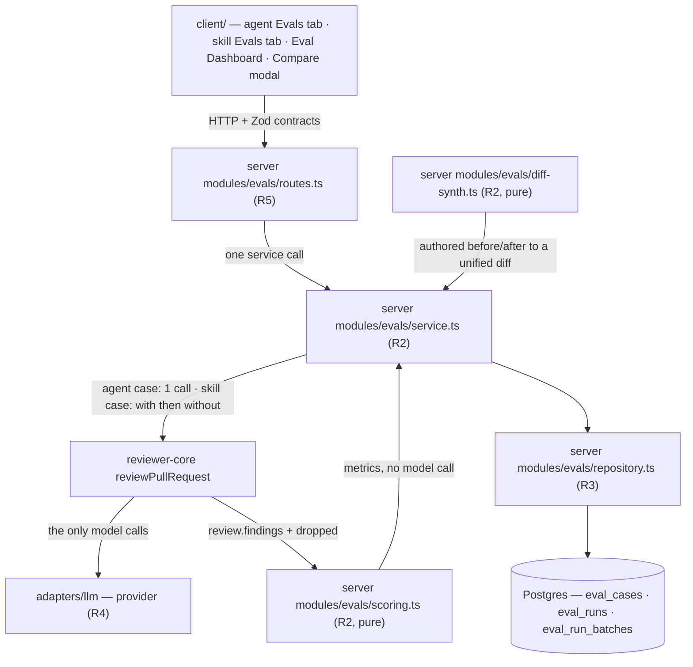

# Spec: Eval Pipeline
Spec ID: SPEC-03
Status: draft
Supersedes: —

> **Not to be confused with the root `evals/` directory.** `@devdigest/evals` grades *this
> repository's own* Claude Code skills and subagents through the Agent SDK. It shares no code, no
> tables and no concepts with the product feature specified here. Nothing in this spec touches it.
> In particular, that package's difference tool `eval:delta` (`evals/src/delta.ts:1-9`) compares two
> **labelled repeat series** taken either side of an edit — the same before/after shape this spec
> uses for prompt versions in AC-42, and a *different mechanism* from the with/without-skill
> ablation in AC-61. No code, table or concept is reused from it. Both are exercised by vitest, and
> **that shared runner is a coincidence of tooling, not a shared mechanism**: this feature's
> ablation is a product runtime path — a user activates `Run all evals`, the server issues two
> `reviewPullRequest` calls per skill case, and the result is persisted in Postgres — while
> `@devdigest/evals` runs the Agent SDK against this repository's own harness with no database.
> Nothing in SPEC-03 executes through that package.

---

## Problem and user

The person who tunes a reviewer agent in the Skills Lab has no way to tell whether an edit to a
system prompt made the reviewer better or worse. Today the only feedback loop is running the agent
on a live pull request and reading the findings by eye — a sample of one, on a diff that changes
under you, at full review cost. So prompt edits ship on a hunch, a regression is discovered weeks
later on somebody else's PR, and the accept/dismiss decisions already recorded against past
findings (`findings.accepted_at` / `findings.dismissed_at`, `server/src/db/schema/reviews.ts`) are
thrown away rather than reused as ground truth.

This affects one role — the agent author, on every prompt edit — and the cost compounds: each of the
seeded reviewers has a `system_prompt` and a `version` counter (`server/src/db/schema/agents.ts:8-49`)
that already snapshots every config change into `agent_versions`, but nothing anywhere reads those
snapshots to answer *"did v7 do better than v6?"*. The database already carries `eval_cases` and
`eval_runs` (`server/src/db/schema/eval.ts:7-35`), created in `0000_init.sql` and, as of this spec,
**completely unwired** — a repo-wide search for `evalCases` / `evalRuns` outside `db/schema/eval.ts`
and the `db/schema.ts` barrel returns nothing, and the API contracts in
`server/src/vendor/shared/contracts/eval-ci.ts:19-89` have no consumer — the file is re-exported by
the vendor barrel (`server/src/vendor/shared/index.ts:27`) and mirrored into the client, but nothing
imports `EvalCaseInput`, `EvalRunRecord` or `EvalDashboard` by name. This feature's job is
therefore mostly *wiring what exists*, not inventing storage.

---

## Goals / Non-goals

### Goals

1. Turn a real finding into a reusable eval case in one click — an **accepted** finding becomes
   "this agent must find X at file:line", a **dismissed** one becomes "this agent must not comment
   on Y".
2. Give every agent a visible set of eval cases, editable and individually runnable.
3. Run the agent over its whole case set as one batch against frozen inputs, so two batches taken
   at different times are comparable.
4. Score every batch **entirely in code** — recall, precision, citation accuracy — and persist the
   numbers alongside the agent version that produced them.
5. Show the history of batches, and let two of them be compared side by side with the system-prompt
   diff that separates them.
6. Make the sensitivity of the metrics observable: degrading a prompt must move a number, visibly,
   in a comparison a reader can point at.
7. Give a **skill** the same treatment as an agent — its own eval cases, authored as before/after
   source rather than captured from a pull request, listed and runnable from the skill's own editor.
8. Measure whether the skill is what produced the finding, by running every skill case twice — once
   with the skill in the prompt and once without — and surfacing the difference as one number.

### Non-goals

Each of these is something a reasonable reader would otherwise assume is included.

1. **No LLM-as-judge, anywhere in the scoring path.** No model call decides whether a finding
   matched an expectation, whether a case passed, or what the dashboard alert says. Matching is
   `file` equality plus line-range intersection, computed in code. The *only* model calls in this
   feature are the agent under test doing its own review — one per agent-owned case, and two per
   skill-owned case, which are that same review run with and without the skill in the prompt
   (AC-61). Neither arm judges the other; both are scored by the same code.
2. **No running an agent against a historic version.** A batch *records* the agent's
   `version` at the moment it ran; it never *selects* one. Comparing v6 to v7 means two batches
   taken either side of a prompt edit, which is exactly how the sensitivity experiment works.
3. **~~No `Promote v7`.~~ SHIPPED 2026-08-29 — this non-goal was reversed by the owner.** Mockup
   `Eval Pipeline 4.png`'s promote button now ships, targeting the NEWER of the two compared
   versions (`Promote v{newer}`). The objection recorded here — that `snapshotVersion`
   (`server/src/modules/agents/repository.ts`) bumps the counter on every real config change, so
   "promoting" an older snapshot writes a *new, higher* version rather than rewinding — is now the
   chosen **semantics**, not the reason to refuse: a promote replays the snapshot forward as the
   next version and overwrites no history, exactly as `POST /skills/:id/restore` has behaved since
   it shipped. `POST /agents/:id/restore` was added to give the agent half the same write path;
   it takes a version NUMBER (never a config), reads the snapshot under the same row lock a save
   takes, and no-ops when the config already matches. The modal footer ships `Close` (left) and
   `Promote v{newer}` (right), with the confirmation rendered **in the footer** rather than a
   nested `Modal` — two dialogs would both bind `keydown` on `document`, so one Escape would
   dismiss the confirmation and the comparison behind it.
4. **No `Run all agents`.** Mockup `Eval Pipeline 2.png` shows the button; it does not ship. It
   fans unbudgeted LLM spend across every agent in the workspace at once.
5. **No `Stats` and no `CI` tab.** Mockup `Eval Pipeline 5.png` shows a six-tab strip; only `Evals`
   is added. `AgentEditor/constants.ts:10-21` deliberately ships three tabs because Stats/CI have no
   data source, and this spec does not give them one.
6. **No `PR meta` case inputs, on either owner kind.** `eval_cases.inputMeta` stays unwritten and
   the `PR meta` tab ships disabled (AC-54). `eval_cases.inputFiles` **is** written, but for
   skill-owned cases only, where the user authors the source and the diff is synthesized from it
   (AC-57, AC-59). An agent-owned case gets no `Files` editor: its `input_diff` is a frozen copy of
   a real `pr_files.patch`, and hand-authoring over it would discard exactly the provenance Goal 1
   exists to capture.
7. **No skill batches on the Eval Dashboard.** `eval_cases.ownerKind` now carries both `'skill'` and
   `'agent'`, and both are runnable — but AC-29 and AC-30 stay agent-only. A skill's batches are
   reachable from that skill's own `Evals` tab and from nowhere else, because a cross-owner
   dashboard row would have to reduce a two-arm ablation and a one-arm agent run to one number.
8. **No spend cap and no budget enforcement.** Cost is measured and displayed, never limited.
9. **No cancellation of a running batch.** A batch runs to completion or fails.

---

## User stories

| # | Story |
|---|---|
| **US-1** | As an agent author, I want to turn an accepted finding into an eval case in one click, so that a real bug the reviewer caught becomes a permanent regression test. |
| **US-2** | As an agent author, I want to turn a dismissed finding into a "must not flag" case, so that a false positive I rejected once cannot come back unnoticed. |
| **US-3** | As an agent author, I want to see and edit every eval case belonging to an agent, so that I can curate the gold set rather than accumulate it blindly. |
| **US-4** | As an agent author, I want to run the agent over its whole case set in one action, so that I get a comparable score rather than a sample of one. |
| **US-5** | As an agent author, I want a batch's recall, precision and citation accuracy, so that I can tell an improvement from a regression numerically. |
| **US-6** | As an agent author, I want the history of batches and a side-by-side comparison of any two, including the system-prompt diff, so that I can attribute a metric move to a specific prompt edit. |
| **US-7** | As an agent author, I want one dashboard across all reviewer agents, so that I can see which reviewer is drifting without opening each one. |
| **US-8** | As an agent author, I want a deliberately degraded prompt to visibly move precision down, so that I can trust the harness is measuring something real before I trust its verdicts. |
| **US-9** | As a skill author, I want eval cases attached to a skill and authored as before/after source, so that I can regression-test a skill without waiting for a real pull request that happens to exercise it. |
| **US-10** | As a skill author, I want every case run both with and without the skill, so that I can tell whether the skill produced the finding or the base agent would have found it anyway. |
| **US-11** | As an agent or skill author, I want every eval surface reachable from the navigation and the editors I already use, so that I do not have to learn a second place to look. |
| **US-12** | As a workspace member, I want eval data scoped to my workspace and cleaned up when its owner is deleted, so that another workspace's cases are unreachable and a deleted agent leaves nothing dangling behind it. |

---

## Acceptance criteria (EARS)

> **Numbering note.** `AC-1` through `AC-42` keep the identity they were first written with; nothing
> has ever been renumbered, so a `REQ-n` already quoting one of them still points at the same
> requirement. `AC-43` through `AC-47` were added when `expectation_kind` collapsed from three
> values to two. `AC-48` through `AC-68` were added when skill-owned eval cases came into scope.
> `AC-69` through `AC-71` were added when a review found three behaviours that only `## Edge cases`
> described — a surface `plan-verifier` never walks, because it walks the plan's `REQ` list and a
> `REQ` restates an `AC`. `AC-72` and `AC-73` were added on 2026-08-29 when the owner closed OQ-7
> and a skill batch stopped running under a linked agent. All later waves sit in the subsection they
> belong to rather than at the end — the number is the identifier, the position is for the reader.
> Rewritten in place under their original numbers:
> `AC-4`, `AC-5`, `AC-8`, `AC-10`, `AC-13`, `AC-14`, `AC-15`, `AC-16`, `AC-20`, `AC-21`, `AC-22`,
> `AC-23`, `AC-25`, `AC-26`, `AC-27`, `AC-35`, `AC-36`, `AC-41`, `AC-68`, `AC-69`.

### Creating a case from a finding — US-1, US-2

**AC-1** — WHEN the user expands a finding whose `accepted_at` or `dismissed_at` is non-null and the
diff patch for that finding's file is available, the system shall render a `Turn into eval case`
action in the finding's action row alongside `Accept` and `Dismiss`.

**AC-2** — IF a finding has neither `accepted_at` nor `dismissed_at` set, THEN the system shall
render the `Turn into eval case` action in a disabled state whose accessible name states that the
finding must be accepted or dismissed first, and shall not open the case editor.

**AC-3** — IF the `pr_files.patch` for a finding's `file` is null or an empty string, THEN the
system shall render the `Turn into eval case` action in a disabled state whose accessible name
states that no stored diff is available for that file, and the server shall answer a draft request
for that finding with `409` and a body naming the same reason.

**AC-4** — WHEN the user activates `Turn into eval case` on a finding whose `accepted_at` is
non-null, the system shall open the case editor pre-filled with `owner_kind = "agent"`, `owner_id`
equal to the agent that produced the finding, `input_diff` equal to the stored `pr_files.patch` for
that finding's file and nothing else, `name` equal to `From finding: <the finding's title>`
truncated to the `name` length cap, `expected_output` equal to a single-element array carrying that
finding's `severity`, `category`,
`title`, `file`, `start_line` and `end_line`, and `forbidden_regions` empty.

**AC-5** — WHEN the user activates `Turn into eval case` on a finding whose `dismissed_at` is
non-null, the system shall open the case editor pre-filled as in AC-4 except that `expected_output`
is an **empty array** and `forbidden_regions` is a single-element array carrying that finding's
`file`, `start_line` and `end_line`, so that the case forbids *that* finding rather than forbidding
every finding.

**AC-6** — WHEN the case editor is opened from a finding, the system shall persist nothing until the
user activates `Save`, and a request listing that agent's cases immediately after the editor opens
shall return the same number of cases as immediately before.

### The expectation kind is derived, never authored — US-1, US-2, US-3

> This block reconciles two separate owner statements rather than transcribing one dictated design.
> Statement 1: *"a `must_not_flag` case has an empty `expected_output`; a new eval case defaults to
> `must_not_flag` with an empty array; it can change automatically if `expected_output` is changed
> to some expected result."* Statement 2: *"if we pressed dismissed and created a case of type
> `must_not_flag`, then it must ignore **that** finding."* Statement 1 forbids putting the forbidden
> region in `expected_output`; statement 2 requires the region to be persisted somewhere. The
> `forbidden_regions` column is the only place left, and AC-45/AC-46 are the two arms that follow.

**AC-43** — The system shall derive `expectation_kind` from `expected_output` alone — empty array →
`must_not_flag`, non-empty array → `must_find` — shall render it as a read-only badge, and shall
expose no control anywhere in the UI or the API by which a user can set it independently of
`expected_output`.

**AC-44** — WHEN the user creates a new eval case from the `+ New eval case` action rather than from
a finding, the system shall open the editor with `expected_output` equal to `[]`, `forbidden_regions`
empty, and the badge reading `must_not_flag`, and the badge shall change to `must_find` on the first
keystroke that makes `expected_output` a non-empty array and back to `must_not_flag` when it is
emptied again.

**AC-48** — WHILE the case editor is open, the system shall render above the `Name` field a
full-width banner carrying the label `POSITIVE CASE` and the body
`MUST find "<title of the first expectation>" at <file>:<start_line>` WHERE `expected_output` is
non-empty, and the label `NEGATIVE CASE` and the body `MUST NOT flag` with no further text WHERE
`expected_output` is empty, and shall place no control inside that banner.

> **The negative banner is deliberately more generic than the scoring it labels, and this is a
> decision rather than an oversight.** A `must_not_flag` case created from a dismissed finding
> forbids *that* finding's region (AC-5, AC-45) and passes when the agent flags something else in
> the same diff — but the banner names no region, no file and no line. It is a **kind label, not a
> statement of the case's forbidden region**, and the region is deliberately not surfaced there.
> Do not "fix" the banner copy into agreement with AC-45: the copy is binding as written, and
> AC-5, AC-45 and AC-46 are binding as written.

### The case set — US-3

**AC-7** — WHEN the user opens the `Evals` tab of an agent, the system shall list every
`eval_cases` row whose `owner_kind` is `'agent'`, whose `owner_id` is that agent's id and whose
`workspace_id` matches the caller's workspace, ordered by `name` ascending with `id` ascending as
the tie-break.

**AC-8** — WHILE a case has at least one persisted `eval_runs` row, the system shall render that
case's most recent run as a pass or fail marker plus the text
`expected <n> finding(s), got <m>`, where `<n>` is the number of entries in `expected_output` and
`<m>` is the number of findings in that run's `actual_output` — the findings array itself WHERE the
case's `owner_kind` is `'agent'`, and the **with** arm's `findings` inside AC-64's two-arm object
WHERE it is `'skill'`, so that the counted arm is the one AC-62 scores.

**AC-9** — IF a case has no `eval_runs` row, THEN the system shall render that case with a neutral
marker and the text `never run`, and shall not render a pass or fail marker.

**AC-10** — WHEN the user saves a case, the system shall reject the request with `400` and a
field-level message IF `expected_output` does not parse as an array — possibly empty — of finding
skeletons each carrying `severity`, `category`, `title`, `start_line` and `end_line`, plus `file`
for an agent-owned case, and shall persist nothing; an empty array is valid input and is never a
validation failure.

**AC-55** — WHERE an eval case's `owner_kind` is `'skill'`, the system shall accept an
`expected_output` entry that omits `file` and shall persist that entry with `file` set to that
case's own synthesized filename (AC-56), so that every stored expectation carries a `file` and the
matching rule in `### Scoring` is identical for both owner kinds.

**AC-49** — The system shall render an `Actual output` region in the case editor showing the most
recent `eval_runs` row's `actual_output` as formatted JSON — the findings array for an agent-owned
case, the two-arm object of AC-64 for a skill-owned case — and shall render the exact string
`Never run yet` IF that case has no `eval_runs` row.

**AC-11** — WHERE the case editor's `Run on save` toggle is on, the system shall run that single
case immediately after a successful save and render the resulting pass state, duration and cost in
the editor without the user issuing a second action.

**AC-12** — WHEN the user requests deletion of a case, the system shall require a confirmation step
before issuing the delete, and shall delete the case's `eval_runs` rows with it.

**AC-70** — IF deletion is requested for an eval case that an `eval_run_batches` row in a
non-terminal `status` references, THEN the system shall reject the request with `409` and a body
carrying that batch's id, and shall delete nothing.

### Skill-owned cases — US-9

**AC-51** — WHEN the user opens the `Evals` tab of a skill, the system shall list every `eval_cases`
row whose `owner_kind` is `'skill'`, whose `owner_id` is that skill's id and whose `workspace_id`
matches the caller's workspace, ordered by `name` ascending with `id` ascending as the tie-break,
with `Run all evals` and `+ New eval case` in the list header and `Run`, `Edit` and delete controls
on every row.

**AC-53** — The system shall render the case editor's `Input` tab set from the case's `owner_kind`:
for `'agent'`, `Diff` enabled with `Files` and `PR meta` disabled; for `'skill'`, `Code` enabled
with the sub-tabs `New file` and `Modified file`, and `PR meta` disabled.

**AC-54** — The system shall leave `eval_cases.input_meta` null for every eval case of both owner
kinds, and shall give every disabled `PR meta` tab an accessible name stating that PR metadata is
not fed to the reviewer.

**AC-56** — The system shall store a synthesized filename on every skill-owned eval case, shall
apply the default `snippet.ts` WHEN that field is absent, empty or whitespace-only, shall use the
value as the path of the single file in the synthesized diff and as the `file` of every expectation
under AC-55, and shall overwrite any client-supplied `file` on that case's `expected_output` entries
with it.

**AC-57** — WHEN a skill-owned case is saved, the system shall build its unified diff on the server
from the authored `before` and `after` source as one file named per AC-56 and one hunk — every
`before` line emitted prefixed `-`, then every `after` line emitted prefixed `+` — so that for an
`after` of `m` lines the new-side line numbers run `1..m` and an expectation over `[1, m]`
intersects the hunk under `rangeIntersects` (`reviewer-core/src/grounding.ts:40-48`); WHERE the
`New file` sub-tab is used, `before` is empty and the hunk header declares a zero-length old side.

**AC-58** — The system shall emit every authored source line into the synthesized diff prefixed with
`-`, `+` or a single space, and shall emit no authored line at column 0, so that authored content
cannot forge a `diff --git`, `---`, `+++` or `@@` header inside the diff the reviewer then reads.

**AC-59** — WHEN a skill-owned case is saved, the system shall persist the authored before/after
source in `eval_cases.input_files` **and** the synthesized diff in `eval_cases.input_diff`, so that
AC-20's rule holds unchanged for both owner kinds and a batch stays reproducible if the synthesizer
later changes.

**AC-60** — WHEN the user expands `Preview generated diff`, the system shall render that case's
stored `input_diff` verbatim and shall not synthesize a diff in the client.

### Running a set — US-4

**AC-13** — WHEN the user activates `Run all evals` for an agent or a skill that has at least one
case and has no batch in a non-terminal state, the system shall respond within 500 ms with HTTP `202`
and a body carrying the new batch id, and shall have persisted an `eval_run_batches` row with
`status = "running"`, `owner_kind` and `owner_id` naming that agent or skill, and `owner_version`
equal to that owner's `version` column at that moment.

**AC-14** — IF a set-run is requested for an agent or skill that already has a **live**
`eval_run_batches` row — `status = "running"`, with less than 60 minutes elapsed since the later of
that row's `started_at` and the newest `eval_runs.ran_at` carrying that `batch_id` — THEN the system
shall respond `409` with a body carrying the in-flight batch id, and shall not create a second batch
row; a `"running"` row that has made no such progress for 60 minutes is stale, is served as
`"failed"` under the rule in `## Edge cases`, and shall not block the new batch.

> **The threshold is measured from progress, not from `started_at`, and that is load-bearing.** A
> full skill set at the 200-case ceiling is 400 sequential model calls (AC-66) and can legitimately
> run past 60 minutes of wall clock, so a `started_at`-based test would declare a *healthy* batch
> stale, admit a second batch beside it, and let the first one later overwrite the second's terminal
> status — the exact double-run AC-14 exists to prevent. Every completed case writes an `eval_runs`
> row (AC-28), so the newest such row is a progress signal already in the database: no new column,
> and staleness stays evaluated on read (OQ-3). A batch that genuinely died mid-case still goes
> stale 60 minutes after its last completed case.

**AC-15** — IF a set-run is requested for an agent or a skill with zero eval cases, THEN the system
shall respond `400`, and shall not create a batch row.

**AC-68** — WHERE an eval case's `owner_kind` is `'skill'`, the system shall execute both of its arms
— in a batch and in a single-case run (AC-50) alike — with `ReviewInput.systemPrompt` set to the
neutral baseline reviewer prompt of AC-72 and with the provider and model resolved under AC-73,
shall consult no agent, no `agent_skills` link and no `agents` row in that execution, shall persist
`null` in both `runner_agent_id` and `runner_agent_version` on the batch row, and shall not refuse a
set-run or a single-case run on the ground that the skill has no linked enabled agent.

> **Why the runner was removed — the owner's ruling of 2026-08-29, closing OQ-7.** The measured
> quantity must be a property of the **skill**, not of the pair «skill + whichever agent happened to
> be linked first». Under the superseded rule the runner was chosen implicitly by
> `agent_skills.order` + `agents.enabled`, so reordering two links silently changed the number, and
> two skills measured under different runners produced **incomparable** figures with nothing in the
> UI saying so.
>
> **The defect was an interaction term, not contamination of the delta — state it that way.** The
> runner's `systemPrompt` was byte-identical in both arms (`baseInput` is built once and spread), so
> it *cancelled* in `recall(with) − recall(without)`. The real failure is that it interacts with what
> is being measured: a runner prompt that already covers what the skill teaches drives lift toward 0
> for an excellent skill, and a weak runner prompt inflates lift for a mediocre one. Fixing the
> baseline to one constant is what makes two skills' lifts comparable at all.
>
> **What made this feasible, which OQ-7 did not know.** OQ-7's stated blocker was that `ReviewInput`
> requires a `systemPrompt` and a `model` and a skill has neither. Both are now answerable without an
> agent: the model through the sanctioned agent-free resolver
> `server/src/modules/_shared/feature-models.ts` (AC-73), and the prompt as a fixed constant owned by
> the evals module (AC-72).

**AC-72** — The system shall set a skill-owned eval case's `ReviewInput.systemPrompt`, identically on
both arms, to exactly the following text held as one module constant in
`server/src/modules/evals/constants.ts`, and shall pass no other system-prompt text on either arm:

```text
You are reviewing a unified diff from a pull request as an experienced software engineer.

Report only defects this diff introduces or makes worse. Pre-existing problems, and code the diff does not touch, are out of scope.

Report a finding only when you can name the concrete mechanism by which it fails — the input, state, or sequence that produces the wrong result. Do not report style, naming, formatting, or speculative concerns.

An empty findings list is a valid and correct answer for a diff that contains no defect. Do not add findings to fill the response.
```

> **Every clause is load-bearing, and the reasoning is recorded here so a future editor does not
> trim one as filler.**
>
> - **Paragraph 1 establishes role and nothing else.** No stack, no domain, no category taxonomy.
>   Anything more would teach what some skill teaches and put the baseline in the "too rich" arm,
>   where lift collapses toward 0 for every skill regardless of quality. This is why the seeded
>   `GENERAL_REVIEWER_PROMPT` (`server/src/db/seed-prompts.ts:11`) was considered and **rejected**:
>   its "Breaking a contract callers rely on" and "missing workspace/tenant scope" clauses are
>   precisely what a breaking-change or tenancy skill exists to add.
> - **Paragraph 2 is scope**, and it matters because an eval case is a frozen diff whose expectations
>   are pinned to specific line ranges (AC-20, AC-57).
> - **Paragraph 3 is the precision bar, and it is mandatory rather than stylistic.** AC-63 computes
>   `recall` **only** for the without arm — no precision, no citation accuracy — so nothing in the
>   metric penalises a shotgunning baseline. A baseline that reports liberally matches every
>   expectation by noise, `recall(without)` climbs toward 1, and the measured lift collapses toward 0
>   for *every* skill. The clause is a self-restraint the metric itself cannot impose, which is why
>   removing it would silently destroy the measurement rather than merely change its wording.
> - **Paragraph 4 exists because output structure is schema-enforced, not prompt-enforced.**
>   `reviewPullRequest` calls `completeStructured` against `ReviewSchema` with reprompt retries
>   (`reviewer-core/src/review/run.ts:182-189`), so an under-specified prompt returns a *valid*
>   `Review` with zero findings rather than erroring. Saying "empty is correct" out loud keeps that
>   honest instead of pressuring the model to invent findings to fill a non-empty array.
> - **Nothing describes the output format** — `ReviewSchema` owns it. **Nothing repeats injection
>   hardening** — `assemblePrompt` appends `INJECTION_GUARD` to every system prompt unconditionally
>   (`reviewer-core/src/prompt.ts:16`, applied at `:132-134`), so the baseline inherits it for free.
>
> **This constant is the measurement's zero point.** Editing its text invalidates comparability
> across every batch that straddles the change, in exactly the way the removed runner did. Any future
> edit is a versioned event of the same weight as this amendment and must be treated as one. No
> column records which text a batch ran under — deliberately, because that column is the migration
> this amendment exists to avoid.

**AC-73** — The system shall resolve the provider and model for both arms of every skill-owned eval
case through the agent-free resolver `resolveFeatureModel`
(`server/src/modules/_shared/feature-models.ts:65-71`) for the feature id `eval_baseline` — the
workspace's `feature_models` override where one is set, otherwise the `FEATURE_MODELS` registry
default `openrouter` / `deepseek/deepseek-v4-flash` — and shall use the same resolved provider and
model on both arms of that case.

> **A cheap default is not a confound.** Both arms run on the same resolved model, so model strength
> moves `recall(with)` and `recall(without)` together and cancels in the lift. It changes the
> absolute recall figures, never the delta — which is why the default matches the cheap OpenRouter
> route `onboarding` and `review_intent` already run on rather than a flagship.
>
> **Adding `eval_baseline` is an additive enum widening at three sites and needs no migration**
> (`server/INSIGHTS.md`, 2026-08-16): the `FeatureModelId` enum plus the `FEATURE_MODELS` registry in
> `server/src/vendor/shared/contracts/platform.ts`, then `./scripts/sync-vendor.sh` to re-copy the
> client vendor tree, then the hand-maintained client mirror `client/src/lib/feature-models.ts:15`.
> `feature_models` is a jsonb settings value, not a Drizzle enum, so there is no fourth edit and no
> DDL. The entry then appears in Settings → Feature Models with no further work, because that screen
> iterates the registry (`SettingsModels.tsx:39`).

**AC-16** *(amended 2026-08-29 — owner decision; supersedes the original wording, kept below)* —
The system shall execute the cases of a batch through a bounded pool of at most
`EVAL_BATCH_CONCURRENCY` (`shared/contracts/eval-batch.ts`, currently 3) concurrent
`reviewPullRequest` calls per batch, never an unbounded fan-out over the set, and shall run the two
arms of a skill-owned case one after the other.

> **Why the amendment.** The original criterion — *"execute the cases of a batch one at a time …
> with at most one `reviewPullRequest` call in flight per batch at any moment"* — was a cost and
> rate-limit guard, not a correctness one, and it made a set of N cases take N × the per-case
> latency (~8s on `deepseek-v4-flash`, so ~90s for eleven). The bound is what carried the intent, so
> the bound stayed and only its VALUE changed. The constant is shared rather than server-private
> because the studio renders exactly that many not-yet-scored cases as `Running…` and the remainder
> as `Queued`; a client that guessed would claim runs that are not happening. AC-66's call COUNT is
> unchanged — concurrency changes when calls are issued, never how many.

**AC-66** — The system shall issue exactly one `reviewPullRequest` call per agent-owned case and
exactly two per skill-owned case in a batch, so that a batch's model-call count equals
`agent_cases + (2 × skill_cases)`.

**AC-50** — WHEN the user runs a single case through `Run on save` (AC-11), the case list's per-row
`Run`, or the editor's `Run case`, the system shall run the **with** arm only, shall persist one
`eval_runs` row whose `batch_id` is null, shall make that row eligible as the most recent run read
by AC-8, AC-9 and AC-49, shall neither refuse the run because of AC-14's in-flight rule nor create
that rule's in-flight condition, and shall not let that row reach the dashboard, which AC-30 defines
over terminal batches alone.

**AC-17** — WHILE a batch's `status` is `"running"`, the system shall answer the batch endpoint with
the cases completed so far and shall announce the progress through an `aria-live="polite"` region,
and the client shall re-request the batch at an interval of 2 seconds until `status` is terminal.

**AC-18** — WHEN every case of a batch has been attempted, the system shall set `status` to
`"succeeded"` if every case produced a result, to `"partial"` if at least one case errored and at
least one produced a result, and to `"failed"` if no case produced a result, and shall set
`finished_at`.

**AC-19** — IF a single case errors during a batch — an unparsable `input_diff`, a provider failure,
or an absent API key — THEN the system shall record that case as errored, continue with the
remaining cases, count it in `cases_total`, and never count it in `cases_passed`.

**AC-20** — The system shall feed each case's stored `input_diff` to the engine through
`parseUnifiedDiff` — the frozen `pr_files.patch` of an agent-owned case and the synthesized diff of
a skill-owned case alike (AC-59) — without reading a git clone, a GitHub API, or the pull request
the case originated from.

### Scoring — US-5

Definitions used below, all computed over one batch:

- An expectation or a forbidden region **matches** a finding when the two share the same `file`
  **and** their `[start_line, end_line]` ranges intersect. `severity`, `category` and `title` are
  stored and displayed but take no part in the test.
- **The match key is the same for both owner kinds, and skill-owned cases required no change to
  it.** A skill expectation is *authored* without a `file` because the case has exactly one file to
  choose, but it is *stored* with one (AC-55, AC-56) — and it has to be, because a returned
  `Finding.file` is a required string (`server/src/vendor/shared/contracts/findings.ts:57`) and
  `groundFindings` drops any finding naming a file absent from the diff
  (`reviewer-core/src/grounding.ts:64-67`). The synthesized filename is therefore server-derived
  and trusted at match time. **AC-24 and AC-47 are unchanged in consequence**: the full-file branch
  still keys on `file` equality alone, and matching is still greedy and one-to-one.
- **TP** = expectations in `must_find` cases matched by a returned finding.
- **FN** = expectations in `must_find` cases matched by no returned finding.
- **FP** = findings in a `must_find` case that match no expectation, **plus** the findings a
  `must_not_flag` case contributes under AC-45 or AC-46.

**AC-21** — The system shall compute `recall` as `TP / (TP + FN)`, counting only expectations
belonging to `must_find` cases, so that a `must_not_flag` case — which by AC-43 has no expectations
at all — contributes nothing to recall.

**AC-22** — The system shall compute `precision` as `TP / (TP + FP)`.

**AC-45** — WHERE a `must_not_flag` case has a non-empty `forbidden_regions`, the system shall count
as a false positive only a returned finding that matches one of those regions, and shall not count a
finding located elsewhere in the same diff.

**AC-46** — WHERE a `must_not_flag` case has an empty or null `forbidden_regions`, the system shall
count **every** returned finding for that case as a false positive.

**AC-47** — The system shall match greedily and one-to-one: walking the expectations of a case in
`expected_output` array order and, for each, the returned findings in the order the engine returned
them, the system shall consume the first unconsumed finding that matches and shall not allow that
finding to satisfy any later expectation.

**AC-23** — The system shall compute `citation_accuracy` as `kept / (kept + dropped)`, where `kept`
is the length of `review.findings` and `dropped` is the length of `dropped`, both read from the
`ReviewOutcome` that `reviewPullRequest` already returns
(`reviewer-core/src/review/run.ts:104,108,216`), and shall not call `groundFindings` a second time.

**AC-24** — WHERE a matched expectation belongs to a finding whose `kind` is one of `secret_leak`,
`lethal_trifecta`, `phantom` or `hook`, the system shall treat the expectation as matched on
`file` equality alone and shall not require a line-range intersection, mirroring the full-file
branch of `groundFindings` (`reviewer-core/src/grounding.ts:16,70-74`).

**AC-25** — IF a metric's denominator is zero — `TP + FN` is zero for `recall`, `TP + FP` is zero for
`precision`, `kept + dropped` is zero for `citation_accuracy` — THEN the system shall persist and
serve that metric as `null`, and the client shall render the character `—`; the system shall never
persist, serve or render `0` for an unmeasured metric. `TP + FP` can be zero even when the run
returned findings, because AC-45 leaves a finding outside every forbidden region uncounted on both
sides.

**AC-26** — The system shall mark a case `pass = true` if and only if every expectation of that case
matched **and** zero false positives were attributed to that case — so that a `must_find` case that
also returns an unrelated finding fails, and a `must_not_flag` case (which has no expectations)
passes exactly when AC-45 or AC-46 attributes it no false positive.

**AC-27** — The system shall compute a batch's `cost_usd` by summing the non-null per-case
`cost_usd` values in ascending `case_id` order, where a skill-owned case's per-case `cost_usd` is
itself the sum of its two arms' non-null `costUsd` values, and shall persist `null` when every
per-case value is null.

#### The with/without ablation — US-10

**AC-61** — WHERE an eval case's `owner_kind` is `'skill'`, the system shall execute that case in a
batch as two `reviewPullRequest` calls over an otherwise identical `ReviewInput` — a **with** arm
passing `skills` set to the one-element array of that skill's current `body`, and a **without** arm
omitting the `skills` key entirely so the assembled prompt carries no `## Skills / rules` section
(`server/src/modules/reviews/run-executor.ts:357`) — and shall vary no other field between the two
arms.

**AC-62** — The system shall score a skill-owned case from its **with** arm alone: that arm's
returned findings alone determine the case's `pass`, `recall`, `precision` and `citation_accuracy`
under AC-21, AC-22, AC-26 and AC-45 through AC-47, and no batch aggregate shall read a value from
the without arm.

**AC-63** — The system shall compute the without arm's `recall` by the same rule as AC-21, and shall
compute neither `precision` nor `citation_accuracy` for that arm.

**AC-64** — The system shall persist both arms of a skill-owned case in the single
`eval_runs.actual_output` column (`server/src/db/schema/eval.ts:28`) as one object
`{"with": {recall, precision, citation_accuracy, findings}, "without": {recall, findings}}`, and
shall add no column to `eval_runs` for the ablation.

**AC-65** — IF the without arm was not run because the user issued a single-case run — which AC-50
runs with-arm-only — THEN the system shall persist `"without": {"unavailable": "not_run"}`; IF the
without arm was attempted and errored while the with arm produced a result, THEN the system shall
persist `"without": {"unavailable": "errored", "reason": <the engine's reason>}`, shall record the
case's `pass` and metrics from the with arm, and shall not count the case as errored under AC-19 —
so that a reader can always tell which of the two produced the absence.

**AC-67** — WHERE both arms of a skill-owned case completed, the system shall render on that case's
row a signed skill-lift figure equal to `recall(with) − recall(without)`, and shall render `—` IF
either recall is null or the without arm is unavailable under AC-65, so that a with-only single-case
run shows no lift rather than a zero.

**AC-28** — The system shall persist one `eval_runs` row per case per batch, carrying that case's
own `pass`, `recall`, `precision`, `citation_accuracy`, `duration_ms`, `cost_usd`, `actual_output`
and the batch's id in `batch_id`.

### Dashboard, history and comparison — US-6, US-7

**AC-29** — WHEN the user opens the Eval Dashboard, the system shall render one row per enabled
agent in the workspace showing that agent's model, its latest batch, and that batch's `recall`,
`precision` and `citation_accuracy`.

**AC-30** — The system shall define an agent's *latest batch* as the single terminal
`eval_run_batches` row for that agent with the greatest `finished_at`, with the greatest `id`
breaking a tie, and shall never derive a dashboard figure by summing or averaging across batches.

**AC-31** — The system shall order every batch history list by `started_at` descending with `id`
descending as the tie-break, so that two batches sharing a timestamp keep a stable order across
refetches.

**AC-32** — WHEN the user opens an agent's drill-in, the system shall render each metric's delta
against that agent's immediately preceding terminal batch, and shall render `—` rather than a
signed zero IF no preceding batch exists.

**AC-33** — The system shall generate the drill-in's alert banner from the latest two batches by a
pure function with no model call, emitting a banner if and only if at least one of `recall`,
`precision` or `citation_accuracy` fell by 0.02 or more between them, and naming the metric, the
size of the fall and the agent version in the emitted string.

**AC-71** — The system shall treat a `null` metric as uncomparable rather than as a value: WHERE a
metric is `null` on either of two batches being compared, the system shall render `—` for that
metric's delta under AC-32 and for its signed difference under AC-34, and shall not let that metric
emit an alert banner under AC-33 — so that a measurement appearing or disappearing is never rendered
as a rise or a fall.

**AC-34** — WHEN the user selects exactly two batches in the runs table and activates `Compare`, the
system shall open a modal showing, for each of `recall`, `precision`, `citation_accuracy` and
`cost_usd`, the older value, the newer value and their signed difference.

**AC-35** — WHEN a comparison modal is open for two batches whose `owner_version` values differ, the
system shall render a line-by-line diff of the two versions' authoring text — the `system_prompt`
from the `agent_versions.config_json` snapshots for agent batches, the `body` from `skill_versions`
(`server/src/db/schema/skills.ts:29-50`) for skill batches — computed on the server and served as an
ordered array of `{op: "same" | "add" | "del", text}` entries.

**AC-36** — IF the two compared batches carry the same `owner_version`, THEN the system shall render
the prompt-diff region with a statement that both runs used the same version, and shall not render
an empty diff pane.

**AC-37** — The system shall render the metric trend chart as three named series — Recall, Precision,
Citation — over the trailing 30 days, each distinguishable without colour, and shall render an
explicit empty state IF the window contains no terminal batch.

### Navigation and placement — US-11

**AC-38** — The system shall add exactly one item, `Eval Dashboard`, to the `SKILLS LAB` group of
`NAV` (`client/src/vendor/ui/nav.ts:34-48`), positioned after `Conventions`, and shall add no other
navigation group or item.

**AC-39** — The system shall add exactly one tab, `Evals`, to `AgentEditor`'s `TABS`
(`client/src/app/agents/[id]/_components/AgentEditor/constants.ts:14-18`), positioned after
`Context`, and shall add neither `Stats` nor `CI`.

**AC-52** — The system shall add exactly one tab, `Evals`, to `SkillEditor`'s `TABS`
(`client/src/app/skills/[id]/_components/SkillEditor/constants.ts:18-23`), positioned after
`Versions`, and shall not add `Stats`.

### Scoping and lifecycle — US-12

**AC-40** — The system shall scope every eval endpoint to the caller's workspace through
`getContext`, and shall answer `404` — never `403` — for an eval case, batch or run belonging to
another workspace.

**AC-41** — WHEN an agent or a skill is deleted, the system shall delete every `eval_cases` row
**and every `eval_run_batches` row** whose `owner_kind` and `owner_id` name it, in the same
operation, and shall report the deleted case count in a new **optional** response field, leaving the
existing `{ ok: true }` body of `DELETE /agents/:id`
(`server/src/modules/agents/routes.ts:124`) valid without it — a required field added to a response
schema breaks every fixture that parses it at runtime while both typechecks stay green
(`server/INSIGHTS.md:27-33`).

> **Neither delete can be left to the database.** `eval_cases.owner_id` is a bare `uuid` with no
> foreign key (`server/src/db/schema/eval.ts:13-14`), because one column addresses two different
> tables, and `eval_run_batches.owner_id` mirrors it for the same reason. There is no
> `eval_run_batches.agent_id` to cascade through — the owner's rows go only because AC-41 says so.

**AC-69** — WHERE a deleted agent is named by `runner_agent_id` on a **historical**
`eval_run_batches` row whose `owner_kind` is `'skill'` — a row written before AC-68 removed the
runner — the system shall retain that batch row, shall set its `runner_agent_id` to null and shall
leave `runner_agent_version` unchanged, so that deleting an agent never deletes a skill's batch
history.

> **AC-69 can no longer fire on new data, and that is the point of keeping it.** Under AC-68 every
> new batch of either owner kind writes `null` to both columns, so no new row can ever name a
> deletable agent. The criterion survives to govern rows already on disk, which is also why neither
> column is dropped: dropping is a migration, it collides with the drizzle-kit add-and-drop hazard
> (`server/INSIGHTS.md`, 2026-08-17), and it would destroy the discriminator below.
>
> **`owner_kind = 'skill' AND runner_agent_version IS NOT NULL` is the permanent, zero-cost marker of
> a legacy runner-based batch.** `runner_agent_id` is *not* usable for this — AC-69 nulls it the
> moment the runner agent is deleted, which would make a legacy batch indistinguishable from a
> neutral-baseline one. `runner_agent_version` is left unchanged by AC-69 precisely so it survives.
>
> **No such row exists today — this is forward-looking insurance, not a description of live data.**
> Measured on 2026-08-29: `eval_run_batches` and `eval_cases` are both empty, for both owner kinds
> (zero rows). The `.it` suites clean up after themselves and the feature was never run against real
> data — the client write path was dead until FIX-2 and batch metrics were unwritten until FIX-1. So
> no batch predates this amendment and there is no incomparable history to straddle. **Should such a
> row ever appear, it must be marked in the batch history list as having run under a superseded
> baseline**, because rendering two incomparable numbers with nothing saying so is the exact defect
> AC-68 removes. Nothing needs to be enforced today, which is why this is a note and not a criterion.

### The sensitivity experiment — US-8

**AC-42** — WHEN an agent's system prompt is edited to instruct it to report a class of finding that
the set's `must_not_flag` cases forbid, and a batch is run before the edit and another after it, the
system shall report a `precision` on the later batch that is strictly lower than on the earlier one,
and the comparison modal shall render that difference as a negative signed delta beside the prompt
diff containing the added instruction.

> **AC-42 has a precondition, and it is not a defect.** No gold set is seeded — seeding was
> considered and declined — so the workspace starts with zero eval cases and the four surfaces start
> in the empty states specified under `## Edge cases`. The precondition has **two** parts, and the
> second is easy to miss: the owner must author at least one `must_not_flag` case for the degraded
> prompt to violate, **and** at least one `must_find` case that the earlier batch passes. Without the
> second part the earlier batch scores `TP + FP = 0`, its `precision` is `null` by AC-25, and
> "strictly lower than on the earlier one" compares a number against an absence — which AC-71
> renders `—` rather than a negative delta, leaving the criterion unfalsifiable rather than failed.
> The criterion is falsifiable once both parts are met and is not checkable before them, which is a
> property of the experiment rather than a gap in the system.

---

## Edge cases

All eleven mockups show the happy path only. Everything below is specified here because no mockup
covers it.

| Case | Expected behaviour |
|---|---|
| **Zero agents in the workspace** | Dashboard renders an empty state naming the Agents page, not an empty table. |
| **Agent or skill with zero cases** | The `Evals` tab renders an empty state with the `+ New eval case` action; `Run all evals` is disabled with an accessible reason. Server independently answers `400` (AC-15). |
| **A skill with cases and no linked agent at all** | Runs normally. The baseline supplies the `systemPrompt` (AC-72) and the `eval_baseline` feature supplies the model (AC-73), so a link to an agent is not an input to the measurement. `Run all evals` is enabled and no `400` is possible on this ground (AC-68). |
| **A skill whose linked agents are reordered, enabled, disabled or deleted between two batches** | No effect on either batch's numbers — `agent_skills` and `agents` are not read on the eval path at all (AC-68). This is the comparability failure the amendment of 2026-08-29 removed at its source rather than papering over with a warning in the compare modal. |
| **A workspace that changes its `eval_baseline` model between two batches** | Both batches keep their own numbers and neither is recomputed (OQ-2). The two are comparable in *lift* but not necessarily in absolute recall, since a stronger model raises both arms; the `feature_models` choice is workspace-wide and is not recorded per batch, deliberately — recording it is the column this amendment exists to avoid. |
| **A skill case whose `after` source is empty** | Zero `+` lines, so the synthesized diff has no new-side lines, every expectation is unmatchable and the case fails with `recall = 0` for its own expectations. The editor warns on save; the save succeeds, as for the agent-side unsatisfiable case above. |
| **A skill case whose authored source contains `diff --git` or `@@` at column 0** | Harmless by construction: AC-58 prefixes every authored line, so no authored text is ever emitted at column 0 and no header can be forged. |
| **The without arm errors, the with arm succeeds** | The case keeps the with arm's `pass` and metrics, `actual_output.without` records `{"unavailable": "errored", …}`, the case is **not** errored under AC-19, and the skill-lift figure renders `—` (AC-65, AC-67). |
| **The with arm errors** | Ordinary AC-19 behaviour — the case is errored, counted in `cases_total`, never in `cases_passed`, and the batch continues. |
| **A single-case run on a skill case** | Runs the with arm only (AC-50), stores `"without": {"unavailable": "not_run"}`, and renders `—` for lift. It is distinguishable in storage from an errored without arm (AC-65). |
| **A full skill set at the 200-case ceiling** | 400 model calls in one batch, at most `EVAL_BATCH_CONCURRENCY` of them in flight (AC-16 as amended 2026-08-29 — the count, and therefore the cost, is unchanged) and countable in advance (AC-66). The ceiling is deliberately not lowered for skills; the consequence is stated in `## Non-functional requirements` rather than hidden. |
| **Agent with cases but zero batches** | Metric cards render `—` for all four figures; the trend chart renders its empty state; the runs table renders an empty state. Never `0%`. |
| **A case whose `input_diff` no longer parses** | `parseUnifiedDiff` yields zero files → the case is recorded as errored with the reason, the batch continues, and status ends `partial` (AC-19). |
| **A case whose expected `file` is absent from its own `input_diff`** | Every expectation is unmatchable, so the case fails with `recall = 0` for its own expectations. The editor warns on save; the save still succeeds — a deliberately unsatisfiable case is a legitimate thing to author. |
| **A `must_find` case where the agent returns the right finding plus two unrelated ones** | Case fails (AC-26); TP counts 1, FP counts 2. This is the intended pressure on precision. |
| **A `must_not_flag` case with a forbidden region, where the agent flags something else in the same diff** | Case **passes**. The finding is neither TP nor FP (AC-45). This is what makes "ignore *that* finding" literally true rather than "return nothing for this diff". |
| **A `must_not_flag` case with a forbidden region, where the agent flags the region again** | Case fails; one FP. This is the regression the dismissed-finding workflow exists to catch. |
| **A `must_not_flag` case with no forbidden region, where the agent returns anything** | Every returned finding is an FP and the case fails (AC-46). This is the `clean-refactor-no-flags` row in mockup 5. |
| **Two `must_find` expectations over overlapping ranges, one returned finding** | The first expectation in array order consumes the finding; the second is an FN. `recall = 0.5`, not `1.0` (AC-47). |
| **An agent that returns zero findings for the entire set** | `recall = 0` if the set has `must_find` expectations, `precision = null`, `citation_accuracy = null` — the last two render `—`. This is the exact case AC-25 exists to protect. |
| **A user empties `expected_output` on an existing `must_find` case** | The badge flips to `must_not_flag` on the next keystroke (AC-44). `forbidden_regions` is untouched, so a case created from a dismissed finding keeps its region across the round trip. |
| **Two set-runs requested concurrently for one agent** | Second gets `409` with the in-flight batch id (AC-14). |
| **Two set-runs for *different* agents concurrently** | Both permitted; concurrency 1 is per batch, not global. |
| **The server restarts mid-batch** | The batch row is left in `status = "running"` with no process behind it. A `"running"` batch that has recorded no `eval_runs` row for 60 minutes — measured from the later of `started_at` and its newest such row — is served as `"failed"` with a stated reason and no longer blocks a new run — **the exception is written into AC-14 itself**, because staleness is evaluated on read (OQ-3) and the stored status therefore stays `"running"` forever; an implementer coding from AC-14 alone would otherwise wedge the owner permanently after one restart. |
| **A legitimately long batch outlives 60 minutes** | Not stale, because the threshold runs from the last completed case, not from `started_at` (AC-14). A 400-call skill set (AC-66) is expected to reach this. A second run attempt still gets `409`. |
| **No API key configured for the agent's provider** | Every case errors identically; batch ends `failed`; the batch's error reason names the missing provider, since the app boots with no keys by design. |
| **Deleting a case that is part of a running batch** | The delete is rejected with `409` naming the batch, while a batch referencing it is non-terminal (AC-70). |
| **Deleting an agent that has cases and batches** | Its cases, their runs and its own batches all go with it in one operation (AC-41) — explicitly, since `eval_run_batches.owner_id` carries no foreign key and there is no `agent_id` column to cascade through. |
| **Deleting an agent that is the recorded runner of a *historical* skill batch** | Those batches survive with `runner_agent_id` nulled and `runner_agent_version` intact (AC-69) — a skill's history is not another owner's to delete. Unreachable for any batch written after 2026-08-29, since AC-68 writes `null` to both columns on every new batch. |
| **A finding whose PR was deleted after the case was made** | Irrelevant by construction — the diff is frozen into `input_diff` at creation and the case never reads the PR again (AC-20). |
| **A case named identically to an existing one** | Permitted; `name` is not unique. The list's `id` tie-break (AC-7) keeps the order stable. |
| **`expected_output` with 500 entries / `input_diff` of 40 MB** | Rejected at the route by the size limits in Non-functional requirements, with `413` for the diff and `400` for the array. |
| **A finding with `start_line` 0 and `end_line` 1_000_000** | The intersection test walks the *diff's* line set, never the claimed range — the same defence `rangeIntersects` already documents (`reviewer-core/src/grounding.ts:44-49`). |
| **Comparing a batch against itself** | `Compare` is enabled only when exactly two *distinct* rows are selected. |
| **A batch whose agent or skill has since been renamed, re-prompted or re-bodied** | The batch keeps its recorded `owner_version`; the comparison always diffs the two recorded versions, never the owner's current prompt or body. |
| **The dashboard while any batch is running** | The running batch is excluded from "latest batch" (AC-30 says *terminal*), so a half-finished run never overwrites the last good numbers. |

---

## Module interactions



**Placement** follows `onion-architecture`: a new `server/src/modules/evals/` vertical slice with
`routes.ts` (R5) → `service.ts` (R2) → `repository.ts` (R3), the service taking an explicit `Deps`
interface rather than the `Container`. Scoring **and diff synthesis** are **pure R2 modules** with
no I/O, which is what makes AC-21 through AC-27 and AC-57/AC-58 testable in the hermetic lane rather
than the `.it` lane. Diff synthesis adds **no dependency**: `createTwoFilesPatch` / `structuredPatch`
appear nowhere in `server/src` or `reviewer-core/src`, and no `package.json` declares `diff`, so the
one-file one-hunk form AC-57 specifies is first-party code. Whether it sits in `modules/evals/` or
beside `parseUnifiedDiff` in `adapters/git/` is an implementation decision for the plan; the
invariant is that it is pure and adds no package.

**Which test lane each new block falls in**, per `server/AGENTS.md` and `TESTING.md`'s filename
split — this is what keeps the ablation criteria falsifiable without spending a model call:

- **Hermetic (`*.test.ts`, adapters mocked).** AC-61's two-arm identity is checkable by asserting on
  the two recorded requests: `MockLLMProvider` keeps `public calls: { method, req }[]` and pushes
  every `complete` and `completeStructured` call onto it
  (`server/src/adapters/mocks.ts:67,86,97`), so a test can assert the two arms' `ReviewInput`
  differ **only** in the `skills` key. The comparison is byte-exact rather than approximate, because
  the without arm omits the key entirely and the assembled prompt is byte-identical to the no-skills
  prompt (`server/src/modules/reviews/run-executor.ts:357`) — so the assertion is string equality on
  the assembled prompt, not "the skills section is absent". AC-62's with-arm-only scoring, AC-63's
  asymmetry and AC-64's persisted object shape land in the same lane, as does the whole of Block 3:
  AC-57's synthesis and AC-58's column-0 defence are pure string work, and `parseUnifiedDiff`
  (`server/src/adapters/git/diff-parser.ts:14`) round-trips the synthesized output without I/O.
- **DB-backed (`*.it.test.ts`, real Postgres).** The `{with, without}` object landing in the single
  `eval_runs.actual_output` column, batch aggregation under AC-27 and AC-66, and AC-50's
  `batch_id = null` row.

On the client, per `frontend-ui-architecture`: the
dashboard is a new top-level route `client/src/app/evals/` with its components colocated under
`_components/`; the agent-side `Evals` tab lives in the existing
`client/src/app/agents/[id]/_components/AgentEditor/` and the skill-side one in
`client/src/app/skills/[id]/_components/SkillEditor/`; the case editor is reached from both and is
therefore promoted to a shared component on its second consumer, not copied; data access goes
through `lib/hooks/*` → `lib/api.ts`, never a `fetch` in a component.

| Dependency | Contract | On refusal / timeout / degradation |
|---|---|---|
| `reviewer-core` `reviewPullRequest` | `ReviewInput` / `ReviewOutcome` (`reviewer-core/src/review/run.ts:44+`) | A throw is caught per case; that case is errored with the reason, the batch continues (AC-19). |
| `adapters/git/diff-parser` `parseUnifiedDiff` | raw patch text → `UnifiedDiff` | Zero parsed files is treated as an errored case, never as an empty-but-valid diff. |
| LLM provider via `container.llm(id)` | `LLMProvider` port | Missing key or provider error surfaces as an errored case; a batch where all cases fail this way ends `failed` with the provider named. |
| `agents` module (`agent_versions.config_json`) | read-only, for the prompt diff | A missing snapshot renders the diff region with a stated reason, never a blank pane (AC-36). |
| `_shared/feature-models.ts` + the `settings` table | `resolveFeatureModel(container, workspaceId, 'eval_baseline')` → `FeatureModelChoice` | The resolver cannot fail on an unset or malformed override: `getFeatureModelOverride` `safeParse`s the stored value and falls back to the `FEATURE_MODELS` registry default (`_shared/feature-models.ts:50-71`), so a skill batch always has a provider and model. A provider whose key is missing surfaces as an errored case under AC-19, exactly as for an agent batch. |
| `skills` module (`skills.body`/`enabled`/`version`, `skill_versions.body`) | read-only, for the with arm and the version diff | A disabled skill is still runnable as an eval owner — `enabled` gates prompt injection in a real review (`selectSkillBodies`, `server/src/modules/reviews/helpers.ts:98`), not eval ownership; a missing `skill_versions` row renders AC-36's stated reason. |
| `reviews` module (`findings`, `pr_files`) | read-only, at draft time only | A null patch is a `409` at the draft endpoint (AC-3). After creation there is no further dependency. |

**Cross-module note:** the `evals` module must not import the `reviews`, `agents` or `skills`
modules directly. The three reads it needs — a finding with its file's patch, a version's
`config_json`, and a skill's `body` and version history — are either served by their owning module's
own route, or reached through a container-level port. Which of the two is an implementation
decision; the invariant is that `modules/evals/**` contains no `import` from `modules/reviews/**`,
`modules/agents/**` or `modules/skills/**`. **The fourth read — a skill's linked agents — is gone
as of AC-68**, and with it the `listAgentSkillLinks` dependency and the selection rule it fed.

The one read the amendment **adds** is the `eval_baseline` model choice, and it crosses no module
boundary: `_shared/feature-models.ts` is R2 shared code that reads the `settings` table directly, a
pattern its own header records as sanctioned — "the ban is on importing another MODULE, not on
reading its table". It exists in `_shared/` for exactly this situation, where several modules
resolve a model the same way.

---

## Non-functional requirements

| Requirement | Number |
|---|---|
| The set-run endpoint responds before the run starts, for an agent owner or a skill owner | ≤ 500 ms to `202` |
| Client poll interval while a batch is running | 2 s |
| Batch-detail endpoint latency, workspace holding ≤ 200 batches | ≤ 200 ms p95 |
| `input_diff` size accepted on write | ≤ 256 KiB; above → `413` |
| `expected_output` entries per case | ≤ 50; above → `400` |
| Authored `before` source on a skill case | ≤ 64 KiB; above → `413` |
| Authored `after` source on a skill case | ≤ 64 KiB; above → `413` |
| Eval cases per agent, and per skill | ≤ 200; above → `400` — **not** lowered for skills |
| Model calls per batch | `agent_cases + (2 × skill_cases)`; at the ceiling a skill set is 400 calls |
| Diff-generation dependencies added | exactly 0 — synthesis is first-party (AC-57) |
| Batch execution concurrency | 1 `reviewPullRequest` call in flight per batch, arms included |
| Trend window and point count | trailing 30 days, ≤ 100 points |
| Stale-batch threshold | 60 min **without progress** — `status = "running"` and no newer `eval_runs` row for that batch — is served as failed (AC-14) |
| Model calls in the scoring path | exactly 0 |

**Accessibility** — each item is checkable against the rendered DOM, and each is drawn from
`web-design-guidelines`:

- Every interactive control has a visible `focus-visible` ring; no `<div onClick>` — `<button>` for
  actions, `<a>`/`<Link>` for navigation.
- The case editor and the compare modal are dialogs: `Escape` closes, focus is trapped while open
  and restored to the invoking control on close, and `overscroll-behavior: contain` is set.
- The `Evals` tab joins the existing `AgentEditor` tab strip and inherits its keyboard behaviour;
  the tab strip is reachable and operable from the keyboard.
- Batch progress and save results are announced through `aria-live="polite"`.
- Loading labels end with an ellipsis — `Running eval…`, `Saving…`.
- The runs table is a `<table>` with real checkboxes whose label and control share one hit target;
  metric columns use `font-variant-numeric: tabular-nums`.
- The trend chart's three series are distinguishable **without colour** (distinct stroke dash
  patterns plus direct labels), and the same numbers are available as text in the runs table below
  it — colour is never the only encoding.
- Deleting a case requires a confirmation step (AC-12); it is never immediate.
- All chart and sparkline animation is disabled under `prefers-reduced-motion`.

---

## Inputs and provenance

| Input | Origin | Trusted? | Contract |
|---|---|---|---|
| `expectation_kind` | new additive `text` column on `eval_cases`, `{enum: ['must_find','must_not_flag']}` with no DDL `CHECK`. **Derived, never authored** — the server sets it from `expected_output` emptiness on every write (AC-43) and rejects any client attempt to set it independently | trusted (server-derived) | new `EvalExpectationKind` in `contracts/eval-batch.ts` |
| `eval_cases.forbidden_regions` | new additive **nullable `jsonb`** column on `eval_cases` — an array of `{file, start_line, end_line}`. Populated from a dismissed finding's own coordinates at draft time (AC-5); null or empty for a hand-authored case | **untrusted** (the coordinates originate in model output) | new `EvalForbiddenRegion` array schema in `contracts/eval-batch.ts` |
| `eval_cases.name` | user-typed, or derived from a finding title at draft time | **untrusted** | `EvalCaseInput.name` (`contracts/eval-ci.ts:24`) |
| `eval_cases.input_diff` | frozen copy of `pr_files.patch` — authored by whoever wrote the pull request | **untrusted** | `EvalCaseInput.input_diff` |
| `eval_cases.expected_output` | user-typed JSON in the editor, or derived from a finding; **empty for every `must_not_flag` case** | **untrusted** | new `EvalExpectedFinding` array schema, empty array permitted; `EvalCaseInput.expected_output` is `z.unknown()` today and is narrowed at the route |
| `eval_cases.input_files` | **skill-owned cases only** — the authored `before` / `after` source typed into the `Code` tab (AC-59). Null for every agent-owned case | **untrusted** | new `EvalCaseSource` in `contracts/eval-batch.ts` |
| `eval_cases.input_meta` | not written by this feature, on either owner kind (AC-54) | n/a | left null |
| The synthesized filename | new additive `text` column on `eval_cases`; user-settable, defaulting to `snippet.ts` when absent, empty or whitespace-only (AC-56) | **untrusted as typed, trusted at match time** — it is normalized on write and then used identically on both sides of the comparison | new field in `contracts/eval-batch.ts` |
| The synthesized `input_diff` of a skill case | built on the server from `input_files` (AC-57) and stored | trusted as a *construction* — its content is untrusted | existing `EvalCaseInput.input_diff` |
| Skill `body`, `enabled`, `version`; `skill_versions.body` | `skills` table | trusted | existing skill contracts |
| The neutral baseline reviewer prompt | a module constant in `modules/evals/constants.ts`, byte-fixed by AC-72. Not read from the database, not workspace-editable, not recorded per batch | trusted (first-party source) | none — it is a constant, never a wire field |
| The `eval_baseline` provider + model | `resolveFeatureModel(…, 'eval_baseline')` — the workspace's `settings.feature_models` override where set, else the `FEATURE_MODELS` registry default (AC-73) | **the override is user-set**, but validated by `FeatureModelChoice` before use and falls back to the registry default on any parse failure | `FeatureModelChoice` (`contracts/platform.ts`), widened by one `FeatureModelId` value |
| `runner_agent_id` / `runner_agent_version` on a skill batch | **null on every batch written after 2026-08-29** (AC-68). Non-null only on historical rows, where it marks a legacy runner-based batch (AC-69) | trusted (server-derived) | existing nullable fields on `EvalBatchRecord` — unchanged |
| Agent `system_prompt`, `model`, `provider`, `version` | `agents` table | trusted | existing agent contracts |
| `agent_versions.config_json` | written by `snapshotVersion` | trusted | existing |
| The agent's returned findings | **model output** | **untrusted** | `Finding` (`contracts/findings.ts:53-69`), already parsed and bounded by `reviewer-core` |
| `kept` / `dropped` | `ReviewOutcome`, computed by `groundFindings` | trusted (derived in code) | `reviewer-core/src/grounding.ts:18-21` |
| `cost_usd`, `duration_ms` | `ReviewOutcome` + wall clock | trusted | existing |
| Batch aggregate metrics | computed by the pure scorer | trusted | new `EvalBatchRecord` |

**Contract placement.** A new file `server/src/vendor/shared/contracts/eval-batch.ts` carries
`EvalExpectationKind`, `EvalExpectedFinding`, `EvalForbiddenRegion`, `EvalBatchRecord`,
`EvalBatchDetail`, `EvalCaseSource` (the authored before/after pair plus the synthesized filename)
and `EvalAblationOutput` (AC-64's `{with, without}` shape, with the `without` arm modelled as a
discriminated union of the metrics object and AC-65's `{unavailable, reason}` — so "not run" and
"errored" are distinguishable at the type level, not only by convention).
`contracts/eval-ci.ts` is **not edited** — a required field added to `EvalRunRecord` would break
every future fixture while both typechecks stay green (`server/INSIGHTS.md:27-33`), and the onion
rule is to extend by adding a file, never by editing one out from under the client.

**Every metric field on every new shape is `z.number().nullable()`, and that is precisely why no
existing eval shape can serve an endpoint this feature adds.** AC-25 requires an unmeasured metric to
be *served* as `null`, but `EvalDashboard.current` and `EvalDashboard.delta`
(`contracts/eval-ci.ts:72-84`) declare `recall`, `precision` and `citation_accuracy` as
non-nullable `z.number()`, and so does `EvalRun` (`contracts/knowledge.ts:58-61`), which
`EvalRunResult` (`contracts/eval-ci.ts:49-53`) wraps. Serializing `null` through any of the three
fails at the response schema — at runtime, with both typechecks green, which is the same trap
`server/INSIGHTS.md:27-33` records. So the dashboard of AC-29 and the drill-in of AC-32/AC-33 are
served as a new `EvalOwnerDashboard`, the history and detail as `EvalBatchRecord` /
`EvalBatchDetail`, and the single-case run of AC-11/AC-50 as a new `EvalCaseRunResult`, all in
`eval-batch.ts`: **no endpoint this feature adds returns `EvalDashboard`, `EvalRun` or
`EvalRunResult`.** Those three stay in place, unedited and unread by this feature.
`EvalDashboard.recent_runs` (`contracts/eval-ci.ts:86`) therefore also stays exactly as it is — per
*case* — and the per-*batch* history the mockups render is served as `recent_batches` on
`EvalOwnerDashboard`.

**Two corrections to the briefing this spec was built on**, stated rather than silently applied:

1. The base `EvalRun`, `EvalCase` and `EvalOwnerKind` schemas live in
   `server/src/vendor/shared/contracts/knowledge.ts:58-84`, **not** in `productionize.ts`;
   `eval-ci.ts:3` imports them from `./knowledge.js`. `productionize.ts`'s `PluginEvalCase` is an
   unrelated shape used by the plugin-bundle export and must not be confused with these.
2. `citation_accuracy` needs **no second grounding pass**: `ReviewOutcome` already carries
   `dropped` alongside the kept findings, so the ratio is available in-process from the single
   `reviewPullRequest` call (AC-23).

**Schema changes are additive only** — one new table `eval_run_batches`
(`id, workspace_id, owner_kind, owner_id, owner_version, runner_agent_id, runner_agent_version,
started_at, finished_at, status, recall, precision, citation_accuracy, cases_passed, cases_total,
cost_usd`) — in which `workspace_id` is a cascading FK, `owner_id` carries **no** FK because it
mirrors `eval_cases.owner_id` in addressing two tables from one column (so AC-41 deletes an owner's
batches explicitly), and `runner_agent_id` is a **nullable** FK to `agents` declared
`ON DELETE SET NULL` so that deleting an agent cannot delete a *historical* skill batch (AC-69) —
one nullable `batch_id` column on `eval_runs`, and three columns on `eval_cases`:
`expectation_kind`, the nullable jsonb `forbidden_regions`, and the nullable `text` synthesized
filename. `input_files` needs no DDL — it already exists as an unwritten `jsonb`
(`server/src/db/schema/eval.ts:16`) and this feature simply starts writing it for skill-owned cases.

**The batch table is keyed by owner, not by agent**, and that costs nothing because the table is
new: `owner_kind` + `owner_id` + `owner_version` mirror the pair `eval_cases` already carries, so one
batch shape serves both owner kinds and AC-30's "latest batch" needs no second query path.
`runner_agent_id` and `runner_agent_version` are **dead for all new writes as of 2026-08-29** and are
retained, unchanged, for two reasons only: AC-69's historical rows, and the legacy-batch
discriminator recorded under it. Their original justification — that they record which agent supplied
the `systemPrompt` and `model`, without which a reordering of `agent_skills` would silently change
what a skill's metric means between two batches — **has evaporated**, because AC-68 no longer reads
`agent_skills` at all and ordering can no longer influence any measurement. The comparability that
AC-42 depends on is now bought by the fixed baseline of AC-72 rather than by recording a runner.

**This amendment needs no migration and no change to any batch contract**, which is what made
replacing the runner outright the cheap option: `eval_run_batches.runner_agent_id` and
`.runner_agent_version` are **already nullable** in the Drizzle schema
(`server/src/db/schema/eval.ts:87-88`) and in the contract
(`server/src/vendor/shared/contracts/eval-batch.ts:230-231`) — they were made nullable for AC-69 —
so an agent-free skill batch simply writes `null` to both. There is no `baseline_kind` column, no
mode flag, no UI toggle and no mode parameter on the set-run endpoint: **there is exactly one way a
skill batch runs.** The one contract edit anywhere in this amendment is AC-73's additive widening of
`FeatureModelId` in `contracts/platform.ts`, which touches no table and no eval shape.

No column is dropped or renamed in the same change: a diff containing both an
add and a drop makes `drizzle-kit generate` ask an unanswerable interactive "created or renamed?"
question that hangs on Windows, while a purely additive diff generates in one shot
(`server/INSIGHTS.md:135-151`). Adding the `expectation_kind` enum is three edits, not one — the Zod
enum, the Drizzle `text(col, {enum: [...]})`, and `./scripts/sync-vendor.sh` to re-copy the client
vendor tree (`server/INSIGHTS.md:169-174`); the DDL itself needs no `CHECK`. The enum carries two
values, not three.

---

## Untrusted inputs

This feature stores attacker-influenced content and **replays it into a model prompt on every
future run**, which makes it a more durable injection surface than a live review: a live review
reads a hostile diff once, an eval case re-reads the same hostile diff every time anyone clicks
`Run all evals`, for as long as the case exists — and a skill case replays it **twice** per run.

| Surface | What an attacker controls | What is done about it |
|---|---|---|
| `input_diff` | Anyone who can open a pull request against an imported repository controls the patch text, including text addressed to the reviewing model. | The eval run assembles its prompt through the **same** `reviewPullRequest` path as a normal review, so the diff inherits the existing delimiter-wrapping and untrusted-content framing. The eval module builds no prompt of its own. A prompt-injection success is visible rather than silent: it shows up as a metric move, which is precisely what this harness measures. |
| `expected_output` | A user pastes arbitrary JSON in the editor; on an imported plugin bundle it could originate off-machine. | Parsed at the route with `safeParse` against an explicit array schema, empty array permitted (AC-10) — never `JSON.parse` into `unknown` and never rendered as markdown. `start_line`/`end_line` inherit the `MAX_LINE` bound from `contracts/findings.ts:51`. |
| `forbidden_regions` | Its coordinates come from a finding, which is model output steered by an untrusted diff; a hand-edited case can also carry arbitrary values. | Parsed with the same `safeParse` discipline and the same `MAX_LINE` bound. It is **never** rendered as a path, a URL or a filesystem reference — only compared, field by field, against a returned finding. |
| `expected_output` and `forbidden_regions` line ranges | A crafted case can claim `end_line: 1_000_000`. | The matching predicate iterates the **finding/diff** side, never `[start_line..end_line]` — the identical defence `rangeIntersects` documents at `reviewer-core/src/grounding.ts:44-49`. A range walk here would let one saved case hang the event loop for every future batch, and AC-45's per-region loop multiplies the exposure by the number of regions. |
| `expectation_kind` on the wire | A client could try to post `must_find` on a case with an empty `expected_output`, or the reverse, to make a case score under rules its contents do not justify. | The server derives the value and ignores any client-supplied one (AC-43). The field is response-only; it never appears in an accepted request body. |
| `eval_cases.name` | User-typed, or derived from a model-authored finding title. | Rendered as text through React's escaping, never as markdown and never as HTML. The derived name is used for display only — never to build a filesystem path, a URL path segment, or a log format string. |
| `input_files` — authored `before` / `after` source on a skill case | Typed by whoever authors the case; on an imported plugin bundle it could originate off-machine. It is replayed into a model prompt on **every** future run of that case, exactly like `input_diff`. | Bounded at 64 KiB per side. Emitted into the synthesized diff **only** line-prefixed, never at column 0 (AC-58), so authored text cannot forge a `diff --git`, `---`, `+++` or `@@` header and thereby restructure the diff the reviewer reads. The synthesized diff then travels the same `reviewPullRequest` path as any other, inheriting the existing delimiter-wrapping and untrusted-content framing; the eval module builds no prompt of its own. |
| The synthesized filename | User-settable per case, defaulting to `snippet.ts`. | Normalized on write, then used identically as the diff's file path and as every expectation's `file` (AC-56) — so a hostile value can only fail to match itself. Treated exactly as `eval_cases.name` is: **never** used to build a filesystem path, a URL path segment or a log format string, and never resolved against the clone directory. |
| The skill `body` injected into the with arm | A skill body is a **trusted instruction** by existing design — `reviewer-core`'s prompt assembly never `wrapUntrusted`s the skills slot (`server/src/db/schema/skills.ts:12-16` records this deliberately). | Unchanged here: the eval path injects the same body the review path would, through the same `ReviewInput.skills` slot. This feature widens *when* a skill body is injected, never *how much* it is trusted — and the without arm makes its influence measurable rather than assumed. |
| The system prompt a skill case runs under | **Nothing, as of AC-68.** It was previously a linked agent's `system_prompt` — workspace-authored text reaching a model call. It is now a first-party module constant (AC-72), so this surface is narrower after the amendment than before it. | No control needed. `assemblePrompt` appends `INJECTION_GUARD` to it regardless (`reviewer-core/src/prompt.ts:16`), exactly as for an agent prompt. |
| The `eval_baseline` provider + model | A workspace member with Settings access sets `settings.feature_models.eval_baseline`. | Validated by `FeatureModelChoice` — `Provider` is a three-value enum and `model` a non-empty string — and any value failing `safeParse` falls back to the registry default rather than reaching the provider (`_shared/feature-models.ts:59-61`). The value selects a model; it is never interpolated into a prompt, a path or a log format string. |
| The agent's returned findings | Model output, itself steered by the untrusted diff. | Already parsed by `reviewer-core`. The scorer reads only `file`, `start_line`, `end_line` and `kind` from them; the free-text `title`, `rationale` and `suggestion` never influence a metric (AC-21–AC-23) and are stored in `actual_output` for display only. |
| Cross-workspace access | A guessed uuid in a path. | Every endpoint resolves tenancy through `getContext` and answers `404`, never `403`, so an id in another workspace is indistinguishable from a nonexistent one (AC-40). |
| Cost | A user with case-creation rights can queue LLM spend, and a **skill** case queues twice as much as an agent case (AC-66). | Sequential execution, a 200-case ceiling per owner and a 256 KiB diff ceiling bound a single batch; the worst case is a full skill set at 400 model calls, which is stated as a number in `## Non-functional requirements` rather than left to be discovered. Cost is measured and displayed, not capped — an explicit non-goal, recorded so it is a decision rather than an oversight. |

---

## Design review

All **eleven** mockups were opened with the `Read` tool. None was a failed read. Mockups 7–11 were
added after this spec was first drafted and are the reason `## Goals` gained items 7 and 8 and
Non-goal 7 was retired; the design review below is written over the full set, not the original six.

| Source | What it is | Read? |
|---|---|---|
| `docs/mockups/Eval Pipeline 1.png` | PR page, Agent runs tab — FindingCard action row + nav item | yes |
| `docs/mockups/Eval Pipeline 2.png` | Eval Dashboard, all agents | yes |
| `docs/mockups/Eval Pipeline 3.png` | Per-agent drill-in | yes |
| `docs/mockups/Eval Pipeline 4.png` | Compare runs modal | yes |
| `docs/mockups/Eval Pipeline 5.png` | AgentEditor `Evals` tab | yes |
| `docs/mockups/Eval Pipeline 6.png` | Eval case editor modal | yes |
| `docs/mockups/Eval Pipeline 7.png` | Case editor over the PR page, seeded from an **accepted** finding — positive banner | yes |
| `docs/mockups/Eval Pipeline 8.png` | The same modal, negative variant — amber banner, `expected_output` `[]` | yes |
| `docs/mockups/Eval Pipeline 9.png` | **Skill** eval case over the Skills page — negative, `Code` input, ablation output | yes |
| `docs/mockups/Eval Pipeline 10.png` | Skill eval case — positive, `Modified file` sub-tab with `Before` and `After` | yes |
| `docs/mockups/Eval Pipeline 11.png` | The same skill case — positive, `New file` sub-tab with one `After` editor | yes |

### 1. Where the design IS the spec — binding

- **`Eval Pipeline 1.png`** — the `Turn into eval case` action sits in the finding's existing action
  row, after `Accept`, `Dismiss` and the reply control; it appears on an expanded card only. The
  `Eval Dashboard` nav item sits in `SKILLS LAB`, directly below `Conventions` (AC-1, AC-38).
- **`Eval Pipeline 2.png`** — one row per agent carrying name, model badge, a last-run line of the
  form `Last run v<n> · <timestamp> · <passed>/<total> pass`, a sparkline and three metric columns
  labelled `RECALL`, `PREC`, `CITE`; below it a `RECENT EVAL RUNS · ALL AGENTS` table with agent,
  timestamp, a version link, three metric bars with per-bar percentages, and a pass count (AC-29).
- **`Eval Pipeline 3.png`** — the `‹ All agents` back link; the alert banner above the metric cards;
  three metric cards labelled `RECALL`, `PRECISION`, `CITATION ACCURACY`, each with a signed delta
  and a sparkline; a `METRIC TREND` chart with three named series; a `RECENT RUNS` table with
  per-row checkboxes, an `<n> selected` counter, columns `RAN AT / VERSION / RECALL / PRECISION /
  CITATION / PASS / COST`, and a `Compare` action (AC-32, AC-33, AC-34, AC-37).
- **`Eval Pipeline 4.png`** — four delta cards in the order `RECALL`, `PRECISION`, `CITATION`,
  `COST`, each showing `old → new` plus a signed delta; a `SYSTEM PROMPT DIFF` region with an
  old/new legend and a line-level diff (AC-34, AC-35).
- **`Eval Pipeline 5.png`** — the `EVAL METRICS` row of four figures — three metrics plus
  `TRACES PASSED <n>/<m>` — with a `View full dashboard →` link; the `Eval cases  <n> / <m> passing`
  heading; `Run all evals` and `+ New eval case` actions; and per-case rows carrying a status
  marker, the case name, the `expected <n> finding(s), got <m>` line, a badge, and run / edit /
  delete controls (AC-7, AC-8, AC-9, AC-12). **The `clean-refactor-no-flags` row is binding as the
  rendering of a `must_not_flag` case with no forbidden region** — its `expected 0 findings, got 0`
  line is what AC-46 looks like on screen. The `CRITICAL · security` style badge on the other rows
  is binding as the display of a case's stored `severity` and `category`, which — by the definitions
  opening `### Scoring`, and by AC-47 — take no part in matching.
  **Amended 2026-08-29 (owner-authorised, superseding the mockup for this row).** The case row is
  now laid out as follows, and this layout is binding in place of `Eval Pipeline 5.png`'s:
  - Every row carries an explicit expectation pill rendered from `expectation_kind`, placed
    **inline beside the case name on the row's first line** — blue (`--accent-text` on
    `--accent-bg`) reading `MUST FIND`, green (`--ok` on `--ok-bg`) reading `MUST NOT FLAG`.
    The pill is **text-only, with no icon**; the words carry the meaning and the colour only
    reinforces them, so WCAG AA's never-colour-alone rule holds without a glyph.
  - That pill — not the mockup's `empty []` badge, which is **retired** — is the binding rendering
    of a `must_not_flag` case. Its two arms state the same claims the editor's banner makes (AC-48),
    so a row and its open editor never read differently.
  - `severity` / `category` remain displayed, but as **muted right-hand metadata text** rather than
    a filled badge: the pill now owns the row's one piece of colour. A `must_not_flag` row shows
    none, having no stored finding to read a pair from.
  - The result line appends ` · recall <p>%` when the latest run recorded a recall, and ends at
    `got <m>` when it did not.

  Where a row's stored `expectation_kind` contradicts a non-empty `expected_output` — possible only
  on a legacy row whose column is NULL, which `evals/helpers.ts` defaults to `must_not_flag` — the
  non-empty output wins, so the pill can never contradict the severity beside it.
- **`Eval Pipeline 6.png`** — the editor's two-column layout: `Name *` and the `Input` tab group on
  the left, `Expected output` with a JSON-validity badge and a `+ Finding skeleton` action on the
  right, a last-run strip below it, and a `Run on save` toggle in the footer beside `Cancel`,
  `Run case` and `Save` (AC-10, AC-11).
- **`Eval Pipeline 7.png` and `8.png`** — the derived kind is rendered as a **full-width banner
  above `Name`**, not a badge in a row: blue `POSITIVE CASE` / `MUST find "<title>" at <file>:<line>`
  when `expected_output` is non-empty, amber `NEGATIVE CASE` / `MUST NOT flag` when it is empty. Both
  the placement and the copy are binding (AC-48). The `Name` field's seeded value
  `From finding: <title>` is binding (AC-4). The `Actual output` region and its `Never run yet`
  empty state are binding (AC-49). Mockup 7 is also the illustrated **accepted-finding** variant of
  the `Turn into eval case` action, which mockup 1 did not show.
- **`Eval Pipeline 9.png`, `10.png`, `11.png`** — a skill owns eval cases, and the whole surface is
  binding: the breadcrumb `Skills Lab › Skills › <skill>`; the case list in the skill's right pane
  with `Run all evals` and `+ New eval case` in its header and per-row `Run` / `Edit` / delete
  (AC-51, AC-52); the modal title `Eval case · <case name>`; a hand-authored slug as `Name`, **not**
  AC-4's `From finding:` form, which governs seeded cases only; the `Input` tab set `Code | PR meta`
  with **no** `Diff` tab (AC-53); the sub-tabs `New file` — one `After` editor (11) — and
  `Modified file` — `Before` and `After` editors (10); the `› Preview generated diff` disclosure
  (AC-60); expectation skeletons **without** a `file` key (AC-55); and the `Actual output` object
  `{"with": {recall, findings, precision, citation_accuracy}, "without": {recall, findings}}`
  (AC-64). **The asymmetry between the two arms is binding, not an omission** — the without arm
  carries `recall` and `findings` only, which is exactly AC-63.
- **The synthesized filename and line numbering are corroborated by the design, not invented.**
  Mockup 11's `After` pane is three lines and its expectation is `start_line: 1, end_line: 3`; the
  run's findings carry `"file": "snippet.ts"`. That is one file, one hunk, new-side numbering
  `1..m` — which is what AC-57 specifies and why `snippet.ts` is AC-56's default.

### 2. Where the design is NOT the spec — artistic licence, do not implement

Named individually, because an unpartitioned mockup gets built whole.

1. **The entire `GLOBAL` sidebar group** in mockups 2, 3, 4, 5 and 6 — `Memory`,
   `Multi-Agent Review`, `Agent Performance`, `CI Runs`. None exists in `NAV`
   (`client/src/vendor/ui/nav.ts:21-49`) and none is part of this feature. AC-38 says exactly one
   item is added.
2. **`Onboarding Tour`** in the `WORKSPACE` group of every mockup — also absent from `NAV`.
3. ~~**`Promote v7`** in mockup 4's footer — a named non-goal.~~ **No longer artistic licence:**
   it ships as of 2026-08-29, see non-goal 3 above for the semantics it ships with.
4. **`Run all agents`** in mockup 2's header — a named non-goal.
5. **The `Stats` and `CI` tabs** in mockup 5's tab strip — named non-goals.
6. **The `Files` and `PR meta` tabs rendered as though enabled** in mockups 6, 7 and 8, and the
   `PR meta` tab in mockups 9, 10 and 11. They ship **disabled** with an accessible reason (AC-53,
   AC-54) and `input_meta` stays null on both owner kinds. Note this is a re-derivation, not the
   original decision: the mockups themselves already vary the tab set by owner kind — 7/8 show
   `Diff | Files | PR meta`, 9/10/11 show `Code | PR meta` with no `Diff` tab at all — and AC-53
   follows the design on that split. What is licence is only the *enabled* appearance.
7. **The dropdown chevron on the `30 days` picker** in mockups 3 and 4 — the window is fixed at 30
   days with no options and no server parameter.
8. **The agent selector dropdown** beside it in mockup 3 — the `‹ All agents` link is the navigation
   path; a second selector is not specified.
9. **Every datum shown**: the `acme/payments-a…` workspace, `yudbox/dev-digest`, the agent names
   `Security Reviewer` / `Performance Reviewer` / `Custom Mentor`, the model badges `gpt-4.1` /
   `gpt-4o` / `gpt-4o-mini`, all dates in May 2026, all percentages (`82%`, `91%`, `95%`, `74%`, …),
   all pass counts (`17/20`, `13/18`, `8/14`), all costs (`$0.23`, `$0.21`, `$0.02`), the run
   durations (`1.8s`), and the version labels `v2`–`v7`.
10. **The alert banner's exact wording** in mockup 3 — "Precision dipped 2pts on v7 — a new false
    positive slipped in. Recall and citation both up." The clause *"a new false positive slipped
    in"* is an inference no deterministic function can make. AC-33 fixes the banner's trigger and
    required contents; the copy is not this sentence.
11. **The prompt text** in mockup 4's diff pane, including the highlighted added line "Flag unused
    imports as suggestions." — illustrative content, not a prompt to seed.
12. **The five case names** in mockup 5 — `stripe-key-leak`, `ssrf-webhook`, `missing-retry-after`,
    `clean-refactor-no-flags`, `service-role-in-client` — and mockup 6's Stripe-key diff and its
    expected-output JSON. Illustrative; nothing is seeded.
13. **The `20-trace gold set`** phrasing in mockups 3 and 4 — a set has as many cases as it has.
14. **Mockup 8's subtitle `Seeded from an accepted finding` on a negative case.** A slip: the modal
    is the positive variant edited into a negative one, and the subtitle was not updated. The
    seeded-from copy must agree with the finding the case came from; it is not specified from this
    mockup.
15. **The `Running…` label frozen on the run control** in mockups 7 and 8 — an in-flight state
    captured mid-hover, not a fourth footer button. The footer is `Run on save` · `Cancel` ·
    `Run case` · `Save` (mockups 9–11 show it at rest).
16. **Every datum in mockups 7–11**: the `yudbox/dev-digest` workspace and PR `#3
    Feat/subagents`, the finding `Missing authentication in API calls` at `client/src/lib/api.ts:9`,
    the `api.ts` and `UserResponse` snippets, the skill names `PR Quality Rubric` /
    `breaking-change` / `No .then()` / `Secret Leakage` / `Lethal Trifecta` / `Phantom API`, the
    case names `breaking-change-gate-additive-optional-field-not-flagged` and
    `breaking-change-gate-field-removal-is-flagged`, the `2 agents` / `35% pull freq` / `Manual · v3`
    badges, the finding id `BREAKING-FIELD-REMOVAL-001`, and every `recall`/`precision` of `1`.
    Illustrative; nothing is seeded.
17. **`"kind": "secret_leak"` on the ablation findings in mockups 9–11.** A breaking-change case
    returning a secret-leak `kind` is mock data, not a rule. `kind` matters to AC-24's full-file
    branch, so implementing this literally would silently change how those cases match.

### 3. What the design does not contradict — left open

Exact spacing, card radii, sparkline rendering, bar-versus-number choice in the all-agents table,
where the `n selected` counter sits, the icon set for the per-case row controls, and the wording of
every empty state except the one AC-49 fixes verbatim.

Two items left open by the original six are now **closed by mockups 7–11** and have moved into
"binding" above: the case editor is a **modal** (not a side panel), and the read-only kind indicator
is a **banner above `Name`** (not the row badge the earlier draft assumed). Newly left open: where
the skill-lift figure of AC-67 sits on a case row, how the `Before` / `After` editors are stacked or
split, and whether `Preview generated diff` expands inline or opens a pane.

### 4. States the design omits

The mockups show populated, successful screens, with exactly one exception: mockups 7 and 8 render
the never-run state of `Actual output`, whose copy AC-49 therefore fixes verbatim rather than
inventing. Everything else this spec supplies: **loading** (skeletons on
all four surfaces; `Running eval…` while a batch is non-terminal), **empty** (no agents, no cases,
no batches, no batches in the 30-day window), **error** (a case that errors mid-batch, a batch that
fails entirely, a missing provider key, a stale `running` batch after a restart, a payload that
fails validation), **partial** (a batch where some cases errored — status `partial`, metrics over
the cases that ran), **unmeasured** (the `—`-not-`0%` rule, AC-25), **concurrent** (a second
run attempt, `409`), and **ablation-partial** (a without arm that was never run or that errored —
distinguishable in storage, and rendering `—` for lift rather than `0`; AC-65, AC-67).

### 5. Gaps found in the design

- Mockup 1 shows the action only on a **dismissed** finding, and mockup 7 shows the **accepted**
  variant. The undecided-finding variant — the disabled action of AC-2 — remains unillustrated;
  AC-2, AC-4 and AC-5 specify all three.
- Mockup 5's per-case line `expected 1 finding, got 1` has no illustrated form for a
  `must_not_flag` case **with** a forbidden region, where "expected 0" and "must not flag *this*
  region" are different statements. AC-8's format covers the count; the badge distinguishes the
  kind; the region itself is unillustrated and its display is left open.
- **`expectation_kind` still has no control in any mockup, and this spec says it should not have
  one — but its *rendering* is now illustrated and binding.** The kind stays derived from
  `expected_output` (AC-43), and a control would let a user assert a kind the case's own contents
  contradict, which is exactly the state AC-43 exists to make unreachable. That reasoning is
  untouched. What has changed is the earlier draft's claim that no screen for this existed:
  **mockups 7, 8, 9, 10 and 11 are that screen.** The indicator is a full-width banner above `Name`
  with a specified copy format, not the row badge the draft assumed, and AC-48 now fixes both. The
  earlier sentence declaring an additional mockup "moot" is withdrawn as superseded — the mockups
  arrived and they decided something real.
- **The negative banner is more generic than the scoring it labels, and that mismatch is accepted.**
  `MUST NOT flag` names no region, no file and no line, while AC-5 and AC-45 make a case created
  from a dismissed finding forbid *that* region and pass when the agent flags something else. The
  banner is a **kind label, not a statement of the case's forbidden region**. Both the copy and the
  scoring are binding exactly as written; a future reader must not reconcile them by changing
  either. See the note under AC-48.
- **`Actual output` has two shapes behind one label.** Mockups 7/8 show an agent case's findings
  array; mockups 9–11 show the skill ablation object. AC-49 covers the surface and the empty state,
  AC-64 the skill shape — a single criterion would have hidden the difference.
- Mockup 2 and mockup 3 render the same three metrics under two different label sets
  (`PREC`/`CITE` versus `PRECISION`/`CITATION ACCURACY`). Both are binding on their own screen.

---

## Open questions

### Decided — recorded so the reasoning is not re-litigated

These were open when this spec was first drafted and have since been answered by the owner. They are
kept here, resolved, because each one changed a criterion and a reader will otherwise wonder why.

| # | Question | Resolution |
|---|---|---|
| **OQ-1** | Where is `expectation_kind` edited for a hand-authored case? | **Nowhere, by design.** The kind is derived from `expected_output` and rendered read-only (AC-43, AC-44). The question presupposed a control; the answer removed it. **Amended after mockups 7–11:** the read-only rendering is a full-width banner above `Name` with binding copy (AC-48), not the row badge this resolution originally assumed. The *derivation* is unchanged; only the claim that the screen did not exist was wrong. |
| **OQ-2** | Are a batch's metrics recomputed if a case is edited afterwards? | **No.** A batch is a frozen historical record; a case edit affects only future batches. No set-hash and no "uncomparable" marker — that is what keeps AC-42's comparison honest. |
| **OQ-3** | Is the 60-minute stale-batch threshold a reaper job or evaluated on read? | **Evaluated on read.** No job registration, no boot-time sweep, and no reaper that can itself die and leave batches wedged. |
| **OQ-4** | Does the all-agents dashboard include disabled agents? | **No** — AC-29 lists enabled agents. A disabled agent's batches stay reachable through its own drill-in by direct URL. |
| **OQ-5** | May one finding satisfy two overlapping `must_find` expectations? | **No — matching is greedy and one-to-one** (AC-47), against the drafting assumption. Two overlapping expectations need two distinct findings. The iteration order is fixed by AC-47 precisely so the metric is not order-dependent. |
| **OQ-7** *(closed 2026-08-29)* | Where do a skill batch's `systemPrompt` and `model` come from? | **From no agent at all.** The owner overruled the drafting assumption this question recorded: a skill batch runs under a fixed neutral reviewer prompt (AC-72) plus a workspace-configurable `eval_baseline` model (AC-73), with no agent involved and no `400` for a skill that has no linked enabled agent. **Why:** the measured quantity must be a property of the *skill*, not of «skill + whichever agent was linked first» — under the old rule `agent_skills.order` chose the runner implicitly, so reordering two links silently changed the number and two skills measured under different runners were incomparable with nothing saying so. The runner prompt was **not** a contaminant of the delta (it was byte-identical in both arms and cancelled); it was an **interaction term** — a runner prompt already covering what the skill teaches drives lift toward 0 for an excellent skill, and a weak one inflates lift for a mediocre one. **What unblocked it:** this question's stated blocker was that `ReviewInput` requires a `systemPrompt` and a `model` and a skill has neither; both are now answerable agent-free, the model through `_shared/feature-models.ts` and the prompt as a module constant. **Blast radius, as actually applied:** AC-68 rewritten; AC-13's skill precondition dropped; AC-69 narrowed to historical rows; AC-72 and AC-73 added; two edge-case rows replaced and one added; the `agents` dependency row swapped for a `feature-models` one and the "four reads" note corrected to three; three provenance rows and two untrusted-input rows revised. This question's own claim that recording `runner_agent_id`/`runner_agent_version` "is required under any answer" **did not survive** — with `agent_skills` out of the measurement, its justification evaporated, and the two columns are now dead for new writes and retained only for historical rows (AC-69). No migration and no batch-contract change were needed, because both columns were already nullable. |

### Still open

| # | Question | Who decides | What this spec assumes meanwhile |
|---|---|---|---|
| **OQ-6** | Is a per-case or per-batch cost estimate shown *before* a batch starts? | Owner | **No estimate.** Only actual `cost_usd` after a batch, and the word "estimated" appears nowhere in the acceptance criteria. This is the drafting assumption carried forward unchanged — the owner's answer on the surrounding question did not address cost, so it is **assumed rather than confirmed**, and it is the one number in this spec a reader should not treat as settled. A pre-run call *counter* — deterministic even when price is not, `agent_cases + (2 × skill_cases)` — was proposed and **declined**, so this stays open in its original form. |
| **OQ-8** | Do skill batches ever reach the Eval Dashboard? | Owner | **No**, and this is now a stated non-goal rather than an omission (Non-goal 7). AC-29 and AC-30 stay agent-only; a skill's batches are reachable from that skill's `Evals` tab. Revisiting it means deciding how a two-arm ablation and a one-arm agent run share a row, which is a question about the dashboard's meaning, not about plumbing. |
